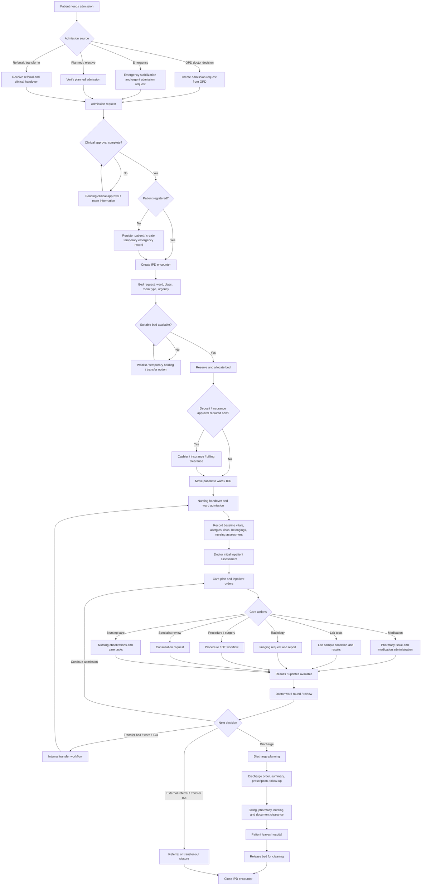
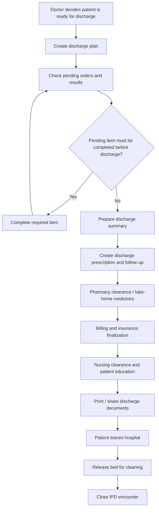

# IPD Patient Flow Blueprint

A professional, flexible, and implementation-ready inpatient department (IPD) flow for a hospital management system.

The goal is to admit the patient safely, allocate the right bed, coordinate inpatient care, manage orders and billing, support transfers, and discharge the patient quickly with complete clinical and financial closure.

---

## 1. Core Design Principles

| Principle | Implementation Meaning |
|---|---|
| One IPD encounter per admission | Every bed movement, nursing note, doctor note, order, medication, procedure, invoice, payment, insurance action, and discharge document links to the same IPD encounter. |
| Admission must be clinically approved | IPD should start from an admission request approved by a doctor, emergency clinician, or authorized admission protocol. |
| Bed management should drive admission | Admission depends on ward, room, bed class, bed availability, isolation need, gender policy, payer approval, and clinical urgency. |
| Billing should be flexible | Payment may happen before admission, during stay, before procedures, through insurance authorization, or at discharge. |
| Emergency care should not wait for billing | Critical patients should be stabilized and admitted first; registration, deposit, and insurance can be completed later according to policy. |
| Inpatient care is a loop | Doctor review, orders, services, results, nursing care, and reassessment continue until discharge or transfer. |
| Discharge planning should start early | Expected discharge, pending services, pharmacy, billing, and summary preparation should begin before the patient physically leaves. |
| Queues should drive operations | Admission desk, bed manager, ward nursing, doctors, lab, radiology, pharmacy, OT/procedure, billing, and discharge desk should each work from role-specific queues. |

---

## 2. High-Level IPD Flow Diagram

---

## 3. Step-by-Step IPD Workflow

| Step | Stage | What Happens | Main Role |
|---|---|---|---|
| 1 | Admission need identified | Patient is marked for admission from OPD, emergency, planned admission, referral, or transfer-in. | Doctor / Emergency clinician / Admission desk |
| 2 | Admission request | Reason for admission, provisional diagnosis, urgency, required ward/class, consultant, and payer are recorded. | Doctor / Admission desk |
| 3 | Patient registration | Existing patient is verified or new/temporary patient record is created. | Reception / Admission desk |
| 4 | IPD encounter creation | A new IPD encounter/admission number is created and linked to the source encounter if applicable. | Admission desk / System |
| 5 | Bed request | Required ward, bed class, room type, isolation need, and priority are selected. | Admission desk / Bed manager |
| 6 | Bed allocation | Suitable bed is reserved and assigned. If unavailable, patient enters waitlist or temporary holding. | Bed manager / Ward in-charge |
| 7 | Billing or insurance gate | Deposit, package, credit, sponsor, or insurance authorization is checked according to policy. | Cashier / Billing / Insurance desk |
| 8 | Ward transfer | Patient is moved to ward, ICU, or assigned unit with handover. | Nurse / Transport / Ward staff |
| 9 | Nursing admission | Baseline vitals, assessment, allergies, risks, belongings, consent, and nursing plan are recorded. | Ward nurse |
| 10 | Initial doctor assessment | Consultant or duty doctor reviews the patient and creates care plan. | Doctor / Consultant |
| 11 | Inpatient orders | Medication, lab, radiology, procedure, surgery, diet, nursing care, and consult orders are created. | Doctor |
| 12 | Service execution | Departments perform orders and update results, reports, or task completion. | Lab / Radiology / Pharmacy / OT / Nursing |
| 13 | Daily review loop | Doctor reviews progress, results, nursing notes, and updates treatment plan. | Doctor / Nurse |
| 14 | Transfer if needed | Patient may move to another bed, ward, ICU, isolation room, OT, or external facility. | Bed manager / Nurse / Doctor |
| 15 | Discharge planning | Expected discharge, pending items, summary, medicine, follow-up, and billing are prepared early. | Doctor / Nurse / Billing / Pharmacy |
| 16 | Final clearance | Billing, pharmacy, nursing, documents, and insurance are cleared. | Billing / Pharmacy / Nurse / Discharge desk |
| 17 | Patient exit | Patient receives discharge summary, prescription, follow-up plan, and leaves hospital. | Discharge desk / Nurse |
| 18 | Bed release | Bed is marked for cleaning, then returned to available status. | Housekeeping / Bed manager |
| 19 | Encounter closure | IPD encounter is closed after clinical and financial completion. | System / Discharge desk |

---

## 4. Admission Entry Paths

### 4.1 Emergency Admission

1. Receive patient in emergency area.
2. Stabilize and record minimum required details.
3. Create temporary or quick patient registration if full details are unavailable.
4. Doctor or emergency clinician creates urgent admission request.
5. Allocate priority ward, ICU, or emergency holding bed.
6. Complete deposit, insurance, or billing later if urgent care cannot wait.
7. Move patient to ward/ICU with clinical handover.

**Rule:** Emergency admission must support deferred registration, deferred billing, and priority bed allocation.

### 4.2 OPD to IPD Admission

1. OPD doctor decides that outpatient care is not enough.
2. Admission request is created from the OPD consultation.
3. Diagnosis, admission reason, urgency, consultant, and recommended ward/class are passed to IPD.
4. Admission desk confirms bed and payer details.
5. IPD encounter is created and linked to the OPD encounter.
6. Patient moves to ward after bed allocation and required clearance.

### 4.3 Planned or Elective Admission

1. Admission is scheduled in advance.
2. Patient details, planned procedure/treatment, consultant, expected date, payer, and bed class are verified.
3. Pre-authorization, deposit, consent, and pre-admission investigations are completed if required.
4. Bed is reserved before arrival or at check-in.
5. Patient is admitted to ward on arrival.

### 4.4 Referral or Transfer-In Admission

1. Referral note or transfer communication is received.
2. Admission desk verifies patient details and receiving consultant.
3. Clinical handover is recorded.
4. Bed, payer, and urgency are confirmed.
5. Patient is admitted and assigned to ward/ICU.

---

## 5. Admission and Bed Management

Bed management should be central to IPD operations.

| Item | Purpose |
|---|---|
| Ward | Medical, surgical, maternity, pediatric, ICU, isolation, or other unit. |
| Bed class | General, semi-private, private, deluxe, ICU, NICU, etc. |
| Room and bed | Exact physical location of the patient. |
| Bed suitability | Checks gender policy, isolation need, equipment need, clinical priority, and payer/package rules. |
| Bed reservation | Temporarily blocks a bed for a patient before physical arrival. |
| Bed transfer | Moves patient between beds, rooms, wards, ICU, or step-down unit. |
| Bed release | Marks bed for cleaning after discharge, then makes it available again. |

### Recommended Bed Statuses

| Status | Meaning |
|---|---|
| `Available` | Bed can be assigned. |
| `Reserved` | Bed is held for an incoming patient. |
| `Occupied` | Patient is currently admitted on the bed. |
| `Cleaning` | Patient left; bed is being prepared. |
| `Maintenance` | Bed/room cannot be used due to repair or maintenance. |
| `Blocked` | Bed is intentionally unavailable due to policy or operational reason. |

---

## 6. Billing, Deposit, and Insurance Design

IPD billing should be configurable and should not force one fixed payment path.

| Payment Timing | Example Use Case |
|---|---|
| Before admission | Elective admission requires deposit or insurance approval. |
| After emergency admission | Critical patient is admitted first; billing is completed later. |
| During stay | Interim bills, deposits, consumables, procedures, or package updates. |
| Before high-cost procedure | Surgery, implant, ICU package, or special investigation approval. |
| At discharge | Final bill settlement and insurance closure. |
| Insurance / credit | Patient proceeds based on sponsor, corporate, or insurance approval. |

### Billing Rules

1. All chargeable services should post automatically to the IPD bill.
2. Departments should not manually duplicate charges already generated from orders.
3. Insurance authorization should track approved amount, exclusions, pending approval, and consumed amount.
4. Emergency patients can be marked as `Billing Deferred` to prevent unsafe delays.
5. Final discharge should check open invoices, pending approvals, deposits, refunds, and outstanding balance.

---

## 7. Nursing Admission and Ward Handover

When the patient reaches the ward, nursing staff should complete the ward admission checklist.

| Nursing Task | Purpose |
|---|---|
| Receive handover | Confirms source, diagnosis, current condition, active orders, and risks. |
| Confirm identity | Verifies patient, admission number, ward, room, and bed. |
| Record baseline vitals | Creates starting clinical reference for the admission. |
| Capture allergies and risk flags | Supports safe medication and care decisions. |
| Record belongings | Tracks patient items if hospital policy requires it. |
| Start nursing care plan | Defines observation frequency, fall risk, diet, mobility, and care tasks. |
| Notify doctor | Alerts assigned consultant or duty doctor that patient has arrived. |

---

## 8. Doctor Inpatient Care Flow

During IPD care, the doctor should be able to:

1. Review admission request, source notes, OPD/emergency history, allergies, vitals, previous results, and current nursing notes.
2. Record initial assessment, working diagnosis, treatment plan, and admission orders.
3. Create or update:
   - Medication orders
   - Lab orders
   - Radiology/imaging orders
   - Procedure or surgery requests
   - Diet orders
   - Nursing instructions
   - Specialist consultation requests
   - Transfer requests
   - Discharge plan
4. Perform ward rounds and update progress notes.
5. Review results and modify the care plan.
6. Decide whether the patient should continue admission, transfer, refer out, or discharge.

---

## 9. Inpatient Orders and Department Routing

All orders should be linked to the IPD encounter and routed to the correct department queue.

| Order Type | Route | Completion Output |
|---|---|---|
| Medication | Pharmacy → ward medication administration | Issued medicine and medication administration record |
| Lab test | Lab sample collection → processing → result upload | Lab result available for doctor review |
| Radiology | Imaging queue → scan/report upload | Radiology report and images if available |
| Procedure | Procedure room / bedside procedure queue | Procedure note and charges |
| Surgery | OT scheduling → pre-op checklist → operation → post-op care | Operative note, anesthesia note, post-op orders |
| Specialist consult | Consultant queue | Consultation note and recommendations |
| Diet order | Dietary/kitchen queue | Diet plan and delivery status |
| Nursing task | Ward nursing queue | Completed nursing intervention or observation |

### Recommended Order Statuses

| Status | Meaning |
|---|---|
| `Ordered` | Doctor has created the order. |
| `Waiting Payment / Authorization` | Service requires billing or insurance clearance. |
| `Waiting Sample / Patient` | Sample or patient is needed. |
| `In Progress` | Department is performing the service. |
| `Result Pending` | Work is done but result/report is not ready. |
| `Completed` | Result, report, dispensing, or task completion is available. |
| `Cancelled` | Order was cancelled with reason. |

---

## 10. Inpatient Care Loop

IPD care should work as a continuous loop until discharge.

1. Doctor writes care plan and orders.
2. Nursing and departments execute tasks.
3. Lab, radiology, pharmacy, procedure, and consult results are updated.
4. Nurse records observations, medication administration, intake/output, and events.
5. Doctor reviews progress during ward round.
6. Care plan is continued, changed, escalated, transferred, or ended with discharge.

This loop prevents IPD from becoming a single linear process and supports real hospital operations.

---

## 11. Transfers and Escalation

A patient may move during admission without closing the IPD encounter.

| Transfer Type | Example |
|---|---|
| Bed transfer | Same ward, different bed. |
| Ward transfer | Medical ward to surgical ward. |
| ICU transfer | Ward to ICU or ICU to step-down ward. |
| Isolation transfer | Move due to infection control need. |
| OT/procedure transfer | Temporary movement for surgery or procedure. |
| External transfer | Referral or transfer to another hospital. |

Each transfer should record reason, from-location, to-location, requested by, approved by, transfer time, handover note, and billing impact.

---

## 12. Discharge Planning and Discharge Flow

Discharge should be treated as a workflow, not a single button.

### Discharge Steps

| Step | What Happens | Main Role |
|---|---|---|
| 1 | Doctor marks patient as discharge planned. | Doctor |
| 2 | System checks pending lab, radiology, procedure, medication, consult, and nursing tasks. | System |
| 3 | Doctor confirms which pending items can be ignored, followed up later, or must be completed. | Doctor |
| 4 | Discharge summary, final diagnosis, treatment given, advice, and follow-up are prepared. | Doctor |
| 5 | Take-home medicines are prepared. | Pharmacy |
| 6 | Final bill, insurance claim, deposit adjustment, refund, or balance payment is completed. | Billing / Insurance |
| 7 | Nurse gives patient education and removes patient from active ward list. | Nurse |
| 8 | Patient receives documents and leaves. | Discharge desk / Nurse |
| 9 | Bed is released for cleaning and then marked available. | Housekeeping / Bed manager |

---

## 13. Recommended IPD Encounter Statuses

| Status | Meaning |
|---|---|
| `Admission Requested` | Doctor or authorized staff has requested admission. |
| `Pending Clinical Approval` | Admission needs consultant or clinical approval. |
| `Pending Registration` | Patient record is incomplete or temporary. |
| `Pending Bed Allocation` | No suitable bed has been assigned yet. |
| `Bed Reserved` | Bed is reserved but patient has not reached the ward. |
| `Pending Deposit / Authorization` | Billing or insurance clearance is required before routine admission. |
| `Billing Deferred` | Patient is allowed to proceed while billing is completed later. |
| `Admitted` | IPD encounter is active. |
| `In Ward` | Patient is admitted in a ward bed. |
| `In ICU` | Patient is admitted in ICU or critical care unit. |
| `In Procedure / OT` | Patient is temporarily in procedure or operating area. |
| `Transfer Pending` | Internal transfer has been requested but not completed. |
| `Waiting Results / Review` | Important results or doctor review are pending. |
| `Discharge Planned` | Doctor has started discharge planning. |
| `Discharge In Progress` | Summary, pharmacy, billing, or clearance is ongoing. |
| `Awaiting Billing Clearance` | Final financial clearance is pending. |
| `Awaiting Pharmacy Clearance` | Take-home medicine or pharmacy clearance is pending. |
| `Ready for Exit` | Clinical and financial clearance are complete. |
| `Discharged` | Patient has left and the admission is completed. |
| `Transferred Out` | Patient was transferred to another facility. |
| `Cancelled` | Admission was cancelled before completion. |
| `Closed` | Encounter is fully closed in the system. |

---

## 14. Recommended Discharge Statuses

| Status | Meaning |
|---|---|
| `Not Started` | No discharge plan exists. |
| `Planned` | Doctor expects discharge soon. |
| `Summary Pending` | Discharge summary is not complete. |
| `Medication Pending` | Take-home medicines are not ready. |
| `Billing Pending` | Final bill or insurance closure is incomplete. |
| `Nursing Clearance Pending` | Ward checklist or patient education is incomplete. |
| `Documents Ready` | Summary, prescription, and follow-up are ready. |
| `Patient Exited` | Patient has physically left the ward/hospital. |
| `Completed` | Discharge workflow is fully closed. |

---

## 15. Key IPD Actions by Role

| Role | Allowed Actions |
|---|---|
| Admission desk | Create admission, verify patient, select payer, assign consultant, coordinate bed request. |
| Bed manager | View bed board, reserve bed, allocate bed, transfer patient, release bed. |
| Ward nurse | Receive patient, record vitals, nursing notes, care tasks, medication administration, handover, discharge checklist. |
| Doctor / Consultant | Approve admission, assess patient, write notes, diagnose, order services, perform ward rounds, transfer, discharge. |
| Cashier / Billing | Collect deposit, post charges, receive payments, process refunds, finalize bill. |
| Insurance desk | Submit pre-authorization, track approvals, manage claim documents, confirm coverage. |
| Pharmacy | Issue ward medicines, manage returns, prepare discharge medicines, clear pharmacy dues. |
| Lab staff | Collect samples, process tests, upload results. |
| Radiology staff | Perform imaging, upload report/results. |
| OT / Procedure team | Schedule and perform procedure or surgery, record notes, post charges. |
| Housekeeping | Clean released beds and update bed readiness. |
| Admin | Configure wards, beds, packages, tariffs, permissions, workflows, and policies. |

---

## 16. Recommended IPD Module Design

The IPD screen should have one active patient board and one bed board.

### 16.1 Active IPD Patient Board

| Column | Purpose |
|---|---|
| Patient | Name, patient ID, age/sex, contact. |
| Admission No. | Unique IPD encounter number. |
| Status | Current admission stage. |
| Ward / Room / Bed | Current patient location. |
| Consultant | Responsible doctor or team. |
| Admission Time | When IPD encounter became active. |
| Length of Stay | Days/hours admitted. |
| Payer | Cash, insurance, corporate, sponsor, credit. |
| Alerts | Allergy, infection control, fall risk, high priority, pending discharge. |

### 16.2 Bed Board

| Column | Purpose |
|---|---|
| Ward | Unit or department. |
| Room / Bed | Physical bed location. |
| Bed Class | General, private, ICU, etc. |
| Bed Status | Available, reserved, occupied, cleaning, maintenance, blocked. |
| Current Patient | Shown only if occupied or reserved. |
| Next Action | Allocate, transfer, clean, release, block, maintain. |

---

## 17. Status-Based Available Actions

| Current Status | Available Actions |
|---|---|
| Admission Requested | Approve admission, reject admission, request more information. |
| Pending Registration | Complete registration, create temporary emergency record. |
| Pending Bed Allocation | Search bed, reserve bed, waitlist, transfer out. |
| Bed Reserved | Confirm arrival, change bed, cancel reservation. |
| Pending Deposit / Authorization | Collect deposit, request insurance approval, mark billing deferred if allowed. |
| Admitted / In Ward | Record vitals, nursing notes, doctor notes, orders, medication, transfer, discharge plan. |
| In ICU | ICU notes, intensive monitoring, orders, transfer to ward, discharge plan. |
| Transfer Pending | Approve transfer, assign target bed, complete handover. |
| Waiting Results / Review | View pending results, notify doctor, continue care. |
| Discharge Planned | Prepare summary, check pending items, start billing, prepare medicines. |
| Discharge In Progress | Complete summary, pharmacy, billing, nursing checklist, documents. |
| Awaiting Billing Clearance | Final bill, payment, insurance claim, refund. |
| Ready for Exit | Print documents, mark patient exited, release bed. |
| Discharged | View summary, print documents, reopen only with permission. |

---

## 18. Important Implementation Rule

The IPD encounter should be the central record.

Everything should attach to the IPD encounter:

- Admission request
- Source OPD/emergency/referral encounter
- Bed allocation and transfers
- Nursing admission assessment
- Vital signs and observation charts
- Doctor notes and ward round notes
- Diagnosis and care plan
- Medication orders and medication administration record
- Lab orders and results
- Radiology orders and reports
- Procedure and surgery records
- Specialist consult notes
- Diet orders
- Consents and uploaded documents
- Insurance authorizations
- Invoices, deposits, payments, refunds, and billing adjustments
- Discharge plan
- Discharge summary
- Take-home prescription
- Follow-up appointment
- Print/share history

This keeps the IPD flow traceable, reduces duplicate records, and makes reporting easier.

---

## 19. Turnaround Time Improvements

| Area | Improvement |
|---|---|
| Admission | Use quick admission for emergency cases and complete full details later. |
| Bed allocation | Maintain live bed board with ward, class, cleaning, reservation, and maintenance status. |
| Billing | Use service-based billing gates and rolling bills instead of waiting until discharge. |
| Insurance | Start pre-authorization early and track pending approvals clearly. |
| Orders | Auto-route doctor orders to department queues immediately. |
| Results | Notify doctor and ward nurse when critical or pending results are available. |
| Pharmacy | Prepare discharge medicines before final billing whenever possible. |
| Discharge | Start summary, pharmacy, and billing before the patient is physically ready to leave. |
| Bed release | Automatically move bed to cleaning after patient exit and notify housekeeping. |
| Queues | Give every role a focused queue so staff see only patients needing their action. |

---

## 20. Minimal Implementation Model

At minimum, the system should include these IPD entities:

| Entity | Purpose |
|---|---|
| Patient | Master patient record. |
| IPD Encounter | Main admission record. |
| Admission Request | Clinical reason and admission approval. |
| Bed Allocation | Current bed and bed history. |
| Ward Transfer | Internal movement history. |
| Nursing Note | Ward assessment, observations, and nursing documentation. |
| Doctor Note | Admission note, progress note, ward round, and discharge decision. |
| Order | Lab, radiology, medication, procedure, surgery, consult, diet, nursing task. |
| Result / Report | Lab result, imaging report, procedure note, consult note. |
| Medication Administration | Medicine given, time, dose, nurse, skipped reason. |
| Billing Ledger | Charges, deposits, invoices, payments, refunds, insurance, and outstanding balance. |
| Discharge Record | Summary, final diagnosis, medication, advice, follow-up, clearance, exit time. |

---

## 21. Final Recommended IPD Flow Summary

```mermaid
flowchart LR
    A[Admission source] --> B[Admission request]
    B --> C[Registration / IPD encounter]
    C --> D[Bed allocation]
    D --> E[Billing or insurance gate if required]
    E --> F[Ward / ICU admission]
    F --> G[Nursing admission]
    G --> H[Doctor assessment]
    H --> I[Care plan and orders]
    I --> J[Services and nursing care]
    J --> K[Doctor review / ward round]
    K -->|Continue care| I
    K -->|Transfer| D
    K -->|Discharge| L[Discharge planning]
    L --> M[Summary, medicines, billing, clearance]
    M --> N[Patient exit]
    N --> O[Bed cleaning and encounter closure]
```

A good IPD system should not force every patient through the same rigid path. It should manage the admission as one central encounter, allow billing at configurable gates, route work through queues, maintain accurate bed status, support continuous inpatient care, and complete discharge with minimum delay.
