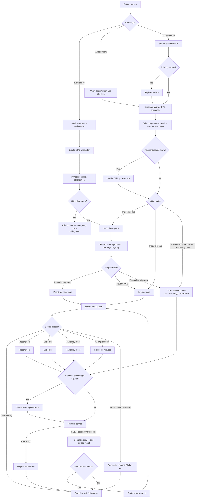

# OPD Patient Flow Blueprint

A simple, flexible, and implementation-ready outpatient department (OPD) flow for a hospital management system.

The goal is to receive the patient quickly, create one traceable OPD encounter, route the patient to the right queue, support flexible billing, and reduce total turnaround time.

---

## 1. Core Design Principles

| Principle | Implementation Meaning |
|---|---|
| One OPD encounter per visit | Every triage note, consultation note, order, result, prescription, invoice, payment, and discharge action links to the same encounter. |
| Patient routing should be flexible | A patient may go to triage, doctor, lab, radiology, pharmacy, procedure, admission, referral, or discharge depending on need. |
| Billing should be a gate, not a fixed step | Payment may happen before consultation, before a service, after service, at pharmacy, at discharge, or through insurance/credit. |
| Emergency care should not be delayed by billing | Emergency patients should receive immediate triage and care, with registration and billing completed as soon as practical. |
| Queues should drive operations | Triage, doctor, lab, radiology, pharmacy, and cashier should each work from role-specific queues. |
| Avoid unnecessary steps | Skip triage or payment only when policy allows; send patients directly to the next useful destination. |

---

## 2. High-Level OPD Flow Diagram

---

## 3. Step-by-Step OPD Workflow

| Step | Stage | What Happens | Main Role |
|---|---|---|---|
| 1 | Patient arrival | Patient is identified as emergency, appointment, or new/walk-in. | Reception / Triage desk |
| 2 | Patient lookup or registration | Existing patient is searched; new patient is registered. Emergency patients can use quick registration. | Reception |
| 3 | OPD encounter creation | A new OPD encounter is created for the current visit. | Reception / System |
| 4 | Department and provider selection | Specialty, service type, doctor, payer, and priority are selected if known. | Reception / Nurse |
| 5 | Billing check | System checks whether payment is required now, later, waived, insured, or on credit. | System / Cashier |
| 6 | Initial routing | Patient is routed to triage, doctor queue, direct service queue, or priority care. | Reception / Nurse / System |
| 7 | Triage | Vitals, chief complaint, symptoms, risk flags, and urgency level are recorded. | Triage nurse |
| 8 | Doctor consultation | Doctor reviews history, triage, notes, diagnosis, and decides the next step. | Doctor / Clinician |
| 9 | Orders and services | Doctor may request lab, radiology, procedure, prescription, admission, referral, or follow-up. | Doctor / Departments |
| 10 | Billing gate for services | Payment or coverage is checked only for the selected service, not the whole visit unless required. | Cashier / System |
| 11 | Service execution | Lab collects samples, radiology performs imaging, pharmacy dispenses, or procedure is done. | Relevant department |
| 12 | Result handling | Results are uploaded and the patient returns to the doctor only when review is needed. | Lab / Radiology / Doctor |
| 13 | Final decision | Doctor completes treatment, prescribes, admits, refers, schedules follow-up, or discharges. | Doctor |
| 14 | Encounter closure | Encounter is marked completed after all required clinical, pharmacy, and billing actions are done. | Doctor / Reception / System |

---

## 4. Arrival Paths

### 4.1 Emergency Patient

1. Receive patient immediately at triage or emergency desk.
2. Create a quick registration record if full details are not yet available.
3. Create an OPD or emergency encounter.
4. Perform immediate triage and mark urgency.
5. Send to priority doctor/emergency care.
6. Complete full registration, billing, and documentation later when safe.

**Rule:** Emergency patients should not be blocked by consultation payment before urgent assessment or treatment.

### 4.2 New Patient

1. Search the system to avoid duplicate patient records.
2. Register demographics and contact details.
3. Create OPD encounter.
4. Select department, service, provider, and payer.
5. Apply billing policy.
6. Route to triage, doctor, or direct service if allowed.

### 4.3 Appointment Patient

1. Verify appointment, provider, time, and department.
2. Check the patient in.
3. Create or activate the OPD encounter.
4. Confirm payer and billing policy.
5. Route to triage if required by department policy, otherwise route directly to the assigned doctor queue.

---

## 5. Triage Flow

Triage is optional for routine cases but strongly recommended for emergency, first-time, high-risk, and undifferentiated walk-in patients.

| Triage Output | Meaning | Next Step |
|---|---|---|
| Immediate | Patient needs urgent attention. | Priority doctor / emergency care |
| Urgent | Patient should be seen before routine queue. | Priority doctor queue |
| Routine | Stable OPD patient. | Normal doctor queue |
| Service-only | Patient has valid direct order, refill, or protocol service. | Lab, radiology, pharmacy, or procedure queue |
| Not fit for OPD | Patient needs admission, emergency transfer, or referral. | Admission / emergency / referral workflow |

Triage should capture:

- Chief complaint
- Vital signs
- Pain score or severity indicator
- Allergies and key risk flags
- Short triage note
- Urgency level
- Recommended next destination

---

## 6. Doctor Consultation Flow

During consultation, the doctor should be able to:

1. Review patient profile, visit history, triage note, vitals, allergies, and previous results.
2. Record complaints, examination notes, diagnosis, and clinical impression.
3. Create one or more of the following actions:
   - Prescription
   - Lab order
   - Radiology/imaging order
   - OPD procedure request
   - Referral
   - Admission request
   - Follow-up appointment
   - Discharge / visit completion
4. Mark whether ordered results require doctor review.
5. Close the consultation or keep the encounter open while waiting for services/results.

---

## 7. Flexible Routing Scenarios

| Scenario | Recommended Route |
|---|---|
| Emergency patient | Arrival → quick registration → urgent triage → priority doctor → treatment/orders → admission/discharge → billing completion |
| Appointment patient | Check-in → encounter → payment check if needed → triage or assigned doctor → consultation → next action |
| New walk-in patient | Registration → encounter → payment check → triage → doctor → orders/prescription/discharge |
| Doctor then lab/radiology then doctor | Consultation → order → payment/coverage check → service → result uploaded → doctor review queue → final decision |
| Consultation and prescription only | Consultation → prescription → pharmacy/payment check → dispense → close encounter |
| Direct pharmacy | Encounter → validate existing prescription/refill/order → payment check → dispense → close encounter |
| Direct lab or radiology | Encounter → validate order/referral/protocol → payment check → perform service → upload result → doctor review if required |
| Service not requiring doctor review | Encounter → service → result/dispense → close encounter or notify patient |
| Admission or referral | Doctor decision → admission/referral request → close OPD encounter after handover |

---

## 8. Billing and Cashier Design

Billing should be configurable and service-based.

| Payment Timing | Example Use Case |
|---|---|
| Before consultation | Private walk-in consultation fee required upfront. |
| After consultation | Patient pays after doctor confirms required services. |
| Before lab/radiology/procedure | Paid diagnostic services. |
| Before pharmacy dispensing | Medicine payment required before dispensing. |
| At discharge/end of visit | Consolidated bill for all OPD services. |
| Insurance/credit | Services proceed based on coverage or account approval. |
| Emergency deferred billing | Patient receives urgent care first; billing is completed later. |

### Billing Rules

- Every invoice item should link to the OPD encounter and, when applicable, the specific service order.
- Cashier clearance should return the patient to the intended next destination, not restart the OPD flow.
- Emergency encounters may bypass payment gates until the patient is stable.
- The system should support partial payments, waivers, insurance approval, credit accounts, and postpaid billing where required.

---

## 9. Lab and Radiology Flow

1. Doctor creates lab or radiology order.
2. System creates invoice if payment is required.
3. Patient is routed to cashier or directly to the service queue.
4. Lab/radiology performs the service.
5. Result or report is uploaded to the encounter.
6. System notifies the doctor or places the patient in the doctor review queue if review is required.
7. Doctor reviews results and decides prescription, more tests, admission, referral, follow-up, or discharge.

**Turnaround rule:** Lab and radiology orders should be allowed to run in parallel when possible.

---

## 10. Pharmacy Flow

1. Prescription is created by the doctor or validated from an existing approved prescription/refill.
2. System checks stock, price, and payment policy.
3. Patient goes to cashier if payment is required.
4. Pharmacy dispenses available medicines.
5. Substitutions, partial dispensing, or unavailable items are recorded.
6. Encounter is closed if no further doctor review is needed.

---

## 11. Recommended Status Model

Use a small encounter status list and detailed order statuses. This keeps the main OPD screen clean while still supporting complex paths.

### 11.1 OPD Encounter Statuses

| Status | Meaning |
|---|---|
| `Registered` | Encounter has been created. |
| `Waiting Payment` | A required payment gate is blocking the next step. |
| `Waiting Triage` | Patient is waiting for triage. |
| `In Triage` | Triage is being performed. |
| `Waiting Doctor` | Patient is waiting for consultation or review. |
| `In Consultation` | Doctor is actively reviewing the patient. |
| `Waiting Service` | Patient has pending lab, radiology, pharmacy, or procedure activity. |
| `Waiting Results` | Lab/radiology/procedure result is pending. |
| `Waiting Doctor Review` | Results are available and require doctor review. |
| `Ready to Close` | Clinical work is done; closure or final billing may be pending. |
| `Completed` | OPD visit is closed. |
| `Admitted` | Patient has been transferred to inpatient/admission workflow. |
| `Referred` | Patient has been referred outside or to another service. |
| `Cancelled` | Visit was cancelled. |

### 11.2 Service Order Statuses

| Status | Used For |
|---|---|
| `Ordered` | Doctor or protocol created the order. |
| `Waiting Payment` | Payment or approval required. |
| `Waiting Service` | Patient is queued for lab, radiology, pharmacy, or procedure. |
| `In Progress` | Department has started the service. |
| `Result Ready` | Lab/radiology/procedure result is available. |
| `Dispensed` | Pharmacy has dispensed medicine. |
| `Completed` | Service is finished. |
| `Cancelled` | Order was cancelled. |

### 11.3 Billing Statuses

| Status | Meaning |
|---|---|
| `Not Required` | No payment needed for this step. |
| `Invoice Created` | Bill has been generated. |
| `Pending Payment` | Payment is required before proceeding. |
| `Paid` | Payment completed. |
| `Partially Paid` | Some payment received; balance remains. |
| `Covered` | Insurance, credit, or package covers the service. |
| `Waived` | Payment waived by authorized user. |

---

## 12. Role-Based Actions

| Role | Key Actions |
|---|---|
| Reception | Search/register patient, verify appointment, create encounter, select department/provider, route patient, close administrative tasks. |
| Triage nurse | Record vitals, symptoms, risk flags, urgency, and next destination. |
| Cashier/Billing | Generate invoice, receive payment, apply insurance/credit/waiver, clear service gates. |
| Doctor/Clinician | Review patient, write notes, diagnose, prescribe, order services, request admission/referral, discharge, schedule follow-up. |
| Lab staff | Receive order, collect sample, process test, upload result. |
| Radiology staff | Receive order, perform imaging, upload report/result. |
| Pharmacy staff | View prescription, check stock, dispense, record partial supply/substitution. |
| Admin | Configure services, fees, payment policies, departments, providers, queues, priorities, permissions. |

---

## 13. OPD Screen Design

The main OPD screen should show active encounters only.

### Recommended Columns

| Column | Purpose |
|---|---|
| Patient | Name, patient ID, age/sex, contact. |
| Arrival type | Emergency, appointment, new/walk-in, follow-up, review. |
| Priority | Immediate, urgent, routine, service-only. |
| Current status | Current encounter status. |
| Current queue | Triage, doctor, lab, radiology, pharmacy, cashier, review. |
| Provider | Assigned doctor or clinician. |
| Arrival time | Used for turnaround time monitoring. |
| Waiting time | Highlights delays. |
| Next action | Contextual action such as triage, consult, pay, collect sample, dispense, review, close. |

Each row should open a patient encounter view with actions based on role, status, permissions, and payment clearance.

---

## 14. Turnaround Time Improvements

| Improvement | How It Reduces Delay |
|---|---|
| Appointment pre-check-in | Reduces registration time for scheduled patients. |
| Quick emergency registration | Prevents urgent care delays. |
| Configurable triage skip | Stable appointment patients can go directly to doctor when allowed. |
| Billing as a reusable gate | Avoids forcing every patient through the same cashier step. |
| Parallel lab/radiology orders | Patient can complete multiple services without waiting for each sequentially. |
| Automatic result notification | Doctor knows when results are ready for review. |
| Direct service routing | Valid prescriptions, refills, referrals, or protocol cases avoid unnecessary consultation. |
| Queue dashboards | Staff can see bottlenecks in triage, doctor, lab, radiology, pharmacy, and cashier. |
| Encounter-based tracking | All departments work from one shared source of truth. |

---

## 15. Implementation Data Objects

At minimum, the OPD module should support these records:

| Object | Purpose |
|---|---|
| `Patient` | Master patient profile. |
| `Appointment` | Scheduled visit information. |
| `OPDEncounter` | Central record for the visit. |
| `QueueItem` | Tracks where the patient is waiting or being served. |
| `TriageRecord` | Vitals, symptoms, urgency, and next destination. |
| `ConsultationNote` | Doctor notes, assessment, diagnosis, and plan. |
| `ServiceOrder` | Lab, radiology, procedure, or pharmacy request. |
| `Result` | Lab/radiology/procedure result linked to an order. |
| `Prescription` | Medication order linked to the encounter. |
| `Invoice` | Bill linked to encounter and service items. |
| `Payment` | Payment, waiver, credit, or insurance approval. |
| `AdmissionRequest` | Request to move patient to inpatient care. |
| `Referral` | Internal or external referral. |
| `DischargeSummary` | Final OPD outcome and instructions. |

---

## 16. Final Implementation Rule

The OPD encounter is the single source of truth.

Every OPD action should attach to the encounter:

- Registration/check-in details
- Triage notes and vitals
- Doctor notes and diagnosis
- Lab orders and results
- Radiology orders and reports
- Procedures
- Prescriptions and dispensing
- Invoices and payments
- Admission requests
- Referrals
- Follow-up appointments
- Discharge/visit summary
- Print and audit history

This makes the OPD flow simple for users, flexible for real hospital operations, and reliable for implementation.
