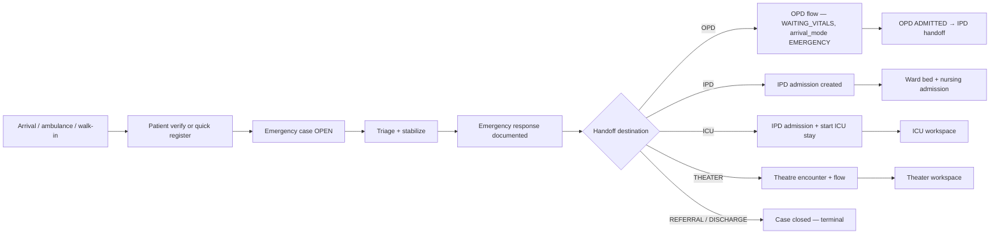

# Emergency Module — Implementation Prompt

## Objective

Complete the **Emergency and Ambulance Module** for HOSSPI HMS so emergency clinicians, triage nurses, ambulance dispatchers, and reception staff can run acute-care intake end-to-end: register or verify patients under time pressure, open emergency cases, triage and stabilize, dispatch and track ambulances, record emergency responses, and **hand off** to OPD, IPD, ICU, Theater, referral, or discharge — without duplicating downstream encounters.

**Source of truth:** implement emergency workflow in alignment with:

- [`.cursor/flows/ipd-flow.mdc`](.cursor/flows/ipd-flow.mdc) — §2.1 emergency admission (deferred registration, deferred billing, priority bed allocation), steps 1–8 admission intake, §4 billing gates (`Billing Deferred`), §16 IPD encounter as hub after IPD/ICU handoff
- [`.cursor/flows/opd-flow.mdc`](.cursor/flows/opd-flow.mdc) — §2 emergency-to-OPD handoff entry path, §3 stage contract (`WAITING_VITALS` entry), §7 OPD-to-IPD handoff when emergency routes through OPD first, §6 UI rules (summary cards filter worklist)
- [`.cursor/app-write-up.mdc`](.cursor/app-write-up.mdc) — Emergency and ambulance module boundaries vs OPD triage, Clinical, IPD, ICU, Theater, Billing, and Patient registry

**Central encounter rule:** the **emergency case** is the hub while the patient is in the emergency department. Handoff creates or reuses the receiving workflow (OPD flow, IPD admission, ICU stay overlay, or theater flow) and links `emergency_case_id` upstream. Emergency does not own inpatient bed management, OPD consultation queues, or cashier workflows after handoff — it preserves source context and navigates staff to the receiving module.

Deliver a **urgent-but-controlled emergency workspace** optimized for triage under pressure: role-focused queues, severity-first layout, predictable primary actions, patient context at a glance, care-before-billing affordances, and no raw internal identifiers in the UI.

---

## Mandatory Reading (before any Emergency change)

1. Re-read [`.cursor/flows/ipd-flow.mdc`](.cursor/flows/ipd-flow.mdc) — especially §2.1 emergency admission, §4 billing/deferred rules, §3 bed management, §16 encounter hub rule.
2. Re-read [`.cursor/flows/opd-flow.mdc`](.cursor/flows/opd-flow.mdc) — §2 entry paths (emergency-to-OPD), §3 stage contract, §6 UI rules, §7 OPD-to-IPD handoff.
3. Re-read [`.cursor/app-write-up.mdc`](.cursor/app-write-up.mdc) — Emergency vs OPD triage vs IPD vs ICU vs Theater boundaries.

---

## Cross-Flow Integration Map

Emergency sits **at the front** of the patient journey and **hands off** to OPD, IPD, ICU, or Theater without closing clinical accountability prematurely.



| Downstream | Flow reference | Emergency responsibility |
| ---------- | -------------- | ------------------------ |
| OPD handoff | opd-flow §2, §3 | Call `POST …/handoff` with `destination=OPD`; backend starts OPD with `arrival_mode=EMERGENCY`, `emergency_case_id`, `WAITING_VITALS`, payment gate waived |
| IPD handoff | ipd-flow §2.1, §4 | `destination=IPD` creates IPD admission; surface `Billing Deferred` when policy allows; link to IPD workspace |
| ICU handoff | ipd-flow §2.1, §11 `In ICU` | `destination=ICU` runs `startIpdFlow` + `startIcuStay`; patient appears on ICU board |
| Theater handoff | app-write-up Theater row | `destination=THEATER` creates theatre encounter and flow |
| OPD → IPD path | opd-flow §7 | When emergency routes OPD first, show OPD stage progression and eventual `ADMITTED` — do not recreate IPD from Emergency |
| Patient registry | app-write-up Patient row | Quick arrival creates incomplete patient with `extension_json.registration.source=EMERGENCY`; prompt completion later |
| Billing | ipd-flow §4 | Show read-only billing/deferred snapshot; no cashier duplication |
| Nursing / triage | app-write-up OPD triage | Emergency owns case-level triage; OPD triage module owns pre-consultation queue when handed to OPD |

---

## Current State (read before changing code)

### Already in place

| Area | Location / API | Notes |
|------|----------------|-------|
| Product scope | `.cursor/app-write-up.mdc` | Emergency cases, triage, response, ambulances, dispatch, trips, handoff to OPD/IPD/ICU/theater |
| IPD emergency path | `.cursor/flows/ipd-flow.mdc` §2.1 | Deferred registration/billing, priority allocation |
| OPD emergency path | `.cursor/flows/opd-flow.mdc` §2 | Emergency-to-OPD with context preservation |
| Frontend scaffold | `frontend/lib/features/emergency/` | `data/`, `domain/`, `presentation/` layers exist |
| Workspace UI | `emergency_workspace_page.dart` | Board, scopes, summary cards, detail, triage/response/ambulance/handoff dialogs (~2k lines) |
| Controller | `emergency_workspace_controller.dart` | Realtime + periodic sync, pagination, scope/search, case selection, mutations |
| Repository | `emergency_repository.dart` / `emergency_repository_impl.dart` | Board list, quick arrival (patient + case + optional triage), triage, response, ambulance dispatch/trip, handoff |
| Emergency case API | `backend/src/modules/emergency-case/` | CRUD + `POST /emergency-cases/:id/handoff` with destinations OPD, IPD, ICU, THEATER, REFERRAL, DISCHARGE |
| Handoff orchestration | `emergency-case.service.js` | `startEmergencyOpdFlow`, `startEmergencyIpdFlow`, `startEmergencyIcuFlow`, `startEmergencyTheatreFlow` |
| Triage API | `backend/src/modules/triage-assessment/` | Linked to emergency case |
| Emergency response API | `backend/src/modules/emergency-response/` | Created on handoff and via UI |
| Ambulance APIs | `ambulance-trip/`, dispatch modules | Dispatch status, trip start/complete |
| Permissions | `emergency:read/write/delete` | `AppPermissions.emergencyRead/Write`; route in `app_routes.dart` |
| Realtime | `RealtimeEventGroups.emergencyWorkspace` | Controller subscribes to emergency domain events |
| Shell integration | `app_router.dart` | `/emergency` route with nav badge from active/critical workload |
| Backend tests | `backend/src/tests/modules/emergency-case/` | Service handoff paths (OPD, IPD, ICU), controller, schema |
| Quick arrival | `createQuickArrival` in repository | Creates incomplete patient + OPEN case + optional triage |

### Known gaps to close

- **Handoff outcome invisible in UI** — backend returns receiving workflow snapshot in audit but detail panel does not show linked OPD encounter, IPD admission, ICU stay, or theater case with deep links.
- **`Billing Deferred` not surfaced** — ipd-flow §2.1/§4 expects emergency IPD/ICU path to mark deferred billing; UI shows static “Care before billing” copy only.
- **No post-handoff navigation** — missing “Open in OPD”, “Open in IPD”, “Open in ICU”, “Open in Theater” actions after successful handoff.
- **Client-side scope filtering** — `ambulance` and `handoff` scopes filter client-side (`_usesClientScopeFilter`); backend list filters should align for accurate pagination and counts.
- **Localization gap** — ~99 `_EmergencyText` private constants; only `emergencyCaseDialogTitle` and nav label in `app_en.arb`.
- **No deep links** — `/emergency?id=…&panel=…` not parsed by router to pre-select case or focus triage/handoff/ambulance panel.
- **Incomplete registration workflow** — quick arrival marks patient incomplete but no “Complete registration” action or link to patient registry with context.
- **OPD triage overlap unclear** — emergency case triage vs OPD triage module boundaries not reflected in UI copy or routing after OPD handoff.
- **IPD admission details thin on handoff** — emergency IPD handoff does not pass admission reason, urgency, consultant, or ward preference from case (backend `startIpdFlow` minimal payload).
- **Referral / discharge handoffs terminal only** — `REFERRAL` and `DISCHARGE` close case without structured referral note or OPD `DISCHARGED` alignment.
- **No frontend tests** — `test/features/emergency/` does not exist.
- **Large page file** — `emergency_workspace_page.dart` mixes board, detail, dialogs; needs extraction per project conventions.
- **Ambulance board incomplete** — dispatch/trip actions exist but no dedicated ambulance resource board (vehicle status, crew, ETA).
- **Mortuary death pathway** — in-hospital death from emergency not linked to mortuary intake (future cross-module; document handoff boundary).
- **Notification deep links** — critical cases and handoff reminders should update shell badge and open case detail.

---

## Scope — Core Capabilities

Implement or finish the following, in priority order. Each item maps to IPD §2.1, OPD §2/§7, and app-write-up Emergency responsibilities.

### 1. Emergency board and role-focused queues

**Goal:** Emergency staff triage open cases by severity and next action using backend-aligned filters.

**Actions:**

- Keep primary layout: **board → case detail → action panel** (`AppWorkspace`, `AppListTable`, `AppWorkspaceDetailPanel`, `AppActionList`, patient context header).
- Preserve and align board scopes with backend filters (move client-only filters server-side where possible):
  - **Active** → `status=OPEN` (default landing)
  - **Critical** → `severity` critical/red or equivalent backend filter
  - **Ambulance** → cases with active dispatch or in-transit trip
  - **Ready for handoff** → triage + response complete, case still OPEN
  - **Closed** → `status=CLOSED`
  - **All** → no status filter
- Summary cards must filter the board (mirror OPD §6 and IPD §14); hide zero-value cards where the workspace pattern expects it.
- Table columns: patient, case ID (display), severity/priority, triage level, arrival time, response status, current location (ED / ambulance), next action, responsible role.
- Prominent severity chip on rows; critical scope drives shell nav badge with active critical count.
- Use display IDs (`displayId`, patient display name) — never surface raw UUIDs.
- Preserve realtime sync via `RealtimeEventGroups.emergencyWorkspace`; refresh selected detail after mutations.

**Reference APIs:** `GET /emergency-cases?status=…&severity=…&search=…`, related triage/response/dispatch/trip lists on detail load.

### 2. Quick arrival and deferred registration

**Goal:** Staff can start care before full demographics per ipd-flow §2.1 step 3.

**Actions:**

- Keep **Quick arrival** dialog: minimal name/phone/severity/optional triage → patient + case + triage.
- Show **registration incomplete** badge on case and patient rows when `extension_json.registration.requires_completion`.
- Add **Complete patient registration** action linking to patient registry with `patientId` and return context.
- Support **attach existing patient** search (reuse patient lookup patterns from OPD/reception).
- After quick arrival, default next actions: record triage → mark response → handoff or stabilize.

**Reference APIs:** `POST /patients` (incomplete extension), `POST /emergency-cases`, `POST /triage-assessments`.

### 3. Triage, stabilization, and emergency response

**Goal:** Document acuity and clinical response before handoff (app-write-up triage responsibility).

**Actions:**

- **Record triage** — triage level, notes; show triage history on detail timeline.
- **Update case priority/severity** — align with triage outcome.
- **Mark emergency response** — clinician response time and notes; required before handoff when policy enforces (surface backend validation errors clearly).
- Patient context header: allergies (from patient record when available), chief complaint, latest vitals if linked, active ambulance status.
- Differentiate copy from **OPD triage module** — emergency triage is case-scoped until OPD handoff; after OPD handoff, OPD workspace owns queue stage.

### 4. Ambulance dispatch and trip tracking

**Goal:** Dispatchers manage pre-hospital and inter-facility ambulance workflow.

**Actions:**

- **Dispatch ambulance** — select vehicle, set dispatch status.
- **Update dispatch status** — en route, on scene, returning, etc.
- **Start trip** / **Complete trip** — link trip to case; update row location column.
- Add **Ambulance resources** section or tab: available vs dispatched vehicles (from reference data / ambulance APIs).
- Ambulance scope queue shows only cases with open dispatch or active trip; prefer server-side filter over client post-filter.
- On trip complete at facility, prompt **Receive patient** → triage or direct handoff.

**Reference APIs:** ambulance dispatch and trip endpoints used in `emergency_repository_impl.dart`.

### 5. Handoff to receiving departments (OPD, IPD, ICU, Theater)

**Goal:** One controlled handoff action starts the correct downstream workflow per backend `handoffEmergencyCase`.

**Actions:**

- **Handoff dialog** — destination (OPD, IPD, ICU, Theater, Referral, Discharge), notes, close-case toggle (default true).
- On success, persist and display **receiving workflow snapshot** on case detail:
  - OPD → encounter display ID, stage (`WAITING_VITALS`), link `/opd?id=…`
  - IPD → admission display ID, stage, link `/ipd?id=…`
  - ICU → admission + active ICU stay, link `/icu?id=…`
  - Theater → theatre case/encounter, link `/theater?id=…`
- **Open in {module}** primary action after handoff when receiving work was created.
- **OPD path:** preserve `emergency_case_id` on OPD encounter; OPD board should show emergency arrival context (verify OPD module shows it — coordinate if gap is in OPD).
- **IPD path:** pass admission reason/urgency from emergency case when backend supports extended `startIpdFlow` payload; mark `Billing Deferred` when tenant policy allows.
- **ICU path:** same as IPD plus ICU stay started — patient must appear on ICU active board without duplicate admission.
- **Referral / Discharge:** structured notes; close case; do not create duplicate OPD/IPD encounters.
- Re-handoff guard: block or warn when case already CLOSED unless admin override.

**Reference API:** `POST /emergency-cases/:id/handoff`.

### 6. Billing and insurance (read-mostly in Emergency UI)

**Goal:** Emergency respects care-before-billing without running cashier workflows (ipd-flow §4).

**Actions:**

- Show billing snapshot on detail when API provides: deferred flag, deposit status, insurance pre-auth state.
- On IPD/ICU handoff, display **Billing Deferred** chip when backend sets it.
- Do not collect payments in Emergency module — link to Billing workspace for deposit collection after stabilization.
- Copy and banners: “Stabilize first — billing can be completed later” for emergency paths.

### 7. Cross-module integration (OPD, IPD, ICU, Theater, Patient registry)

**Goal:** Emergency connects cleanly across the patient journey defined in OPD and IPD flows.

**Actions:**

- **OPD → IPD after emergency:** when patient was handed to OPD then admitted, show read-only OPD `ADMITTED` context on closed emergency case summary.
- **IPD emergency admission:** align with ipd-flow §2.1 — deferred registration, deferred billing, priority bed request after handoff (bed ops remain in IPD).
- **ICU direct from emergency:** `startEmergencyIcuFlow` patients land on ICU board; emergency detail shows ICU stay reference.
- **Theater emergency:** post-handoff link to theater pre-op queue.
- **Deep links:** handle `/emergency?id={caseDisplayId}&panel={triage|response|ambulance|handoff}` — select case and focus panel.
- **Notifications:** critical severity, ambulance ETA, handoff pending update badges and row highlights.
- **Patient registry:** incomplete registration flag and deep link to complete demographics.

### 8. Case closure, cancellation, and audit trail

**Goal:** Closed cases remain searchable with full handoff and response history.

**Actions:**

- **Close case** via handoff with `close_case=true` or explicit cancel when backend supports it.
- Closed scope shows summary: final destination, handoff time, actor when API provides metadata.
- Print/share emergency summary (triage, response, ambulance, handoff) using existing print template patterns.
- Audit-friendly timestamps on triage, response, dispatch, trip, handoff events.

---

## Module Boundaries (do not violate)

From `.cursor/app-write-up.mdc`:

| Own in Emergency | Do not duplicate — use other module |
| ---------------- | ----------------------------------- |
| Emergency case, triage, response, ambulance dispatch/trip | OPD consultation queues and disposition (OPD flow) |
| Quick/incomplete registration trigger | Full patient demographics lifecycle (Patient registry) |
| Handoff orchestration to downstream flows | IPD bed board, nursing admission, ward care (IPD / Nursing) |
| Pre-handoff stabilization documentation | ICU monitoring, alerts, ICU stays (ICU module) |
| Emergency theater handoff trigger | Theater scheduling, anesthesia, intra-op (Theater) |
| Care-before-billing UX | Invoices, payments, cashier (Billing) |
| Pre-consultation OPD triage queue | OPD triage module when patient is in OPD workflow |

---

## UI / UX Requirements

Follow `frontend/.cursor/ui-patterns.mdc`, `design-system.mdc`, `components.mdc`, and `layouts.mdc`. Mirror proven workspace patterns from **OPD**, **IPD**, and **ICU**.

### Organization

- **Two primary views**, clearly separated:
  1. **Emergency case board** — active triage and handoff queue (default).
  2. **Ambulance operations** — dispatch status and vehicle/trip tracking (tab or secondary view).
- **Single primary task per region:** board (main), detail (split panel), actions (grouped panel).
- **Progressive disclosure:** summary cards for critical/ambulance/handoff workload; search and scope chips; complex forms in dialogs.
- **Role-appropriate actions:** triage nurse (triage, vitals), emergency clinician (response, handoff), dispatcher (ambulance), reception (quick arrival, patient search) — per flow §13 adapted for emergency.
- Default landing: **Active** queue.

### Simplicity

- **Severity first** — color on severity/triage chips and critical summary card only; avoid alarm fatigue elsewhere.
- **One status chip + one next-action column** on the board.
- **Action panel hierarchy:** triage → response → ambulance (if pre-hospital) → handoff → close case (terminal last).
- **Forms:** one column on narrow viewports; datetime for response/trip events; validate required handoff notes when policy requires.
- **Loading/saving:** `AppWorkspace` status tone; refresh selected row after modal actions.

### Professional healthcare feel

- Terminology: triage, stabilization, handoff, dispatch, deferred registration — not generic “submit”.
- Calm hierarchy: neutral backgrounds; urgency color on severity only.
- Audit-friendly: show who/when on triage, response, and handoff when API provides actor metadata.
- Accessibility: semantic labels on queues, tables, and dialogs; keyboard-navigable modals.
- No raw UUIDs, internal enum codes, or debug field names in production UI.

---

## Architecture and Conventions

Follow `frontend/docs/workflows/feature-workflow.md` and `.cursor/` rules.

| Rule | Requirement |
|------|-------------|
| Layering | UI/controllers → repository interface → repository impl → API client. No API calls from widgets. |
| State | Riverpod `AsyncNotifier` controllers; `Result<T>` / `AppFailure` for errors. |
| DTOs | `data/dtos/` with explicit mappers to `domain/entities/`. |
| Localization | All user strings in `app_en.arb`; run codegen; remove `_EmergencyText` over time. |
| Permissions | `AccessGate` / `AppAccessActionGate`; `emergency:read/write` + clinical roles as applicable. |
| Case anchor | All mutations use emergency case id; detail reload aggregates triage/response/dispatch/trip. |
| Handoff | Use `POST …/handoff` as canonical — do not call OPD/IPD start APIs directly from UI. |
| Shared UI | Reuse patient lookup, print templates, and clinical context headers from shared modules. |
| File size | Extract widgets to `presentation/widgets/`; keep page compositional. |
| Tests | Add `test/features/emergency/` — controller scopes, DTO mapping, handoff destination mapping, quick arrival flow. |
| Backend | Extend handoff response DTO with receiving workflow snapshot before adding duplicate orchestration endpoints. |

**Do not** duplicate OPD or IPD admission lifecycle in Emergency. **Do not** add emergency business logic to `core/` unless genuinely cross-module.

**Reuse existing services** — analyze `emergency-case.service.js` handoff paths, OPD `arrival_mode=EMERGENCY`, and IPD `startIcuStay` before adding endpoints.

---

## Suggested Implementation Order

1. **Handoff outcome display + cross-links** — show receiving workflow IDs; “Open in OPD/IPD/ICU/Theater”.
2. **Localization pass** — migrate `_EmergencyText` to `app_en.arb`.
3. **Widget extraction + deep links** — split `emergency_workspace_page.dart`; parse `/emergency?id=&panel=` query params.
4. **Server-aligned board filters** — move ambulance/handoff scopes to backend query params; fix pagination counts.
5. **Billing deferred surfacing** — read IPD admission billing state after IPD/ICU handoff.
6. **Quick arrival polish** — existing patient search, complete registration link, incomplete badge.
7. **Ambulance operations view** — vehicle board and dispatcher-focused queue.
8. **Extended IPD handoff payload** — admission reason, urgency, consultant when backend extended.
9. **OPD emergency context verification** — ensure OPD shows `emergency_case_id` source (coordinate OPD module if gap).
10. **Tests + quality gate** — see below.

Work in small, reviewable increments. One clear responsibility per new file.

---

## Acceptance Criteria

- [ ] Staff can open Emergency workspace, filter by scope, and open case detail with live sync.
- [ ] **Quick arrival** creates incomplete patient + case; **attach existing patient** works.
- [ ] Triage, response, ambulance dispatch/trip lifecycle persist and appear on case timeline.
- [ ] **Handoff** to OPD, IPD, ICU, and Theater starts receiving workflow and shows snapshot with deep link.
- [ ] OPD handoff creates encounter at `WAITING_VITALS` with emergency context (opd-flow §2).
- [ ] IPD/ICU handoff creates admission (and ICU stay for ICU) without duplicate records (ipd-flow §2.1, §11).
- [ ] **Billing Deferred** visible on detail when backend marks emergency admission accordingly.
- [ ] Board scopes match backend filters; summary cards filter worklist (opd-flow §6 pattern).
- [ ] Deep links (`/emergency?id=…&panel=…`) open correct case/panel.
- [ ] Workload count drives shell nav badge; critical queue highlights urgent cases.
- [ ] All user-facing strings localized; `emergency:read/write` permissions enforced.
- [ ] UI provides **case board** and **ambulance operations** with scannable urgent-care layout.
- [ ] `flutter analyze` and `flutter test` pass; new Emergency tests cover repository mapping and handoff flows.

---

## Quality Gate

Before marking complete, run from `frontend/`:

```sh
flutter pub get
dart format --set-exit-if-changed .
flutter analyze
flutter test
```

Run backend Emergency tests from `backend/`:

```sh
npm test -- --testPathPattern="emergency-case|emergency-response|triage-assessment|ambulance-trip"
```

Enable `scheduling-queue` module entitlement (emergency-cases) and emergency permissions for integration testing. Add focused tests during development; run the full gate before PR or merge.

---

## Key File References

```
.cursor/flows/ipd-flow.mdc                          # §2.1 emergency admission, billing deferred, encounter hub
.cursor/flows/opd-flow.mdc                          # §2 emergency-to-OPD, §7 OPD-to-IPD, stage contract
.cursor/app-write-up.mdc                            # Emergency module boundaries

frontend/lib/features/emergency/
├── data/dtos/emergency_dtos.dart
├── data/repositories/emergency_repository_impl.dart
├── domain/entities/emergency_entities.dart
├── domain/repositories/emergency_repository.dart
└── presentation/
    ├── controllers/emergency_workspace_controller.dart
    └── pages/emergency_workspace_page.dart

frontend/lib/features/opd/                         # Receives OPD handoff (arrival_mode EMERGENCY)
frontend/lib/features/ipd/                         # Receives IPD handoff; bed ops
frontend/lib/features/icu/                           # Receives ICU handoff via startIcuStay
frontend/lib/features/theater/                     # Receives theater handoff
frontend/lib/features/patients/                      # Quick/incomplete registration completion
frontend/lib/app/router/app_router.dart            # /emergency route + deep-link handling

backend/src/modules/emergency-case/
├── services/emergency-case.service.js             # Handoff orchestration (OPD/IPD/ICU/Theater)
├── routes/emergency-case.routes.js
└── schemas/emergency-case.schema.js
backend/src/modules/emergency-response/
backend/src/modules/triage-assessment/
backend/src/modules/ambulance-trip/
backend/src/modules/opd-flow/services/opd-flow.service.js    # Emergency OPD start
backend/src/modules/ipd-flow/                                  # Emergency IPD/ICU start
```

---

## Flow Traceability Matrix

Use when implementing or reviewing PRs — every deliverable should map to source documents.

| Source | Section | Topic | Primary implementation target |
|--------|---------|-------|-------------------------------|
| ipd-flow | §2.1 | Emergency admission | Quick arrival, deferred reg/billing, IPD/ICU handoff |
| ipd-flow | §4 | Billing gates | Billing Deferred display; link to Billing |
| ipd-flow | §3, §6 | Bed allocation after admit | Hand off to IPD; no bed board in Emergency |
| ipd-flow | §11 | `In ICU` | ICU handoff → ICU workspace |
| ipd-flow | §16 | IPD encounter hub | IPD/ICU handoff creates linked admission |
| opd-flow | §2 | Emergency-to-OPD entry | OPD handoff with `emergency_case_id` |
| opd-flow | §3 | Stage `WAITING_VITALS` | OPD handoff initial stage |
| opd-flow | §6 | Summary cards filter worklist | Emergency summary card behavior |
| opd-flow | §7 | OPD-to-IPD handoff | Show OPD `ADMITTED` on closed emergency case when applicable |
| app-write-up | Emergency row | Module responsibility | Cases, triage, ambulance, handoff |
| app-write-up | Module boundaries | vs OPD/IPD/ICU/Theater/Billing | No duplicate downstream workflows |
