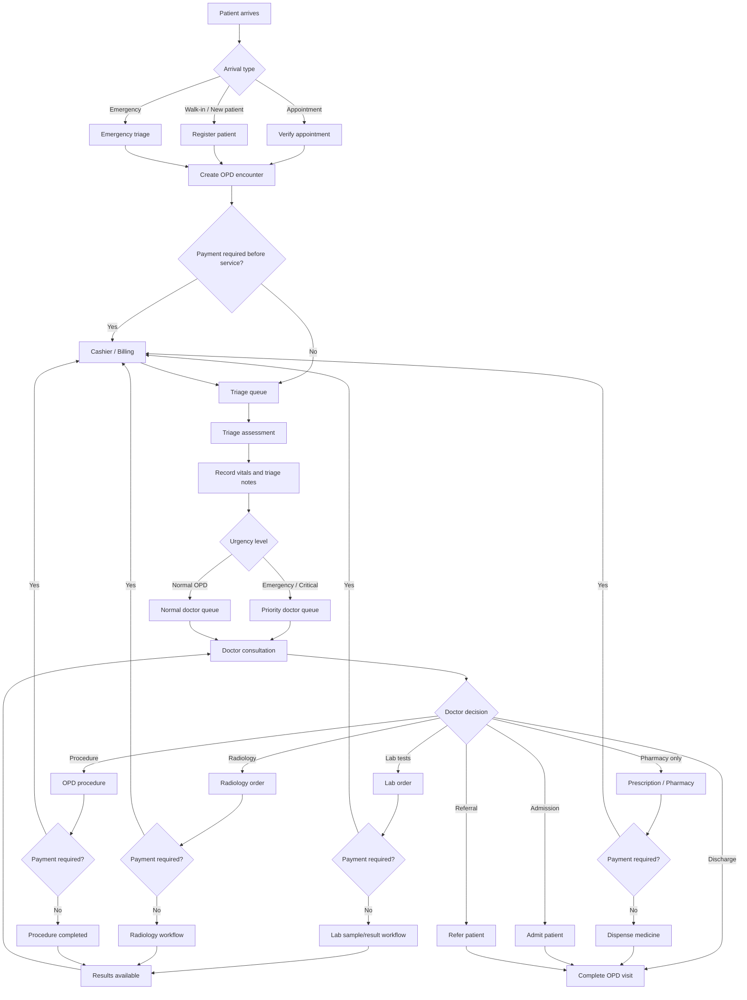

# OPD Patient Flow Blueprint

This document defines a professional outpatient department workflow that can be used to guide the implementation of the OPD and triage module in a hospital management system.

---

## 1. High-Level OPD Flow

---

## 2. Step-by-Step OPD Workflow

| Step | Stage | Main Action | Responsible Role |
|---|---|---|---|
| 1 | Arrival | Patient comes to hospital | Reception |
| 2 | Registration | Register new patient or verify existing patient | Reception |
| 3 | Appointment check | Confirm scheduled appointment if applicable | Reception |
| 4 | OPD encounter | Create OPD visit/encounter | Reception |
| 5 | Billing check | Determine if payment is required before service | Reception / Cashier |
| 6 | Payment | Receive consultation or service payment | Cashier / Billing |
| 7 | Triage queue | Patient waits for triage | Nurse / Triage |
| 8 | Triage | Record vitals, symptoms, urgency level | Nurse / Clinician |
| 9 | Doctor queue | Patient waits for assigned doctor | Reception / Nurse |
| 10 | Consultation | Doctor reviews patient, writes notes and diagnosis | Doctor / Clinician |
| 11 | Orders | Doctor requests lab, radiology, drugs, admission, or procedure | Doctor |
| 12 | Service execution | Lab, radiology, pharmacy, or procedure is performed | Relevant department |
| 13 | Result review | Patient returns to doctor if results need review | Doctor |
| 14 | Final decision | Discharge, admit, refer, follow-up, or continue treatment | Doctor |
| 15 | Close encounter | OPD visit is completed | Doctor / Reception / System |

---

## 3. Recommended OPD Encounter Statuses

| Status | Meaning |
|---|---|
| `Registered` | Patient has been registered for OPD |
| `Waiting Payment` | Patient must pay before proceeding |
| `Waiting Triage` | Patient is waiting for triage |
| `In Triage` | Triage is currently being done |
| `Waiting Doctor Assignment` | Patient needs a doctor assigned |
| `Waiting Doctor Review` | Patient is waiting to see the doctor |
| `In Consultation` | Doctor is attending to the patient |
| `Waiting Lab Payment` | Lab order exists but payment is required |
| `Waiting Lab Sample` | Patient needs sample collection |
| `Waiting Lab Results` | Lab work is in progress |
| `Waiting Radiology Payment` | Imaging order exists but payment is required |
| `Waiting Radiology` | Patient is waiting for imaging |
| `Waiting Pharmacy Payment` | Prescription exists but payment is required |
| `Waiting Pharmacy` | Patient is waiting for dispensing |
| `Waiting Procedure` | Patient is waiting for OPD procedure |
| `Waiting Result Review` | Results are ready and patient should return to doctor |
| `Admitted` | Patient has been sent to inpatient/admission |
| `Referred` | Patient has been referred elsewhere |
| `Completed` | OPD encounter is closed |

---

## 4. Patient Categories

| Category | Description |
|---|---|
| Appointment patient | Patient already has a scheduled appointment |
| Walk-in patient | Patient comes without appointment |
| New patient | Patient is not yet registered in the system |
| Emergency patient | Patient needs urgent triage or urgent doctor review |
| Follow-up patient | Patient returns for review after previous visit |
| Review patient | Patient returns after lab/radiology results |

---

## 5. Key OPD Actions by Role

| Role | Allowed Actions |
|---|---|
| Reception | Register patient, create OPD encounter, assign queue, assign doctor |
| Triage nurse | Record vitals, set urgency level, send to doctor |
| Cashier / Biller | Receive payments, confirm invoices, clear patient for service |
| Doctor / Clinician | Write notes, diagnose, prescribe, order lab/radiology, request admission, refer, discharge |
| Lab staff | Collect sample, process test, upload results |
| Radiology staff | Perform imaging, upload report/results |
| Pharmacy staff | View prescription, dispense drugs |
| Admin | Configure providers, services, fees, rooms, departments, permissions |

---

## 6. Recommended OPD Module Design

The OPD screen should have one main patient list showing active OPD patients only.

### Default Columns

| Column | Purpose |
|---|---|
| Patient | Name, patient ID, contact |
| Status | Current OPD stage |
| Provider | Assigned doctor or clinician |
| Arrival time | Time patient entered OPD |

Each row should be clickable and open a modal with available actions based on the patient’s current status.

---

## 7. Status-Based Available Actions

| Current Status | Available Actions |
|---|---|
| Waiting Payment | Pay consultation, cancel visit |
| Waiting Triage | Record vitals, skip triage, assign doctor |
| Waiting Doctor Assignment | Assign doctor |
| Waiting Doctor Review | Start consultation |
| In Consultation | Add notes, request lab, request radiology, prescribe, admit, refer, discharge |
| Waiting Lab Results | View order, update lab result |
| Waiting Result Review | Send back to doctor |
| Waiting Pharmacy | Dispense medicine |
| Completed | View summary, print summary |

---

## 8. Important Implementation Rule

The OPD encounter should be the central record.

Everything should attach to the OPD encounter:

- Triage notes
- Vital signs
- Consultation notes
- Diagnosis
- Lab orders
- Radiology orders
- Prescriptions
- Procedures
- Invoices/payments
- Admission request
- Referral
- Discharge summary
- Print history

This keeps the OPD flow clean and easy to track.