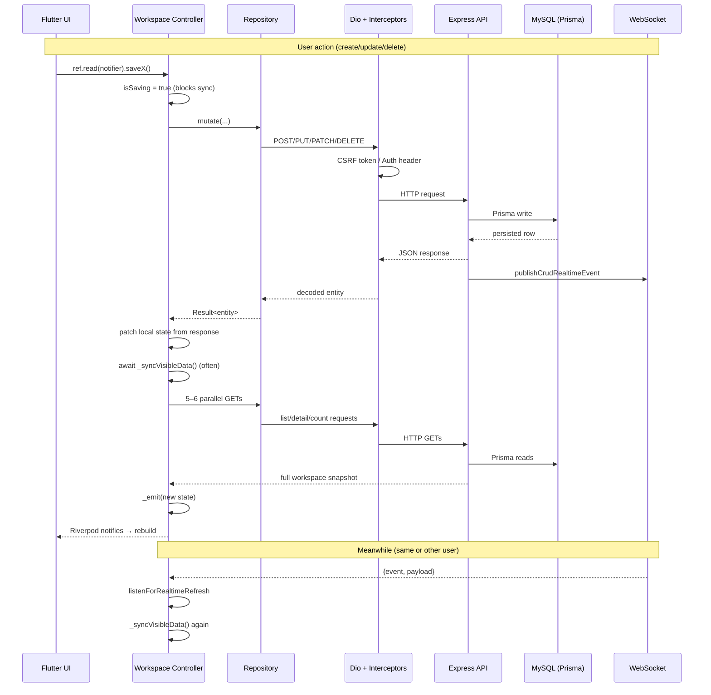

# Data Flow & Bottleneck Analysis — HMS App

This is a **refetch-heavy sync model**, not a push-to-UI model. After most actions, the UI waits for HTTP round-trips (often several in sequence) before it reflects changes. That pattern is repeated across **15+ workspace controllers**, which is why the delay feels general.

---

## Architecture at a Glance

| Layer | Tech | Role |
|-------|------|------|
| **UI** | Flutter widgets | `ref.watch(controllerProvider)` → rebuild on state change |
| **State** | Riverpod `AsyncNotifier` | Workspace controllers own all visible data |
| **Data** | Repository impls | DTO ↔ Entity mapping, call `ApiClient` |
| **Network** | Dio + interceptors | REST only for reads/writes |
| **Backend** | Express → Service → Prisma | Persist to MySQL, broadcast WebSocket event |
| **Realtime** | WebSocket | Notification only — **does not carry full entity data** |

There is **no Bloc/Provider package**, no HTTP response cache, and **no optimistic updates** (UI changes only after HTTP success).

---

## General Data Flow



### Read path (page load)

1. Widget mounts → `ref.watch(opdWorkspaceControllerProvider)` (or equivalent).
2. Controller `build()` runs `runWorkspaceInitialLoad()` (session wait + up to 3 retries).
3. `_loadInitialState()` fetches lists — often **sequentially**, not in parallel.
4. `Timer.periodic` starts background polling.
5. `listenForRealtimeRefresh` subscribes to WebSocket events.

### Write path (user action)

1. UI calls controller method (e.g. `startOpdFlow`, `saveVitals`).
2. Controller sets `isSaving: true`.
3. Repository sends **one REST mutation**.
4. Backend persists → returns JSON → broadcasts WebSocket event.
5. Controller patches local state from the mutation response.
6. Controller often calls **`_syncVisibleData()`** — refetches entire visible workspace.
7. UI rebuilds only after step 6 completes.

---

## The Core Pattern (Repeated Everywhere)

OPD is representative of all clinical workspaces:

```36:47:frontend/lib/features/opd/presentation/controllers/opd_workspace_controller.dart
    listenForRealtimeRefresh(
      ref: ref,
      events: RealtimeEventGroups.opd,
      shouldDefer: () => _isSyncing || (_currentState?.isSaving ?? false),
      onRefresh: (_) => _syncFromRealtime(),
    );
    final Result<OpdWorkspaceState> result = await runWorkspaceInitialLoad(
      ref,
      _loadInitialState,
    );
    _startVisibleDataSync();
```

After a mutation:

```1121:1147:frontend/lib/features/opd/presentation/controllers/opd_workspace_controller.dart
    _emit(current.copyWith(isSaving: true, clearLastFailure: true));
    try {
      final Result<OpdFlowDetail> result = await action();
      return result.when(
        success: (OpdFlowDetail detail) async {
          // ... local patch from response ...
          await _flushPendingRefresh();
          if (refreshAfter) {
            final AppFailure? syncFailure = await _syncVisibleData();
```

And `_syncVisibleData` fires **5–6 REST calls** per sync:

```848:872:frontend/lib/features/opd/presentation/controllers/opd_workspace_controller.dart
    final Future<Result<AppPage<OpdAppointment>>> appointmentsFuture =
        _repository.listAppointments(current.appointmentQuery);
    final Future<Result<AppPage<OpdQueueEntry>>> queueFuture = _repository
        .listVisitQueues(current.queueQuery);
    final Future<Result<AppPage<OpdFlowSummary>>> flowsFuture = _repository
        .listOpdFlows(current.flowQuery);
    final Future<Result<AppPage<OpdFlowSummary>>> triageFuture = _repository
        .listTriageQueue(current.triageQueueQuery);
    final Future<Result<OpdFlowAggregateCounts>> summaryCountsFuture =
        _repository.getOpdSummaryCounts();
    // ... plus selected flow detail if open ...
```

---

## Identified Bottlenecks (Ranked by Impact)

### 1. Post-mutation full workspace refetch (highest impact)

**What:** After many mutations, the app does not trust the mutation response alone. It immediately runs `_syncVisibleData()`, which re-downloads all visible lists.

**Why it hurts:** User waits for **mutation HTTP + 5–6 GET HTTP calls** before the UI settles. On slow networks this can be 2–10+ seconds.

**Scope:** OPD, Lab, Pharmacy, Nursing, ICU, IPD, Emergency, Clinical, Radiology, Theater, HR, etc.

---

### 2. Triple refresh redundancy

Three independent mechanisms all trigger the same heavy `_syncVisibleData()`:

| Trigger | Interval / When |
|---------|-----------------|
| **Post-mutation** | Every save with `refreshAfter: true` |
| **WebSocket** | On any matching CRUD event |
| **Polling** | Every 6–20s while screen is open |

Polling intervals across workspaces:

| Workspace | Poll interval |
|-----------|---------------|
| OPD | 6s |
| Emergency, ICU, IPD, Clinical, Patient registry | 8s |
| Lab, Nursing, Pharmacy, Physiotherapy, Theater | 10s |
| Radiology | 12s |
| Biomedical, Operations | 15s |
| HR, Mortuary | 20s |

```763:766:frontend/lib/features/opd/presentation/controllers/opd_workspace_controller.dart
  void _startVisibleDataSync() {
    _syncTimer ??= Timer.periodic(_syncInterval, (_) {
      unawaited(_syncVisibleData());
    });
```

**Why it hurts:** Network and DB load stay high even when idle. During saves, `isSaving` and `_isSyncing` defer refreshes, then a **queued flush** runs afterward — another full sync.

---

### 3. No optimistic UI

**What:** `isSaving: true` shows a loading state, but lists do not update until HTTP completes. There is no “update UI now, rollback on failure” pattern.

**Why it hurts:** Perceived latency equals full server round-trip + refetch time, even when the mutation response already contains the changed entity.

---

### 4. WebSocket does not update UI directly

**What:** Backend publishes events after persistence (`publishCrudRealtimeEvent`), but the frontend **ignores the payload** and re-fetches via HTTP.

```16:21:frontend/lib/core/realtime/realtime_refresh.dart
/// Realtime listener for workspace refreshes triggered by websocket events.
///
/// Controllers keep their own business-specific refresh methods; this helper
/// centralizes websocket subscription, burst coalescing, and in-flight refresh
/// protection so the first update is reflected immediately while follow-up
/// events during the same refresh are collapsed into one trailing reload.
```

**Why it hurts:** Every realtime update adds another full HTTP sync cycle instead of merging the event payload into local state.

---

### 5. Sequential initial bootstrap

**What:** OPD loads 5 list endpoints one after another on first paint:

```679:714:frontend/lib/features/opd/presentation/controllers/opd_workspace_controller.dart
    final Result<AppPage<OpdAppointment>> appointmentsResult = await _repository
        .listAppointments(appointmentQuery);
    // ...
    final Result<AppPage<OpdQueueEntry>> queueResult = await _repository
        .listVisitQueues(queueQuery);
    // ...
    final Result<AppPage<OpdFlowSummary>> flowsResult = await _repository
        .listOpdFlows(flowQuery);
    // ...
    final Result<OpdFlowAggregateCounts> summaryCountsResult = await _repository
        .getOpdSummaryCounts();
    // ...
    final Result<AppPage<OpdFlowSummary>> triageQueueResult = await _repository
        .listTriageQueue(triageQueueQuery);
```

**Why it hurts:** First load latency = sum of RTTs, not max. Same pattern appears in Lab, Discharge, Communications (metrics before workspace).

---

### 6. Dio interceptor chain (every request)

Interceptor order on authenticated client:

```71:86:frontend/lib/core/network/network_providers.dart
  dio.interceptors.addAll(<Interceptor>[
    LocaleInterceptor(readLocale: () => _readRequestLocale(ref)),
    CsrfInterceptor(tokenDio: csrfDio),
    AuthInterceptor(
      readAccessToken: tokenProvider.readAccessToken,
      onTokenRefresh: () async {
        return (await tokenProvider.refreshStoredSession()) != null;
      },
```

| Interceptor | Delay |
|-------------|-------|
| **CsrfInterceptor** (`QueuedInterceptor`) | Extra GET `/auth/csrf-token` before first POST/PUT/PATCH/DELETE; serializes mutating requests |
| **AuthInterceptor** (`QueuedInterceptor`) | Async token read per request; on 401 → refresh session → retry entire request |
| **ConnectionRetryInterceptor** | Up to 2 retries with 100–200ms backoff |

**Why it hurts:** First mutation in a session pays a CSRF round-trip. Expired tokens double request latency. `QueuedInterceptor` serializes concurrent writes.

---

### 7. Session/bootstrap retries

```58:74:frontend/lib/core/workspace/workspace_session_guard.dart
Future<Result<T>> runWorkspaceInitialLoad<T>(
  Ref ref,
  Future<Result<T>> Function() load, {
  int maxAttempts = 3,
}) async {
  await awaitAuthenticatedWorkspaceSession(ref);
  // ...
  for (var attempt = 0; attempt < maxAttempts; attempt++) {
    if (attempt > 0) {
      await Future<void>.delayed(Duration(milliseconds: 120 * attempt));
```

**Why it hurts:** Up to 360ms+ artificial delay before workspace data appears when auth timing races.

---

### 8. `isSaving` / `_isSyncing` deferral queue

While a save is in flight, realtime and poll refreshes are deferred (`shouldDefer`, `_refreshPending`). After save completes, `_flushPendingRefresh()` runs **another** `_syncVisibleData()`.

**Why it hurts:** If mutation already triggers `_syncVisibleData()`, you can get **back-to-back full refetches**.

---

### 9. Backend middleware stack (per request)

Every API call passes through JWT auth, RBAC, CSRF validation, module entitlement (60s cache), rate limiting, i18n. After writes, `publishCrudRealtimeEvent` also runs a recipient lookup query.

**Why it hurts:** Adds fixed overhead on every one of the 5–6 post-mutation GETs.

---

### 10. Await chain in `_refreshVisiblePages`

Futures are started in parallel but **awaited sequentially**:

```864:872:frontend/lib/features/opd/presentation/controllers/opd_workspace_controller.dart
    final Result<AppPage<OpdAppointment>> appointmentsResult =
        await appointmentsFuture;
    final Result<AppPage<OpdQueueEntry>> queueResult = await queueFuture;
    final Result<AppPage<OpdFlowSummary>> flowsResult = await flowsFuture;
```

**Impact:** Moderate — network runs in parallel, but UI emission waits until all complete. Slowest endpoint sets the floor.

---

## Why the Delay Feels “General”

It is not one bug. It is a **systemic sync strategy**:

```
User action → 1 write HTTP → local patch → full workspace refetch (5–6 GETs)
                ↑                                    ↑
         CSRF/Auth overhead              Same path for WS + polling
```

Every module workspace controller follows this template. Any screen that calls `ref.read(notifier).mutate()` inherits the same latency profile.

---

## Summary: Where Time Is Spent (Typical Mutation)

| Phase | Approx. cost |
|-------|--------------|
| CSRF fetch (first mutation) | +1 RTT |
| Mutation POST/PUT | 1 RTT + DB write + middleware |
| Local state patch | ~instant |
| `_syncVisibleData()` | 5–6 RTTs + 5–6 DB reads |
| Pending flush (if WS/poll queued) | Another full sync |
| **Total perceived delay** | **Often 2× mutation time or more** |

---

## Highest-Leverage Fixes (If You Want to Address This)

1. **Stop unconditional post-mutation `_syncVisibleData()`** — trust mutation response + targeted invalidation (only refetch affected list).
2. **Optimistic updates** — update UI immediately, reconcile on response.
3. **Use WebSocket payload** — merge entity deltas instead of full HTTP reload.
4. **Reduce or disable polling** when WebSocket is connected.
5. **Parallelize `_loadInitialState()`** — `Future.wait` instead of sequential `await`.
6. **Parallelize `_refreshVisiblePages` emission** — emit partial updates as each list returns.

---

## Key Files Reference

### Frontend — infrastructure

- `frontend/lib/bootstrap.dart` — app startup, `ProviderScope`
- `frontend/lib/core/network/network_providers.dart` — Dio wiring
- `frontend/lib/core/network/api_interceptors.dart` — CSRF, Auth interceptors
- `frontend/lib/core/workspace/workspace_session_guard.dart` — session wait + bootstrap retries
- `frontend/lib/core/realtime/realtime_refresh.dart` — WebSocket → HTTP refetch bridge
- `frontend/lib/core/realtime/realtime_service.dart` — WebSocket connection

### Frontend — exemplar feature slice (OPD)

- `frontend/lib/features/opd/domain/repositories/opd_repository.dart`
- `frontend/lib/features/opd/data/repositories/opd_repository_impl.dart`
- `frontend/lib/features/opd/presentation/controllers/opd_workspace_controller.dart`
- `frontend/lib/features/opd/presentation/pages/opd_workspace_page.dart`

### Backend — infrastructure

- `backend/src/server.js` — HTTP + WS bootstrap
- `backend/src/app/index.js` — middleware stack
- `backend/src/middlewares/auth.middleware.js`
- `backend/src/middlewares/module-entitlement.middleware.js`
- `backend/src/lib/websocket/crud-realtime.js` — post-persistence broadcast
- `backend/prisma/schema.prisma`
