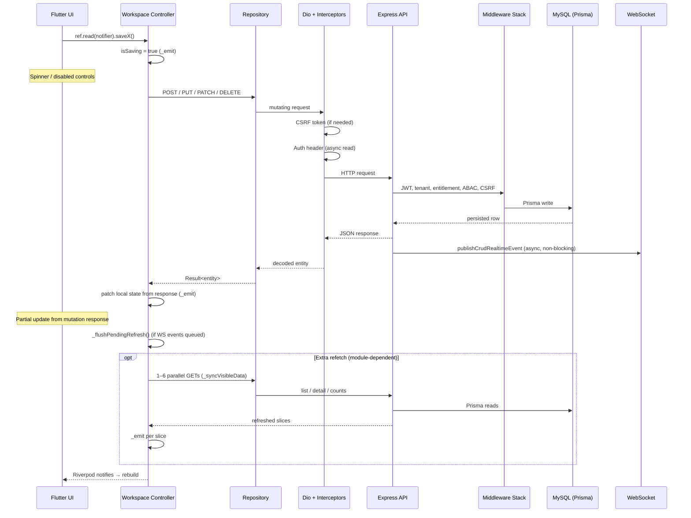
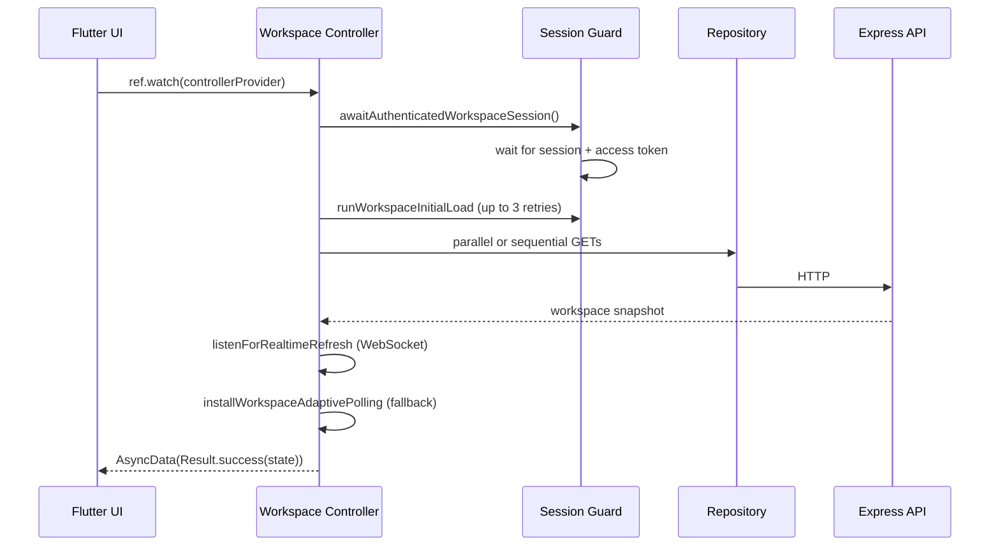
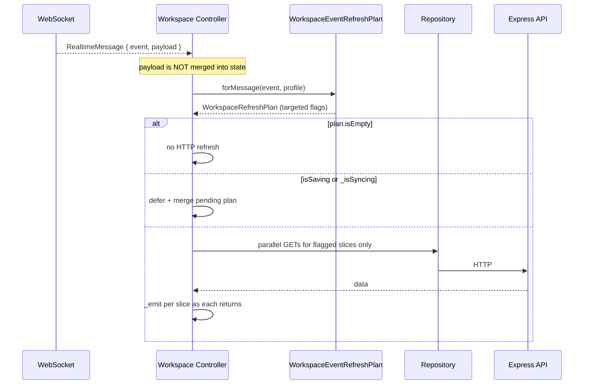

# Data Flow & Bottleneck Analysis — HMS App

This report maps how data moves from the Flutter UI through the REST API to MySQL and back, and why updates often feel slow across the app. The delay is **systemic**: the architecture is a **refetch-heavy HTTP sync model** shared by **50+ workspace controllers**, not a single bug in one screen.

---

## Architecture at a Glance

| Layer | Technology | Role |
|-------|------------|------|
| **UI** | Flutter widgets | `ref.watch(*ControllerProvider)` → rebuild when controller emits new state |
| **State** | Riverpod `AsyncNotifier` | Workspace controllers own all visible list/detail data |
| **Data** | Repository impls | DTO ↔ entity mapping; call `ApiClient` |
| **Network** | Dio + interceptors | REST for all reads and writes |
| **Backend** | Express 5 → Service → Prisma | Persist to MySQL/MariaDB; broadcast WebSocket event |
| **Realtime** | WebSocket (`ws`) | **Signal only** — frontend ignores payload and re-fetches via HTTP |

There is **no Bloc/Provider package**, **no HTTP response cache** for workspace data, and **no true optimistic updates** (UI does not change before the mutation HTTP call completes).

---

## General Data Flow

### Write path (user action → UI update)



### Read path (page load)



### Cross-user update path (realtime)



---

## Frontend Layers

### 1. UI → Controller

- Pages use `ConsumerWidget` / `ConsumerStatefulWidget`.
- Data binding: `ref.watch(opdWorkspaceControllerProvider)` (pattern repeated per module).
- Mutations: `ref.read(opdWorkspaceControllerProvider.notifier).startOpdFlow(...)`.
- UI rebuilds only when the controller calls `_emit(...)`, which sets `state = AsyncData(Result.success(nextState))`.

### 2. Controller → Repository → ApiClient

- Each feature has `domain/repositories/*_repository.dart` + `data/repositories/*_repository_impl.dart`.
- Repositories inject `apiClientProvider` (`DioApiClient`).
- All network results are `Result<T>` — failures never throw to the UI.
- Default API timeout: **30 seconds** (`AppConfig.apiTimeout`).

### 3. Dio interceptor chain (every request)

Order on the authenticated client (`network_providers.dart`):

| # | Interceptor | Latency impact |
|---|-------------|----------------|
| 1 | `LocaleInterceptor` | Negligible |
| 2 | `CsrfInterceptor` (**QueuedInterceptor**) | Extra GET `/auth/csrf-token` before first POST/PUT/PATCH/DELETE; **serializes** all mutating requests |
| 3 | `AuthInterceptor` (**QueuedInterceptor**) | Async token read per request; on 401 → refresh session → **retry entire request** |
| 4 | `ConnectionRetryInterceptor` | Up to 2 retries with 100–200 ms backoff |
| 5 | `SafeDiagnosticsInterceptor` | Debug logging only |

`QueuedInterceptor` on CSRF and Auth means concurrent writes are **not truly parallel** at the HTTP layer.

### 4. Session bootstrap delays

`workspace_session_guard.dart`:

- Blocks workspace load until session is restored and `ensureAccessTokenReady()` completes.
- `runWorkspaceInitialLoad` retries up to **3 times** with **120 ms × attempt** artificial delay between retries.

---

## Sync Mechanisms (Three Paths to the Same HTTP Refetch)

Every clinical workspace uses the same trio:

| Mechanism | When it runs | What it does |
|-----------|--------------|--------------|
| **Mutation response patch** | After every successful write | Merges returned entity into local lists (`_upsertAppointment`, `_replaceOrder`, etc.) |
| **WebSocket → HTTP** | On matching domain events while connected | Maps event → `WorkspaceRefreshPlan` → targeted `_syncVisibleData(plan)` |
| **Adaptive polling** | **Only when WebSocket is disconnected** | `Timer.periodic` fires full or partial `_syncVisibleData` |

### WorkspaceRefreshPlan (targeted refetch)

`workspace_refresh_plan.dart` defines bitflags (`appointments`, `queue`, `flows`, `primaryList`, `selectedDetail`, etc.). `workspace_event_refresh_plan.dart` maps each WebSocket event to the **smallest** plan for that workspace profile.

Example (OPD / clinical flow): an appointment event refreshes only `appointments + summaryCounts`; an OPD flow event refreshes `flowWorkspace` (flows + triage + summaryCounts + selectedDetail).

### Adaptive polling intervals (when WS is down)

| Workspace | Interval |
|-----------|----------|
| OPD | 6 s |
| Emergency, ICU, IPD, Clinical, Patient registry | 8 s |
| Lab, Nursing, Pharmacy, Physiotherapy, Theater | 10 s |
| Radiology | 12 s |
| Biomedical, Operations | 15 s |
| HR, Mortuary | 20 s |

When disconnected, polling typically calls `_syncVisibleData(plan: WorkspaceRefreshPlan.full)` — a **full workspace reload** every N seconds.

### Deferral and coalescing

While `isSaving` or `_isSyncing` is true:

- Realtime refreshes are **deferred** (`shouldDefer` in `listenForRealtimeRefresh`).
- Pending plans are **merged** (`WorkspaceRefreshPlan.merge`).
- After the save/sync completes, `_flushPendingRefresh()` runs another HTTP sync.

`listenForRealtimeRefresh` also **coalesces bursts**: only the last event in a burst is kept; intermediate events are dropped.

---

## Backend Layers

### Request flow

```
HTTP → server.js → createApp (global middleware) → /api/v1 router
  → authenticate → hydrateRequestScope → enforceTenantScope
  → hydrateRequestContext → enforceModuleEntitlement → enforceAbacAccess
  → module routes → validateRequest (Zod) → controller → service → repository → Prisma
```

### Post-write realtime

After persistence, services call `publishCrudRealtimeEvent` (`backend/src/lib/websocket/crud-realtime.js`):

1. `findRealtimeRecipientUserIds` — DB lookup for who should receive the event.
2. `publishDomainEvent` — push to connected WebSocket clients.

Delivery failures do **not** roll back the DB write. The HTTP response is already sent before WS delivery completes.

### Backend latency contributors (per request)

| Component | File | Impact |
|-----------|------|--------|
| **ABAC** | `abac.middleware.js` | 3–5 DB queries on clinical/patient routes before controller logic |
| **Module entitlement** | `module-entitlement.middleware.js` | Up to 3 COUNT queries on cache miss (60 s TTL) |
| **ETag / offline** | `offline.middleware.js` | SHA1 hash of full JSON body on GET responses where validators enabled |
| **Prisma pool** | `prisma/client.js` | Default **10** connections; workspace aggregation endpoints fire many parallel queries |
| **Friendly ID** | Prisma extension | Extra counter upsert on every `create` |
| **Deep middleware stack** | `app/index.js` | 14 global + 6 API-v1 middlewares on every protected request |

Background workers (report scheduler 60 s, notification delivery 15 s) do **not** block normal API responses.

---

## Identified Bottlenecks (Ranked by Impact)

### 1. HTTP round-trip is the gate for all UI updates (highest impact)

**What:** Even with WebSocket connected, the frontend **never applies WS payload to state**. Every realtime signal triggers one or more HTTP GETs. The user's own mutation must complete its REST call before any local patch.

**Why it hurts:** Perceived latency = mutation RTT + (optional) refetch RTT(s). On slow networks this is often **2–10+ seconds**.

**Scope:** All 50 workspace controllers.

---

### 2. Post-mutation and post-save follow-up refetches (high impact)

**What:** Behavior varies by module, but many paths still trigger extra HTTP after the mutation response:

| Pattern | Example | Effect |
|---------|---------|--------|
| Full workbench reload | Lab `createOrder` → `_refreshWorkbench()` | 1 write + 1 aggregated GET |
| Targeted sync after queue change | OPD `_mutateQueue(refreshFlowsAfter: true)` | 1 write + flowWorkspace GETs |
| Deferred flush | Any save while WS events arrive | Mutation + queued `_syncVisibleData` |
| Full reload on realtime | Billing `refresh()` on any billing event | 2 sequential GETs (overview + items) |
| `invalidateSelf()` | Billing, home dashboard, reports | Full controller rebuild + all bootstrap GETs |

OPD flow mutations patch locally and usually **do not** refetch — but `_flushPendingRefresh()` after every save can still add a full sync if events were deferred during `isSaving`.

---

### 3. WebSocket disconnected → polling fallback (high impact when WS unstable)

**What:** `WorkspaceAdaptivePolling` stops when connected, but when disconnected the app falls back to periodic **full** `_syncVisibleData(WorkspaceRefreshPlan.full)` every 6–20 s.

**Why it hurts:** Any WS outage (reconnect backoff up to **10 s**, network blips, token refresh) means updates appear only on the next poll tick. Users experience multi-second to multi-minute staleness.

---

### 4. `isSaving` / `_isSyncing` deferral queue (medium–high impact)

**What:** While a save is in flight:

- Realtime refreshes from other users are queued.
- New sync requests merge into `_pendingRefreshPlan`.
- After save: `_flushPendingRefresh()` runs the merged plan.

**Why it hurts:** If a slow mutation runs (up to 30 s timeout), the screen stays stale for remote changes. After save, an additional sync cycle runs even when the mutation response already updated local state.

---

### 5. Dio `QueuedInterceptor` serializes writes (medium impact)

**What:** `CsrfInterceptor` and `AuthInterceptor` extend `QueuedInterceptor`. Concurrent mutations are processed one at a time through the interceptor chain.

**Why it hurts:** Rapid user actions (or UI that fires multiple writes) stack behind each other. First mutation in a session also pays an extra CSRF token GET.

---

### 6. Backend middleware + DB on every refetch slice (medium impact)

**What:** Each `_syncVisibleData` slice is a separate HTTP request, each passing the full middleware stack (JWT, tenant, entitlement, ABAC on clinical routes).

**Why it hurts:** A `flowWorkspace` refresh = 4+ requests × middleware overhead × DB reads. Connection pool (10) can queue under load.

---

### 7. WebSocket payload ignored (medium impact)

**What:** Backend sends `{ resource_id, affected, payload }` in realtime events. Frontend uses only `message.event` to pick a refresh plan, then re-downloads data.

**Why it hurts:** Every realtime update costs full HTTP bandwidth and server query time instead of merging a small delta.

---

### 8. No true optimistic UI (medium impact)

**What:** Controllers set `isSaving: true` and wait for HTTP before patching state. There is no "update UI immediately, rollback on failure."

**Why it hurts:** Perceived latency always includes the full mutation round-trip, even when the change is predictable (toggle status, move queue position).

**Note:** After HTTP success, many controllers **do** patch locally without refetching (OPD appointments, Lab `_mutateWorkflow`). This helps but does not eliminate the initial wait.

---

### 9. Module-specific full-reload patterns (medium impact)

| Module | Pattern |
|--------|---------|
| **Billing** | Sequential bootstrap: `getWorkspace` then `listWorkItems`; realtime → full `refresh()` |
| **Home dashboard** | 600 ms debounce + `invalidateSelf()` on realtime |
| **Lab** | `createOrder` always calls `_refreshWorkbench` after void response |
| **HR** | `fullOnMatch` profile → full workspace on any CRUD event |
| **Communications** | Panel snapshot cache — instant tab switch but potentially stale |

---

### 10. Search debounce (low–medium, deliberate)

UI-level debounce before list API calls: 220–400 ms on patient registry, billing, clinical, lab search fields.

---

### 11. Bootstrap and retry delays (low impact)

- Session wait before first API call.
- Up to 360 ms retry delay on failed initial load.
- Connection retry: 100–200 ms per retry.

---

## Why the Delay Feels "General"

It is not one screen or one API. It is a **repeated architectural template**:

```
User action
  → wait for mutation HTTP (CSRF + Auth + middleware + DB write)
  → patch local state from response (sometimes)
  → optional _syncVisibleData (1–6 more HTTP GETs)
  → optional _flushPendingRefresh (if WS events deferred during save)

Remote changes
  → WebSocket event
  → ignore payload
  → _syncVisibleData (HTTP refetch)
  → OR wait 6–20 s if WS disconnected
```

Every workspace controller (`*_workspace_controller.dart`) follows this pattern. Any screen that calls `ref.read(notifier).mutate()` inherits the same latency profile.

---

## Typical Mutation Timeline

| Phase | Approx. cost |
|-------|--------------|
| CSRF fetch (first mutation in session) | +1 RTT |
| Mutation POST/PUT/PATCH/DELETE | 1 RTT + middleware + DB write |
| Local state patch from response | ~instant |
| `_flushPendingRefresh` (if WS events queued during save) | 1–6 RTTs |
| Extra `_syncVisibleData` (module-dependent) | 0–6 RTTs |
| **Total perceived delay** | **Often 1.5×–3× a single RTT; worse on slow networks or WS outage** |

---

## Highest-Leverage Fixes

1. **Apply WebSocket payload to local state** — merge entity deltas instead of HTTP reload on every event.
2. **Stop unconditional post-mutation refetch** — trust mutation response; invalidate only affected slices (Lab `createOrder`, billing full refresh are prime targets).
3. **True optimistic updates** — update UI on action, reconcile/rollback on HTTP response.
4. **Reduce disconnect polling scope** — use targeted plans in adaptive polling, not always `WorkspaceRefreshPlan.full`.
5. **Batch workspace reads** — single backend "workspace snapshot" endpoint per module instead of 4–6 parallel GETs each with full middleware.
6. **Relax `QueuedInterceptor` where safe** — allow parallel reads; cache CSRF token aggressively.
7. **Backend: cache ABAC decisions** or skip redundant scope queries on list endpoints within a request burst.

---

## Key Files Reference

### Frontend — infrastructure

| File | Purpose |
|------|---------|
| `frontend/lib/bootstrap.dart` | App startup, `ProviderScope` |
| `frontend/lib/core/network/network_providers.dart` | Dio wiring |
| `frontend/lib/core/network/api_client.dart` | `DioApiClient` wrapper |
| `frontend/lib/core/network/api_interceptors.dart` | CSRF, Auth (`QueuedInterceptor`) |
| `frontend/lib/core/workspace/workspace_session_guard.dart` | Session wait + bootstrap retries |
| `frontend/lib/core/workspace/workspace_refresh_plan.dart` | Targeted refetch flags |
| `frontend/lib/core/workspace/workspace_event_refresh_plan.dart` | Event → plan mapping |
| `frontend/lib/core/workspace/workspace_adaptive_polling.dart` | Poll only when WS down |
| `frontend/lib/core/workspace/workspace_fast_sync.dart` | `installWorkspaceAdaptivePolling`, `WorkspacePendingRefresh` |
| `frontend/lib/core/realtime/realtime_refresh.dart` | WebSocket → HTTP refetch bridge |
| `frontend/lib/core/realtime/realtime_service.dart` | WebSocket connection + reconnect backoff |

### Frontend — exemplar feature slice (OPD)

| File | Purpose |
|------|---------|
| `frontend/lib/features/opd/domain/repositories/opd_repository.dart` | Repository interface |
| `frontend/lib/features/opd/data/repositories/opd_repository_impl.dart` | Dio calls |
| `frontend/lib/features/opd/presentation/controllers/opd_workspace_controller.dart` | State, mutations, sync |
| `frontend/lib/features/opd/presentation/pages/opd_workspace_page.dart` | UI binding |

### Backend — infrastructure

| File | Purpose |
|------|---------|
| `backend/src/server.js` | HTTP + WS bootstrap |
| `backend/src/app/index.js` | Global middleware stack |
| `backend/src/app/router.js` | `/api/v1` route mounting + auth chain |
| `backend/src/middlewares/auth.middleware.js` | JWT / API key auth |
| `backend/src/middlewares/abac.middleware.js` | Attribute-based access (DB-heavy) |
| `backend/src/middlewares/module-entitlement.middleware.js` | Subscription gate (cached 60 s) |
| `backend/src/middlewares/offline.middleware.js` | ETag, idempotency, cache headers |
| `backend/src/lib/websocket/crud-realtime.js` | Post-persistence broadcast |
| `backend/src/prisma/client.js` | Prisma + connection pool |
| `backend/prisma/schema.prisma` | Database schema |

---

*Analysis based on codebase review. Models: exploration agents + direct file verification.*
