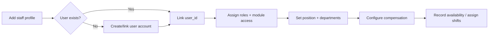
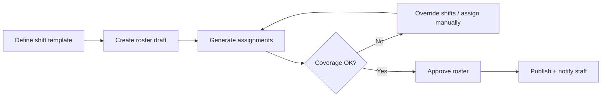

# Human Resources Module — Comprehensive Implementation Prompt

## Objective

Complete the **Human Resources (HR) Module** for HOSSPI HMS so HR managers and workforce administrators can run hospital staffing end-to-end from one professional workspace: onboard staff, assign roles and module access, attach staff to departments and units, configure compensation, manage leave and availability, create and approve work schedules (including reusable templates), generate and publish rosters, and preview/process payroll — **enabling** clinical and operational modules without owning patient flows.

**Source of truth:**

1. [app-write-up.mdc](./.cursor/app-write-up.mdc) — HR module scope vs clinical and operational modules; demo seed expectations (default HR account, department users)
2. [flows/opd-flow.mdc](./.cursor/flows/opd-flow.mdc) — §5 role teams (reception, nurse, doctor, billing, lab, radiology, pharmacy) require rostered staff with correct RBAC
3. [flows/ipd-flow.mdc](./.cursor/flows/ipd-flow.mdc) — §13 key IPD actions by role (admission desk, bed manager, ward nurse, doctor, cashier, pharmacy, lab, radiology, OT, housekeeping, admin)
4. [flows/nursing-flow.mdc](./.cursor/flows/nursing-flow.mdc) — ward nursing coverage depends on assigned nurses and shift rosters
5. [prompts/04-access-admin-module-prompt.md](./prompts/04-access-admin-module-prompt.md) — Users/Roles owns authentication accounts and permission matrices; HR links staff profiles to users
6. [prompts/02-subscriptions-module-prompt.md](./prompts/02-subscriptions-module-prompt.md) — module entitlements (`hr-rosters`) gate HR workspace visibility

**Central workforce rule:** every staff profile, assignment, shift, roster, leave record, and compensation row attaches to **tenant/facility scope** and links to a **user account** when the person needs system access. HR does **not** mutate OPD/IPD encounters, patient records, clinical orders, or patient billing. Clinical modules consume **user accounts, role assignments, and rostered availability** maintained by HR (and Users/Roles).

Deliver a **professional HR workspace**: staffing overview, staff directory, work-item queues, roster generation/publish, and payroll preview/process — modal-first, permission-gated, and realtime-aware.

---

## Global Implementation Standards

Mandatory platform rules for all work in this module.

| Area | Requirement |
| ---- | ----------- |
| Product scope | [app-write-up.mdc](./.cursor/app-write-up.mdc) — respect module boundaries; do not duplicate workflows owned elsewhere. |
| Patient flows | Align with [`.cursor/flows/`](./.cursor/flows/). Use [opd-flow.mdc](./.cursor/flows/opd-flow.mdc) and [ipd-flow.mdc](./.cursor/flows/ipd-flow.mdc) for journey touchpoints; read the module-specific flow file when one exists (lab, nursing, pharmacy, radiology, discharge, emergency, icu, theater). |
| Encounters | One active OPD encounter per outpatient visit; IPD admission as inpatient hub; overlays (ICU, Theater) and executing departments attach — never parallel admission records. |
| UI/UX | Modern, clean, minimal on-screen text; hospital workflow language (not enum names or UUIDs). Follow `frontend/.cursor/design-system.mdc`, `components.mdc`, `ui-patterns.mdc`, `ui-workspace.mdc`, `layouts.mdc`, `platform_guidelines.mdc`. Reuse `frontend/lib/shared/*` before creating new widgets. Responsive on Android, iOS, web, Windows, macOS, Linux. |
| Theming and i18n | Full theme support (light/dark/system). All user-visible strings in `app_en.arb` — no hardcoded labels. |
| Modal-first workflows | **All create/edit/approve/complete/handoff actions** use **in-page dialogs, bottom sheets, or nested modals**. Do **not** navigate to new routes for within-module workflows. Shell entry route `/hr` and deep-link **pre-selection** (`?id=`, `?queue=`, `?search=`) are allowed; selecting a row opens the workspace detail panel — not a separate workflow page. |
| Realtime sync | Subscribe to relevant `RealtimeEventGroups` in workspace controllers. After mutations, refresh affected rows, detail panels, summary cards, and nav badges. Keep UI, frontend state, backend services, and database consistent. |
| Architecture | UI/controllers → repository → API (`frontend/.cursor/feature_workflow.mdc`, `architecture.mdc`). Enforce RBAC + ABAC + tenant/facility scope + module entitlements (frontend `AccessGate` + backend authorization). |
| Database | Apply migrations for schema changes per backend standards; keep API contracts and schema aligned. |
| Quality gate | From `frontend/`: `flutter pub get`, `dart format --set-exit-if-changed .`, `flutter analyze`, `flutter test`. From `backend/`: targeted `npm test` for touched modules. |

---

## Flow Integration Requirements

HR does not implement patient flow stages. Integration is **indirect** — HR ensures the right people exist, are authorized, and are scheduled.

### OPD flow ([opd-flow.mdc](./.cursor/flows/opd-flow.mdc) §5)

| OPD concept | HR module responsibility |
| ----------- | ------------------------ |
| Reception team | Staff profiles + roles for receptionists; module entitlement for scheduling/patients |
| Nurse team | Rostered nurses for vitals and queue support; availability windows |
| Doctor team | Provider schedules and practitioner type on staff profile; compensation per consultation/review where applicable |
| Billing / Lab / Radiology / Pharmacy teams | Correct RBAC roles and module entitlements so each module's workspace actions are unlocked |
| Provider assignment | OPD doctor assignment consumes staff marked available and with clinical roles — HR rosters and availability must align |

### IPD flow ([ipd-flow.mdc](./.cursor/flows/ipd-flow.mdc) §13)

| IPD role | HR module responsibility |
| -------- | ------------------------ |
| Admission desk, bed manager | Staff exist with correct roles and facility scope |
| Ward nurse, charge nurse | Shift rosters and assignments cover ward units; swap/leave approvals do not leave gaps unflagged |
| Doctor / consultant | Active assignments to departments/units; on-call or ward-round coverage via rosters |
| Cashier, insurance, pharmacy, lab, radiology, OT | Role matrices per §13; HR assigns roles, Users/Roles defines permissions |
| Housekeeping | Distinct from HR — HR does not own cleaning tasks; may share staff directory for non-clinical staff |
| Admin | Configure via Users/Roles; HR does not replace tenant/facility admin |

### Nursing flow ([nursing-flow.mdc](./.cursor/flows/nursing-flow.mdc))

| Nursing concept | HR module responsibility |
| --------------- | ------------------------ |
| Ward care loop | Assigned ward nurses appear as users with nursing role in Nursing/IPD modules |
| Handover / transfer | Staff on shift at time of handover traceable via shift assignments |
| Discharge nursing clearance | Not an HR stage — HR only ensures staffing coverage |

### Users/Roles and subscriptions ([04-access-admin](./prompts/04-access-admin-module-prompt.md), [02-subscriptions](./prompts/02-subscriptions-module-prompt.md))

| Concept | HR responsibility |
| ------- | ----------------- |
| User accounts | HR staff profiles **link** to users; account creation/activation may delegate to Access Admin or be initiated from HR onboarding modal |
| Role assignment | HR assigns **one or more roles** to the linked user; backend `user_role` is source of truth |
| Module entitlements | Subscription module flags (`hr-rosters`, `scheduling`, `clinical`, etc.) determine menu visibility — HR surfaces effective access on staff detail |
| Multi-role users | Supported per app-write-up; staff detail shows all active roles |
| Permission preview | Show effective permissions summary (read-only) — editing permission groups stays in Access Admin |

### Billing touchpoint

Payroll deductions or stipends that reference patient billing are owned by [prompts/09-billing-module-prompt.md](./prompts/09-billing-module-prompt.md). HR owns **payroll runs and staff compensation** — not patient invoices.

### Recommended HR journeys

**Staff onboarding**



**Roster lifecycle**



---

## Current State (read before changing code)

### Already in place

| Area | Location / API | Notes |
|------|----------------|-------|
| Product scope | `.cursor/app-write-up.mdc` | HR owns staff profiles, assignments, shifts, rosters, leave, workforce planning |
| Frontend scaffold | `frontend/lib/features/hr/` | `data/`, `domain/`, `presentation/` layers |
| Workspace UI | `hr_workspace_page.dart` (~3.4k lines) | Staff directory, detail panel, work queues, modal CRUD |
| Controller | `hr_workspace_controller.dart` | Load, filter, select staff, mutations, deep-link query |
| Repository | `hr_repository_impl.dart` | Workspace, reference data, staff CRUD, assignments, leave, availability, shifts, swaps, roster generate/publish, payroll process |
| HR workspace API | `backend/src/modules/hr-workspace/` | `GET /hr/workspace`, `/work-items`, `/reference-data`; roster/swap/leave/payroll actions |
| Legacy CRUD APIs | `staff-profile`, `staff-assignment`, `staff-leave`, `staff-availability`, `shift-assignment`, `shift-swap`, `roster`, `payroll-run`, `staff-compensation` | Hybrid workspace + granular REST |
| Roster engine | `backend/.../hr-roster-engine.js` | Generate assignments, coverage metrics, constraints |
| Feature flag | `hr_workspace_v1` | Required for `/hr` workspace routes |
| Module gate | `hr-rosters` entitlement + `hrRead`/`hrWrite`/`rosterWrite`/`rosterApprove`/`rosterPublish` permissions | See `AccessRequirement` constants in workspace page |
| Deep links | `HrWorkspaceQuery.fromUri` | `?id=`, `?queue=`, `?search=` parsed |
| Localization | `app_en.arb` | HR workspace strings largely defined |
| Backend tests | hr-workspace service/schema tests | Present |
| Compensation schema | `staff_compensation` table | Pay types: `PER_HOUR`, `PER_MONTH`, `PER_PROCEDURE` |
| Realtime | HR workspace update events | Emitted to HR recipient roles after mutations |

### Known gaps to close

- **Staff onboarding flow** — create staff requires manual `user_id`; no integrated user creation or initial role assignment from HR.
- **Roles and module access UI** — `HrReferenceData.roles` loaded from API; **no assign/revoke role or module entitlement actions** on staff detail.
- **Multi-department UX** — backend supports multiple `staff_assignment` rows; UI needs clearer primary vs additional assignments and end-assignment flow.
- **Compensation pay types** — clinical models (per task, per review) not in schema; compensation dialog covers hourly/monthly/procedure only.
- **Schedule templates** — `shift_templates` in reference data used in shift dialogs; **no template CRUD** or bulk attach-to-staff workflow.
- **Work-item completeness** — approve/reject leave, swap, roster publish, payroll process partially wired in queue panel; preview payroll not exposed in UI.
- **Roster ↔ OPD scheduling** — provider schedules for OPD not fully unified with HR rosters.
- **Access Admin overlap** — no deep-link from HR staff detail to Users/Roles for advanced permission editing.
- **Large page file** — `hr_workspace_page.dart` mixes directory, detail, queues, and all dialogs; needs widget extraction to `presentation/widgets/`.
- **Frontend tests** — expand beyond backend coverage.
- **Feature flag gating** — document enablement for dev/demo (`hr_workspace_v1` + `hr-rosters` subscription).

---

## Scope — Core Capabilities

Implement or finish the following, in priority order. Each item maps to app-write-up HR responsibilities and flow staffing requirements.

### 1. Staff directory and profiles

**Goal:** Searchable workforce directory with professional detail panel for every staff member.

**Actions:**

- Keep primary layout: **summary cards → staff directory → detail panel** (`AppWorkspace`, `AppWorkspaceSummaryGrid`, `AppListTable`, `AppWorkspaceSplitContent`, `AppWorkspaceDetailPanel`).
- Directory columns: staff number, name, position, primary department, practitioner type, assignment status — use display IDs and names, never raw UUIDs.
- Search and filters: text search, position, department, practitioner type via `AppSearchBar` advanced filters.
- Detail overview: `AppInfoTileGrid` for staff number, name, position, department, practitioner type, hire date, linked user.
- **Add staff** and **Edit staff** via `showAppWorkspaceMutationDialog` — create requires `user_id` today; extend to support user picker or nested onboarding sub-modal.
- Preserve deep links: `/hr?id={staffDisplayId}` pre-selects staff in directory.

**Reference APIs:** `GET /hr/workspace`, `GET /staff-profiles`, `GET /staff-profiles/:id`, `POST/PUT /staff-profiles`.

### 2. Roles, permissions, and module access

**Goal:** HR can grant staff the roles and module rights needed for OPD/IPD/clinical modules per flow role tables.

**Actions:**

- Add staff detail actions: **Assign role**, **Revoke role**, **View module access** (read-only effective entitlements).
- Support **one or more roles** per linked user; show role list with facility/department scope where applicable.
- Module access summary: which subscribed modules the user can reach (derived from roles + subscription entitlements).
- Use existing Users/Roles APIs (`user_role`, role assignment) via HR repository or coordinated service — do not duplicate permission group editing ( stays in Access Admin).
- Optional: **Open in Users/Roles** deep-link for advanced permission matrix editing.
- Gate actions with `AccessRequirement` (HR write + appropriate admin permissions).

**Reference APIs:** Users/Roles module endpoints; `GET /hr/reference-data` (roles list).

### 3. Positions, titles, and department assignments

**Goal:** Staff can hold a position/title and belong to one or more departments (and unit/room where supported).

**Actions:**

- **Assign position** dialog — update staff position/title and practitioner type.
- **Assign department** dialog — create new `staff_assignment` with facility, department, unit, room, start/end dates.
- Detail **Assignments** section: list all active and historical assignments; distinguish primary department (on profile) vs additional assignments.
- Add **End assignment** action when backend supports status/end-date update.
- Directory shows primary department; detail shows full assignment history.

**Reference APIs:** `POST /staff-assignments`, `GET /staff-assignments?staff_profile_id=`, `PUT /staff-profiles/:id`.

### 4. Leave and availability

**Goal:** HR and managers approve leave; staff availability informs roster generation.

**Actions:**

- **Request leave** from staff detail (create `staff_leave`).
- Work queue **Leave requests** — approve/reject with reason via nested confirmation modal.
- **Record availability** — time slots and preference status on staff detail.
- Summary card counts pending leave; card click filters queue in place (no route change).
- After approval/rejection, refresh staff detail leave section and queue counts.

**Reference APIs:** `POST /staff-leaves`, `POST /hr/leaves/:id/approve`, `POST /hr/leaves/:id/reject`, `POST /staff-availabilities`.

### 5. Work schedules, shift templates, and rosters

**Goal:** HR creates individual schedules and reusable templates, generates rosters, and publishes approved schedules.

**Actions:**

- **Shift templates (predefined schedules):** CRUD modal for templates; attach template to one or more staff via shift assignment or roster generation.
- **Assign shift** — assign staff to a shift (optionally from template).
- **Record availability** — feeds roster engine constraints.
- **Shift swap** — staff-initiated swap request; HR approves/rejects from swap queue.
- Work queues:
  - **Roster drafts** — generate (`dry_run` preview in nested modal), publish, override shifts.
  - **Unassigned shifts** — assign or override from queue row actions.
  - **Overdue shifts** — surface staffing gaps (when queue supported).
- Roster workflow: draft → generate assignments → review coverage → approve → publish + notify staff.
- Align published rosters with OPD provider scheduling where product requires unified coverage (coordinate with OPD module — do not duplicate OPD encounter logic).

**Reference APIs:** `GET /hr/rosters/:id/workflow`, `POST /hr/rosters/:id/generate`, `POST /hr/rosters/:id/publish`, `POST /hr/shifts/:id/override`, `POST /shift-assignments`, `POST /shift-swap-requests`, `POST /hr/swaps/:id/approve|reject`.

### 6. Payroll and compensation

**Goal:** Per-staff compensation configuration and facility payroll run processing.

**Actions:**

- **Compensation** dialog per staff — configure pay type and rate:
  - **Per hour** (`PER_HOUR`)
  - **Per month / salary** (`PER_MONTH`)
  - **Per procedure** (`PER_PROCEDURE`) — extend to **per task** / **per review** if schema migration approved
- Multiple compensation rows with effective from/to dates and currency; show in detail **Compensation** section.
- **Run payroll** from staff detail or **Payroll drafts** queue — create payroll run, preview line items (`GET /hr/payroll-runs/:id/preview`), process with notes.
- Payroll is operational — not on critical path for single patient flow; audit trail on process action.
- Gate payroll actions with `hrWrite` + `financialApprove` where required.

**Reference APIs:** `staff_compensation` CRUD (via staff profile or dedicated endpoint), `POST /payroll-runs`, `GET /hr/payroll-runs/:id/preview`, `POST /hr/payroll-runs/:id/process`.

### 7. Work-item queues and summary cards

**Goal:** HR managers see pending approvals and act without leaving the workspace.

**Actions:**

- Summary cards (filter queues in place):
  - Pending leave
  - Pending shift swaps
  - Roster drafts awaiting publish
  - Unassigned shifts
  - Payroll drafts
- Hide zero-value cards where workspace pattern expects it.
- Work queue panel: `AppListTable` with queue-specific columns and row actions (approve, reject, generate, publish, assign).
- **Approval framing:** show pending state, next required action, and approving role on actionable rows.
- Queue switcher in detail panel header — icon buttons filter `HrQueue` without navigation.

**Reference APIs:** `GET /hr/work-items?queue=`.

### 8. Cross-module staffing enablement

**Goal:** Staff configured in HR appear correctly in clinical modules.

**Actions:**

- After role assignment, session refresh or realtime update ensures OPD/IPD/Nursing modules see assignable users.
- Practitioner type and department on staff profile visible to modules that consume provider lists.
- Document demo seed: default HR user, department users (doctor, nurse, receptionist, etc.) per app-write-up.
- Do **not** call patient-flow APIs from HR; integration is via shared user/role/staff records only.

### 9. Deep links, notifications, and shell integration

**Goal:** Staff reach HR context from home and cross-module entry points.

**Actions:**

- Parse `/hr?id=&queue=&search=` — implemented via `HrWorkspaceQuery`; verify router wiring and pre-selection.
- Home dashboard **approve roster** action → `/hr?queue=ROSTER_DRAFTS` when entitled.
- Realtime: subscribe to HR workspace events; refresh summary counts and selected detail after remote mutations.
- Shell nav badge when pending work items exist (if pattern supported).

### 10. Widget extraction and test coverage

**Goal:** Maintainable codebase and regression safety.

**Actions:**

- Extract from `hr_workspace_page.dart` into `presentation/widgets/`: staff detail body, work queue panel, dialog field groups (`_StaffProfileFields`, `_AssignmentFields`, etc.).
- Add controller tests for mutations and queue filters.
- Add widget tests for critical dialogs (staff create, leave approve, roster publish) where feasible.
- Backend: extend hr-workspace tests for new role-assignment coordination endpoints if added.

---

## UI / UX Requirements

This is a **workforce administration workspace** — staff directory, assignments, leave, shifts, rosters, and payroll — **not** a patient clinical queue. Mirror peer **admin/management workspaces** (Users/Roles, Operations, Subscriptions) for consistency.

### Organization

- **Two primary regions:**
  1. **Staff directory** (default) — searchable workforce list with detail panel.
  2. **Work queues** — management approvals (toggle via summary cards or queue panel).
- **Single primary task per region:** directory (browse/select staff), detail (read + act), queues (approve/process).
- **Progressive disclosure:** summary cards for queue counts; advanced filters in search bar; complex forms in dialogs/nested modals.
- **Role-appropriate actions:** HR manager (full CRUD), roster supervisor (approve/publish), payroll approver (process runs) — per permissions.

### Simplicity

- Use hospital workflow language: "Assign to department", "Approve leave", "Publish roster" — not enum names (`PER_HOUR`, `ROSTER_DRAFTS`).
- One status chip + next-action column on work queues.
- **Action panel hierarchy** on staff detail: profile edit → assignments → roles/access → compensation → scheduling → leave.
- Loading/saving: `AppWorkspace` status tone; refresh selected staff row and summary cards after modal success.

### Professional HR feel

- Calm admin aesthetic; urgency color only on overdue shifts or SLA-breached items if applicable.
- Display IDs (`staffNumber`, `displayId`) — copyable where useful.
- No patient data in HR workspace.
- Full theme support (light/dark/system); all strings in `app_en.arb`.
- Responsive on Android, iOS, web, Windows, macOS, Linux.
- Accessibility: semantic labels on tables, action buttons, and dialogs.

### Modal-first (mandatory)

- **All** create, edit, assign, approve, reject, generate, publish, and process actions use `showAppWorkspaceMutationDialog`, `AppDialog`, or nested modals.
- Multi-step flows (roster generate preview → confirm publish; payroll preview → process) use **nested modals**, not new routes.
- Shell route `/hr` and query pre-selection only — never `/hr/staff/:id/edit` style workflow routes.

---

## Architecture and Conventions

Follow `frontend/.cursor/feature_workflow.mdc`, `architecture.mdc`, and `realtime_sync.mdc`. **Re-read app-write-up and OPD/IPD flow role tables before any HR flow change.**

| Rule | Requirement |
| ---- | ----------- |
| Layering | Widgets → Riverpod controllers → repository interface → impl → API client. No API calls from widgets. |
| State | `AsyncNotifier` + `Result<T>` / `AppFailure` for errors. |
| DTOs | `data/dtos/` with explicit mappers to `domain/entities/`. |
| Permissions | `AccessGate` / `AppAccessActionGate`; `hr-rosters` module + `hrRead`/`hrWrite`/`rosterWrite`/`rosterApprove`/`rosterPublish`/`financialApprove`. |
| Scope | Tenant, facility, department on assignments and roster operations. |
| Module boundaries | Do not implement patient registry, OPD queues, IPD admissions, or billing in HR. |
| Users/Roles | Link staff to users; coordinate role APIs — do not duplicate permission group CRUD. |
| File size | Extract widgets to `presentation/widgets/`; shared components to `frontend/lib/shared/`. |
| Realtime | Partial refresh after modal success; subscribe to HR workspace event group. |
| Backend | Prefer extending hr-workspace service for coordinated mutations before parallel endpoints. |

**Do not** create OPD encounters or IPD admissions from HR. **Do not** own patient billing. **Do not** embed clinical order or vitals workflows.

**Reuse existing services** — analyze Access Admin user/role APIs, legacy staff CRUD modules, and hr-roster-engine before adding endpoints.

---

## Module Boundaries (do not violate)

From [app-write-up.mdc](./.cursor/app-write-up.mdc):

| Module | Owns | HR must not duplicate |
| ------ | ---- | --------------------- |
| **HR** | Staff profiles, assignments, leave, availability, shifts, rosters, payroll runs, workforce admin | — |
| **Users/Roles** | Authentication accounts, permission groups, system role definitions | Full permission matrix editing |
| **Subscriptions** | Plan modules and entitlements | Subscription CRUD |
| **OPD / IPD / Clinical** | Patient flows and encounters | Any patient queue or clinical action |
| **Billing** | Patient invoices and cashier actions | Patient billing (payroll only) |
| **Nursing** | Ward care execution on IPD admission | Nursing notes, MAR, vitals |
| **Tenant/Facility** | Org structure master data | Facility/department CRUD — consume IDs from settings |

---

## Suggested Implementation Order

1. **Audit** — map each scope item to existing dialogs/actions in `hr_workspace_page.dart`; produce gap checklist.
2. **Widget extraction** — split page into compositional widgets before adding features.
3. **Multi-assignment UX** — improve assignments section; end-assignment if API supports.
4. **Roles and module access** — staff detail actions + repository methods coordinating Users/Roles APIs.
5. **Onboarding flow** — user picker or nested create-user sub-modal on add staff.
6. **Schedule template CRUD** — template modal + attach-to-staff via shift/roster flows.
7. **Work queue completeness** — wire all approve/reject/generate/publish/preview actions; nested modals for confirm steps.
8. **Compensation pay types** — schema migration if `PER_TASK`/`PER_REVIEW` required; update dialog and payroll calculation.
9. **Deep links and home integration** — verify router, home roster action, nav badges.
10. **Tests + quality gate** — controller, repository, critical widget tests; backend hr-workspace tests.

---

## Acceptance Criteria

- [ ] HR can add, edit, and view staff profiles from `/hr` without route navigation for CRUD.
- [ ] HR can assign **one or more roles** and view **module access** for a staff member's linked user.
- [ ] HR can assign **one or more departments** (and unit/room); detail lists all assignments with dates.
- [ ] HR can set position/title and compensation (hourly, monthly, procedure/variable pay types per schema).
- [ ] HR can record availability, assign shifts, manage swap requests, and use **predefined schedule templates**.
- [ ] HR can generate, approve, and publish rosters from work queues with nested confirmation modals.
- [ ] HR can preview and process payroll runs from staff detail or payroll draft queue.
- [ ] Leave and swap queues are fully actionable with correct permissions and localized strings.
- [ ] Staff with clinical roles (doctor, nurse, receptionist, etc.) are assignable in OPD/IPD modules via user/role system per flow §5 / §13.
- [ ] No patient-flow API calls from HR module.
- [ ] All within-module actions use dialogs or nested modals — no workflow sub-routes.
- [ ] Feature flag (`hr_workspace_v1`) and module entitlement (`hr-rosters`) documented for dev/demo.
- [ ] `flutter analyze`, HR tests, and targeted backend tests pass.

---

## Quality Gate

From `frontend/` when touching Flutter:

```sh
flutter pub get
dart format --set-exit-if-changed .
flutter analyze
flutter test
```

From `backend/` when touching API or schema:

```sh
npm test -- --testPathPattern="hr-workspace|staff-profile|roster|payroll"
```

Apply database migrations per backend workflow before merging schema changes.

Manual QA (web):

```sh
cd frontend
.\tool\run_web_5201.ps1
```

Navigate to `/hr` → add staff → assign departments and roles → set compensation → create schedule from template → approve roster draft → preview payroll.

---

## Key File References

```
frontend/lib/features/hr/
  presentation/pages/hr_workspace_page.dart
  presentation/controllers/hr_workspace_controller.dart
  presentation/widgets/                    — extract target
  domain/entities/hr_entities.dart
  data/repositories/hr_repository_impl.dart
  data/dtos/hr_dtos.dart

backend/src/modules/hr-workspace/
  routes/hr-workspace.routes.js
  services/hr-workspace.service.js
  services/hr-roster-engine.js

backend/src/modules/staff-profile/, staff-assignment/, staff-leave/,
  staff-availability/, shift-assignment/, roster/, payroll-run/

Related:
  frontend/lib/features/access_admin/       — Users/Roles coordination
  prompts/04-access-admin-module-prompt.md
  prompts/24-hr-module-prompt.md            — companion summary prompt
  prompts/12-opd-module-prompt.md           — OPD staffing context
  prompts/19-ipd-module-prompt.md           — IPD staffing context
  prompts/09-billing-module-prompt.md       — payroll vs patient billing boundary

Standards:
  .cursor/app-write-up.mdc
  .cursor/flows/opd-flow.mdc, ipd-flow.mdc, nursing-flow.mdc
  frontend/.cursor/ui-workspace.mdc, design-system.mdc, realtime_sync.mdc
```

## Deliverable

A production-ready HR workspace — frontend and backend as needed — that closes the gaps above, respects module and flow boundaries, and delivers modal-first workforce administration enabling hospital clinical and operational modules.
