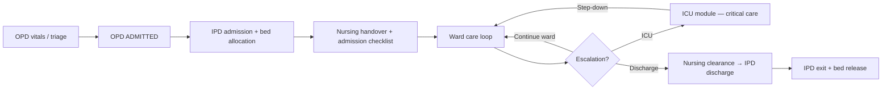

# Nursing Module — Implementation Prompt

## Objective

Complete the **Nursing Module** for Hosspi HMS so ward nurses, charge nurses, and nursing supervisors can run inpatient nursing care end-to-end: receive IPD handovers, complete admission checklists, record vitals and observations, administer medications, execute nursing tasks, manage shift handovers, support transfers and discharge clearance, and coordinate with doctors — with clear handoffs from **OPD → IPD → Nursing** and escalation paths to **ICU** when critical care is required.

Deliver a **professional, calm, ward-grade workspace** that is easy to scan during busy shifts: clear workload queues, predictable primary actions, admission-checklist visibility, and no raw internal identifiers in the UI.

**Central encounter rule:** the **IPD admission** (and its encounter) remains the parent record for ward nursing. Nursing notes, vitals, medication administration, care plans, and handovers attach to that admission — Nursing does not create parallel inpatient records.

**Module boundary (per `../.cursor/app-write-up.mdc`):** Nursing owns nursing observations, medication administration, care tasks, ward activity, and handover. Inpatient owns admission and bed assignment; ICU owns intensive-care stays and critical-alert workflows; Clinical/Doctor owns orders; Discharge owns final episode closure. Nursing executes nursing-facing work and clearance steps — it does not finalize IPD discharge or own ICU stay lifecycle.

**Flow alignment:** every nursing workflow step must map to `../.cursor/flows/ipd-flow.mdc` (steps 5–9, 11–13, 16) and respect `../.cursor/flows/opd-flow.mdc` (nurse vitals and queue support during outpatient stages; terminal `ADMITTED` handoff to IPD).

---

## Current State (read before changing code)

### Already in place

| Area | Location / API | Notes |
|------|----------------|-------|
| Frontend scaffold | `frontend/lib/features/nursing/` | `data/`, `domain/`, `presentation/` layers exist |
| Workspace UI | `nursing_workspace_page.dart` | Summary cards, ward worklist, patient detail, admission checklist panel, vitals/notes/MAR/care-plan/handover/transfer dialogs, prescription dialog, print handover |
| Controller | `nursing_workspace_controller.dart` | Realtime + periodic sync, scope/ward/search filters, detail mutations, prescription reference data |
| Repository | `nursing_repository.dart` / `nursing_repository_impl.dart` | Board via `GET /ipd-flows?include_icu=true`; mutations via IPD flow actions and related resources (`/vital-signs`, `/handovers`, `/care-plans`) |
| Backend IPD orchestration | `backend/src/modules/ipd-flow/` | `add-nursing-note`, `add-medication-administration`, `add-ward-round`, `request-transfer`, `update-transfer`, `plan-discharge` |
| ICU overlay (read) | `nursing_dtos.dart`, detail panels | `icu_status`, critical alerts, ICU observations displayed on nursing detail |
| Clinical actions (partial) | `clinical_prescription_action_dialog.dart`, `clinical_free_text_action_dialog.dart` | Prescription + free-text note; lab/radiology not wired |
| Shared vitals | `AppRecordVitalsDialog` | Reused for nursing vitals capture |
| Permissions / roles | `clinicalWrite`, `patientWrite`, `inpatient-bed-management` module | Roles: nurse, wardManager, icuManager (read context) |
| Realtime | `RealtimeEventGroups.nursing` | Admissions, vitals, pharmacy, diagnostics |
| Localization (substantial) | `app_en.arb` | Nursing workspace strings, checklist labels, action labels |
| Shell integration | `app_router.dart` | `/nursing` route with nav badge from workload count |
| Tests (minimal) | `test/features/nursing/data/nursing_dtos_test.dart` | DTO mapping only |

### Known gaps to close

- **OPD nursing scope missing** — OPD flow assigns nurses to `WAITING_VITALS` and provider-assignment support; Nursing workspace is IPD-only. No shared OPD vitals queue or deep-link from OPD nursing stages.
- **Admission checklist incomplete** — flow §5 requires receive handover, confirm identity, baseline vitals, allergies/risks, belongings, care plan, notify doctor. UI checklist infers completion from data presence but lacks explicit actions for identity confirmation, allergy capture, belongings, and doctor notification.
- **Clinical orders gap** — prescription dialog exists; lab and radiology shared dialogs not wired (unlike planned IPD/ICU patterns).
- **Nursing task orders** — flow §7 routes doctor nursing instructions to ward nursing queue; no UI to view/complete nursing-task orders on the worklist.
- **ICU boundary** — ICU status/alerts shown read-only; no **Open in ICU workspace** link; intensive monitoring mutations should live in ICU module, not duplicated in Nursing.
- **Discharge nursing clearance** — flow §10 step 7 / §12 `Nursing Clearance Pending` not modeled; checklist shows discharge pending but no structured clearance action or status sync with IPD discharge workflow.
- **Ward filter backend alignment** — `applyWard` may filter client-side only; verify `ward_id` query param on `GET /ipd-flows` matches summary-card counts.
- **Scope filter backend alignment** — scopes like `medicationDue`, `handoverPending`, `urgent` may rely on client-side `matchesScope`; prefer backend queue filters when API supports them.
- **Deep links** — no `/nursing?id={admissionDisplayId}&panel={vitals|medication|handover|checklist}` parsing in router.
- **Cross-navigation** — limited links to IPD admission detail, patient registry, OPD source encounter, or ICU workspace.
- **Dedicated module entitlement** — gates on `inpatient-bed-management`; consider `ward-nursing` or document why inpatient entitlement is correct per subscription model.
- **Large page file** — `nursing_workspace_page.dart` (~2.6k lines) mixes board, detail, dialogs, checklist; needs widget extraction.
- **Tests** — no controller, workspace, or dialog widget tests beyond DTO mapping.
- **Intake/output and care tasks** — flow §8 care loop mentions I/O and event recording; not exposed in nursing UI if backend supports them.

---

## Flow Integration Requirements

### IPD flow (`../.cursor/flows/ipd-flow.mdc`)

| IPD step / concept | Nursing module responsibility |
| ------------------ | ----------------------------- |
| Step 5–6: Bed allocation / patient arrival | Show ward/bed on board; admission checklist starts when `ADMITTED_IN_BED` |
| Step 8: Ward transfer / handover | Receive handover from admission desk, OPD, emergency, or another ward; **accept handover** dialog |
| Step 9: Nursing admission | Complete checklist: identity, vitals, allergies, belongings, care plan, notify doctor |
| Step 11: Inpatient orders | Execute nursing-facing orders; doctors place orders — nursing records administration and task completion |
| Step 12: Service execution | MAR, vitals, nursing notes, nursing-task completion feed the care loop |
| Step 13: Daily review loop | Surface vitals trend, notes, pending meds, and alerts for ward round context |
| Step 14: Transfer / escalation | Request or progress transfer; **ICU escalation** → hand off to ICU module (do not own ICU stay start) |
| Step 16: Discharge clearance | Nursing clearance checklist + patient education before IPD finalizes exit |
| Encounter status `Admitted / In Ward` | Default nursing board scope; exclude `DISCHARGED` / `CANCELLED` from active queues |
| Encounter status `In ICU` | Show on board with ICU badge; link to ICU workspace for critical-care actions |
| Backend stages | Row badges and next-action labels use backend `stage`, `next_step`, `transfer_status`, `discharge_status` |

### OPD flow (`../.cursor/flows/opd-flow.mdc`)

| OPD concept | Nursing module responsibility |
| ----------- | ----------------------------- |
| `WAITING_VITALS` | Nurses capture triage vitals — either extend Nursing workspace with OPD vitals queue or deep-link to OPD/Clinical vitals action (do not duplicate encounter) |
| `WAITING_DOCTOR_ASSIGNMENT` | Nursing-supported assignment steps when role permits |
| Doctor disposition → `ADMITTED` | OPD terminal for outpatient; nursing ward work begins after IPD admission exists |
| OPD `ADMITTED` handoff (§7) | Nursing board surfaces patient after IPD bed assignment; show linked OPD encounter on detail when API provides source |
| No duplicate encounters | Nursing lists IPD admissions for inpatient work; OPD vitals attach to OPD encounter only |
| Role rules (§5) | Nurse actions visible only when stage + permission allow; hide actions backend would reject |

### Recommended nursing patient journey



---

## Scope — Core Capabilities

Implement or finish the following, in priority order.

### 1. Ward worklist and queue contract

**Goal:** Nurses triage workload by scope aligned with IPD stages and nursing priorities.

**Actions:**

- Keep primary layout: **summary cards → worklist table → detail panel → action bar** (`AppWorkspace` pattern).
- Preserve scopes: **Assigned ward**, **Urgent**, **Medication due**, **Handover pending**, **Transfer pending**, **Discharge pending**, **All** — summary cards filter the worklist, not modal lists.
- Board columns (minimum): patient, admission no., ward/bed, stage, alerts (medication due, critical, transfer), admitted time, next action / responsible role.
- Use `GET /ipd-flows` with `include_icu=true`, `queue_scope=ACTIVE` (or `ALL`), and backend filters (`stage`, `transfer_status`, `ward_id`, `has_critical_alert`) where supported.
- Default landing: **Assigned ward** or highest-workload scope per facility policy.
- Show empty states explaining IPD entry path (“Patients appear after IPD admission and bed assignment”).
- Display IDs only — never raw UUIDs.
- Subscribe to `RealtimeEventGroups.nursing`; refresh affected row/detail after mutations.

**Reference:** `nursing_repository_impl.dart` `listWardPatients`, `ipd-flow.service.js` list filters.

### 2. Nursing admission and ward handover (IPD flow §5)

**Goal:** Complete structured ward admission when patient arrives.

**Actions:**

- Expand admission checklist to match flow §5 tasks with explicit completion actions:
  - **Receive handover** — create/accept handover with source summary (admission desk, OPD, emergency, transfer).
  - **Confirm identity** — structured confirmation (patient name, admission no., ward/bed) with timestamp and nurse actor.
  - **Baseline vitals** — `AppRecordVitalsDialog` (existing).
  - **Allergies and risk flags** — pull from patient registry; allow capture/update when permitted; show on detail header.
  - **Belongings** — optional belongings note when hospital policy requires (backend field or nursing note category).
  - **Care plan** — `addCarePlan` (existing) with observation frequency, fall risk, diet, mobility.
  - **Notify doctor** — handoff notification or documented “doctor notified” action when API supports it.
- Checklist items link to the action that completes them; show pending vs complete with audit-friendly who/when when API provides.
- IPD detail should reflect checklist progress (coordinate with IPD module — shared DTO fields or read-only mirror).

### 3. Vitals, observations, and nursing documentation

**Goal:** Capture monitoring data for the inpatient care loop (flow §8, §13).

**Actions:**

- **Vitals** — record single or vital-set via `/vital-signs` on encounter (existing); show trend/history panel.
- **Nursing notes** — `add-nursing-note` via IPD flow (existing free-text dialog).
- **Medication administration (MAR)** — `add-medication-administration` (existing dialog); link to pharmacy-issued orders when API provides order reference.
- **Care plans** — create/update care plan entries (existing).
- **Ward round notes** — if doctor ward rounds appear on timeline, nursing can view; nursing does not replace doctor round documentation.
- Timeline merges vitals, notes, MAR, handovers, transfers, ICU observations (read-only), and discharge events.

### 4. Medication and clinical order support

**Goal:** Nurses support medication workflow and doctor-ordered services without owning order authoring (except where role permits).

**Actions:**

- Keep **Record medication administration** as primary nurse action.
- **Prescription dialog** — retain for authorized roles (`clinicalWrite`); use `ClinicalRequestBillingPanel` for pay-now vs bill-later.
- Wire shared clinical order dialogs where nurses/doctors with write access need them from nursing context:
  - `ClinicalLabOrderActionDialog`
  - `ClinicalRadiologyOrderActionDialog`
- Pass `ClinicalActionContext` with patient, encounter, admission IDs from `NursingPatientDetail`.
- **Nursing task orders** — when backend exposes nursing-task queue on admission detail, show pending tasks with complete/cancel actions routed to IPD or nursing-task API.
- Orders route to department queues per flow §7; nursing does not execute lab/radiology/pharmacy department work.

### 5. Handovers and shift continuity

**Goal:** Safe nurse-to-nurse and ward-to-ward continuity (flow §8 step 4).

**Actions:**

- **Create handover** — structured handover with clinical summary, pending tasks, risk flags (existing dialog; enrich if API supports fields).
- **Accept handover** — `acceptHandover` on pending handovers (existing).
- **Pending handovers queue** — `handoverPending` scope + summary card; list pending handovers via `/handovers?status=PENDING`.
- Print/share handover summary (existing print template) for shift change packet.

### 6. Transfers and ICU escalation (IPD flow §9)

**Goal:** Support internal movement without closing the admission; defer ICU intensive care to ICU module.

**Actions:**

- **Request / update transfer** — `request-transfer`, `update-transfer` with `APPROVE`, `START`, `COMPLETE`, `CANCEL` when role permits (partially wired).
- Surface `transfer_status` on board: `REQUESTED`, `APPROVED`, `IN_PROGRESS`, `COMPLETED`.
- **ICU patients** — show `icu_status` and critical-alert badge; provide **Open in ICU workspace** deep-link (`/icu?id=…`) for monitoring, observations, and alert resolution — do not duplicate ICU mutations in Nursing.
- Ward nursing continues for non-ICU inpatients; step-down patients returning from ICU appear on board with updated location.

### 7. Discharge nursing clearance (IPD flow §10, §12)

**Goal:** Nursing completes ward checklist and patient education before IPD finalizes discharge.

**Actions:**

- When `stage=DISCHARGE_PLANNED` or `discharge_status=Nursing Clearance Pending`, show discharge clearance panel.
- Checklist: medication education, wound care instructions, follow-up appointments, belongings returned, identity band removed (per policy), patient exited confirmation prep.
- **Mark nursing clearance complete** — call backend discharge substate action when API exists; until then, document gap and use `add-nursing-note` with clearance category as interim.
- Do not expose **Finalize discharge** or **Close encounter** in Nursing — those stay in IPD per flow §10.
- `dischargePending` scope filters patients needing nursing discharge action.

### 8. OPD and cross-module navigation

**Goal:** Traceable path across modules without duplicate records.

**Actions:**

- Detail header links: **IPD admission**, **patient registry**, **OPD source encounter** (when available), **ICU workspace** (when `icu_status=ACTIVE`).
- IPD admission detail: link **Open in Nursing workspace** with admission pre-selected.
- OPD `WAITING_VITALS`: document integration path — OPD workspace vitals action vs future nursing OPD queue; preserve `encounter_id` for vitals.
- Deep links: `/nursing?id={displayId}&panel={checklist|vitals|medication|handover|discharge}` — parse in `app_router.dart`, select patient, focus panel.
- Preserve `encounter_id` from IPD overlay for vitals and clinical actions.

### 9. Localization, permissions, and polish

**Actions:**

- Audit `nursing_workspace_page.dart` for remaining hard-coded strings; migrate to `app_en.arb`.
- Gate write actions with `AccessGate` / `AppAccessActionGate` (`clinicalWrite`, `inpatient-bed-management` or dedicated nursing entitlement).
- Role matrix per flow §13: ward nurse (vitals, notes, MAR, handover, discharge checklist); ward manager (roster context, transfer approve); doctor (orders via clinical dialogs when opened from nursing).
- Extract large widgets to `presentation/widgets/` when page exceeds maintainable size.
- Severity styling for urgent/critical-alert rows consistent with ICU/IPD patterns.

---

## UI / UX Requirements

Follow `frontend/.cursor/ui-patterns.mdc`, `design-system.mdc`, `components.mdc`, and `layouts.mdc`. Mirror **IPD** and **ICU** workspace patterns (`AppWorkspace`, `AppListTable`, `AppWorkspaceDetailPanel`, `AppActionPanel`, `AppWorkspacePatientContextHeader`).

### Organization

- **Single primary task per region:** worklist (triage), detail (monitoring + history), actions (grouped bar).
- **Progressive disclosure:** summary cards for shift workload; ward/advanced filters collapsed; mutations in dialogs.
- **Four logical domains:**
  1. **Ward worklist** — active inpatients and nursing queues (default landing).
  2. **Admission & handover** — checklist and shift handover.
  3. **Care execution** — vitals, notes, MAR, care plan, nursing tasks.
  4. **Movement & exit** — transfers, ICU link, discharge clearance.
- Urgent/medication-due patients: visible badges on row + optional sort priority.

### Simplicity

- One status chip per domain (stage, transfer, discharge, ICU) — avoid duplicate badges.
- Action bar order: **Handover** → **Vitals** → **Note** → **Medication** → **Care plan** → **Clinical orders** (role-gated) → **Transfer** → **Discharge clearance**.
- Disable ward actions for ICU-primary workflows with tooltip **Open ICU workspace** when `icu_status=ACTIVE` and action belongs in ICU module.
- No raw enum names in user-facing labels.

### Professional healthcare feel

- Terminology: handover, medication administration, nursing note, care plan, discharge clearance — not generic “submit”.
- Handover-aware copy for transfers and shift changes.
- Accessibility: semantic labels on vitals fields, checklist items, and action buttons.

---

## Architecture and Conventions

Follow `frontend/docs/workflows/feature-workflow.md` and `../.cursor/` rules.

| Rule | Requirement |
|------|-------------|
| Layering | UI/controllers → repository interface → repository impl → API client. No API calls from widgets. |
| State | Riverpod `AsyncNotifier` controllers; `Result<T>` / `AppFailure` for errors. |
| DTOs | `data/dtos/` with explicit mappers to `domain/entities/`. |
| IPD orchestration | Prefer `POST /ipd-flows/:id/*` for workflow mutations on admissions. |
| Localization | All user strings in `app_en.arb`. |
| Permissions | `AccessGate` for module; action-level gates per flow §13 role matrix. |
| Shared UI | Reuse `lib/shared/clinical_actions`, `AppRecordVitalsDialog`, `lib/shared/components`. |
| Flow docs | Verify alignment with `ipd-flow.mdc` and `opd-flow.mdc` when changing nursing behavior. |
| Tests | `test/features/nursing/` — DTO mapping, controller mutations, checklist + dialog smoke tests. |

**Do not** create parallel nursing admission records. **Do not** finalize IPD discharge from Nursing. **Do not** own ICU stay start/end or critical-alert resolution — link to ICU module. **Do not** duplicate billing charge capture — use shared clinical billing panel on orders.

**Reuse existing services** — extend `ipd-flow.service.js` nursing overlays and `NursingRepositoryImpl` rather than duplicating admission queries.

---

## Suggested Implementation Order

1. **Checklist completion actions** — identity, allergies, belongings, notify doctor; wire to APIs or structured notes.
2. **Deep links** — `/nursing?id=&panel=` router parsing + IPD ↔ Nursing cross-links.
3. **Scope/backend filter alignment** — ward_id and queue scopes on `GET /ipd-flows`; fix summary-card count mismatches.
4. **Clinical orders** — lab/radiology dialogs + nursing-task queue when API available.
5. **ICU boundary** — deep-link to ICU workspace; hide duplicated ICU mutations in nursing action bar.
6. **Discharge nursing clearance** — panel + backend substate integration.
7. **OPD vitals path** — document and implement OPD `WAITING_VITALS` handoff (OPD workspace or nursing OPD queue).
8. **Widget extraction** — split `nursing_workspace_page.dart` into `presentation/widgets/`.
9. **Tests + quality gate** — repository, controller, admission checklist, primary dialogs.

Work in small, reviewable increments. One clear responsibility per new file.

---

## Acceptance Criteria

- [ ] Nurses can open Nursing workspace, filter by scope and ward, select a patient, and view detail with vitals, notes, MAR, care plans, and handovers.
- [ ] **Admission checklist** reflects flow §5 tasks with completable actions and visible progress on detail.
- [ ] Vitals, nursing notes, medication administration, care plans, and handover create/accept work with API validation errors in UI.
- [ ] Transfer request/update shows status on board; ICU patients link to ICU workspace without duplicating ICU mutations.
- [ ] **Discharge clearance** nursing steps are completable when `DISCHARGE_PLANNED`; finalize discharge remains in IPD only.
- [ ] Lab/radiology/prescription orders can be created from nursing detail when role permits, with pay-now / bill-later billing.
- [ ] OPD `ADMITTED` → IPD admission → nursing handover path is traceable via cross-links; no duplicate encounters.
- [ ] Deep links (`/nursing?id=…&panel=…`) open correct admission and panel.
- [ ] All user-facing strings localized; permissions and module entitlement enforced; no raw UUIDs in UI.
- [ ] Realtime/sync keeps worklist and detail current after mutations.
- [ ] `flutter analyze` and `flutter test` pass; new tests cover repository mapping and primary nursing flows.

---

## Quality Gate

Before marking complete, run from `frontend/`:

```sh
flutter pub get
dart format --set-exit-if-changed .
flutter analyze
flutter test
```

Run backend IPD tests from `backend/`:

```sh
npm test -- --testPathPattern=ipd-flow
```

Enable `inpatient-bed-management` module entitlement for integration testing. Manually smoke-test: OPD vitals → OPD admit → IPD bed assign → nursing handover + checklist → vitals + MAR → transfer request → discharge planned → nursing clearance → IPD finalize.

---

## Key File References

```
.cursor/flows/ipd-flow.mdc          # Nursing admission §5, care loop §8, orders §7, discharge §10
.cursor/flows/opd-flow.mdc          # Nurse vitals, ADMITTED handoff §7
.cursor/app-write-up.mdc            # Module boundaries: Nursing vs IPD vs ICU vs Discharge

frontend/lib/features/nursing/
├── data/dtos/nursing_dtos.dart
├── data/repositories/nursing_repository_impl.dart
├── domain/entities/nursing_entities.dart
├── domain/repositories/nursing_repository.dart
└── presentation/
    ├── controllers/nursing_workspace_controller.dart
    └── pages/nursing_workspace_page.dart

frontend/lib/features/ipd/           # Admission anchor, bed, discharge finalize
frontend/lib/features/icu/           # Critical care — link, do not duplicate
frontend/lib/features/clinical/      # OPD/consultation context
frontend/lib/shared/clinical_actions/
├── clinical_request_billing_panel.dart
└── dialogs/
    ├── clinical_lab_order_action_dialog.dart
    ├── clinical_radiology_order_action_dialog.dart
    ├── clinical_prescription_action_dialog.dart
    └── clinical_free_text_action_dialog.dart
frontend/lib/app/router/app_router.dart    # /nursing route + deep-link handling

backend/src/modules/ipd-flow/
├── routes/ipd-flow.routes.js        # nursing-note, medication-administration, transfers, discharge
├── services/ipd-flow.service.js     # Queue filters, nursing overlays, timeline
└── schemas/ipd-flow.schema.js

backend/src/modules/handover/        # Handover CRUD
backend/src/modules/care-plan/       # Care plan records
backend/src/modules/vital-sign/      # Vitals capture
```

---

## Flow Traceability Matrix

| Flow section | Topic | Primary implementation target |
|--------------|-------|-------------------------------|
| IPD §5 | Nursing admission checklist | `_NursingAdmissionChecklistPanel` + completion actions |
| IPD §7 | Nursing task orders | Pending tasks panel + completion |
| IPD §8 | Inpatient care loop | Vitals, MAR, notes, handover |
| IPD §9 | Transfers / ICU escalation | Transfer dialogs + ICU deep-link |
| IPD §10, §12 | Discharge + nursing clearance | Discharge clearance panel |
| IPD §13 | Ward nurse role | Permission gates on actions |
| IPD §15 | Status-based actions | Action bar visibility by `stage` |
| OPD §5 | Nurse role | OPD vitals integration path |
| OPD §7 | OPD → IPD handoff | Source encounter on detail; no duplicate records |
| app-write-up | Module boundaries | Nursing vs IPD/ICU/Discharge ownership |
