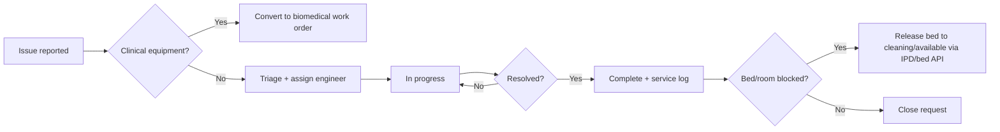

# Operations Module — Implementation Prompt

## Objective

Complete the **Operations (Facilities Maintenance) Module** for HOSSPI HMS so operations engineers, facility managers, ward in-charges, and admission desk staff can run non-clinical facility work end-to-end: report maintenance issues, triage and assign engineers, track SLA and status, log preventive service on facility assets, coordinate safety checks, hand over to biomedical when clinical equipment is involved, and unblock IPD bed/ward readiness — without duplicating housekeeping cleaning workflows or biomedical clinical-equipment lifecycle.

**Source of truth:** implement operations workflow in alignment with:

- [flows/ipd-flow.mdc](../.cursor/flows/ipd-flow.mdc) — §3 bed statuses (`Maintenance`, `Blocked`), §14.2 bed board, steps 6/14/18 (bed allocation, transfer, release/cleaning), §17 turnaround (live bed board with maintenance visibility)
- [flows/opd-flow.mdc](../.cursor/flows/opd-flow.mdc) — §5 role rules (operations is not an OPD clinical actor; facility issues may be reported upstream from reception/ward staff)
- [app-write-up.mdc](../.cursor/app-write-up.mdc) — Operations vs Housekeeping vs Biomedical module boundaries

**Central facility rule:** every maintenance request, asset service log, and operational readiness action attaches to **facility structure** (facility, ward, room, bed, non-clinical asset) — not to a patient encounter. When a request originates from an IPD admission or OPD visit context, preserve **source location and optional encounter reference** for traceability; do not create parallel admission or outpatient records in Operations.

Deliver a **professional, calm, engineering-grade workspace** optimized for triage under load: role-focused queues, SLA visibility, predictable primary actions, location context at a glance, and no raw internal identifiers in the UI.

---

## Current State (read before changing code)

### Already in place

| Area | Location / API | Notes |
|------|----------------|-------|
| Product scope | `../.cursor/app-write-up.mdc` | Operations owns electrical, plumbing, water, power, HVAC, safety, maintenance requests, operational readiness |
| IPD bed context | `../.cursor/flows/ipd-flow.mdc` §3, §14.2 | Recommended bed statuses include `Maintenance`, `Blocked`; operations should unblock beds after repair |
| Frontend scaffold | `frontend/lib/features/operations/` | `data/`, `domain/`, `presentation/` layers exist |
| Workspace UI | `operations_workspace_page.dart` | Request queue, summary cards, filters, detail dialog, triage/assign/status/service-log/note actions, report dialog |
| Controller | `operations_workspace_controller.dart` | Realtime + periodic sync, pagination, status/priority/facility/asset/date filters, mutations |
| Repository | `operations_repository.dart` / `operations_repository_impl.dart` | CRUD-ish on `/maintenance-requests`; triage; status update; notes via description append; `/assets`; `/asset-service-logs` |
| Backend API | `backend/src/modules/maintenance-request/` | List, get, create, update, delete, `POST …/triage`, `POST …/convert-to-work-order` |
| Metadata encoding | `operations_dtos.dart` | Category, priority, issue, location parsed from structured `description` lines on read; written on create |
| Housekeeping overlap | `frontend/lib/features/housekeeping/` | Also lists/creates maintenance requests; realtime events shared via `HOUSEKEEPING_EVENTS` |
| Biomedical bridge | `maintenance-request.service.js` | `convertMaintenanceRequestToWorkOrder` creates `equipment_work_order` linked to request |
| Permissions / module gate | `facilities-maintenance` entitlement | `operationsRead` / `operationsWrite`; route `/operations` in `app_routes.dart` |
| Realtime | `RealtimeEventGroups.operations` | Maintenance triage/convert + housekeeping workspace updates |
| Localization | `app_en.arb` | Operations workspace strings largely defined (scopes, categories, dialogs, report) |
| Shell integration | `app_router.dart` | `/operations` route with nav badge from `workloadCount` (open + in-progress) |
| Tests | `test/features/operations/` | DTO parsing + controller load/mutation tests exist |

### Known gaps to close

- **No structured backend fields** — category, priority, issue, location, assignee, SLA live in `description` text; fragile parsing; priority filter is client-side only.
- **`convert-to-work-order` not wired in frontend** — biomedical handoff for clinical-equipment issues unavailable from Operations UI.
- **No ward/room/bed linkage** — IPD flow expects bed `Maintenance`/`Blocked` status; requests use free-text `location` only; no `ward_id` / `bed_id` on request or bed-status side effect on complete.
- **No IPD / OPD entry points** — ward nurses and bed managers cannot raise operations requests from IPD bed board or nursing detail with pre-filled location.
- **No dedicated asset board** — assets load for pickers/summary count only; no asset status workspace tab per operational readiness.
- **Housekeeping boundary unclear in UI** — both modules expose maintenance requests; Operations should own engineering triage; Housekeeping should own cleaning-linked requests without duplicate triage UX.
- **Biomedical boundary** — `GENERAL_ASSET` vs clinical equipment not distinguished; no prompt to convert when category implies biomedical ownership.
- **Deep links missing** — `/operations?id=…` query params not parsed to pre-select request or open detail panel.
- **SLA breach visibility** — `dueAt` computed client-side but no overdue queue, badge, or summary card.
- **Backend priority filter** — `listRequests` does not pass `priority` query param; filtering happens in DTO layer after fetch.
- **Cancel/delete flow** — repository has no delete; terminal cancel relies on status PUT only.
- **Operational readiness report** — report dialog is client-side summary only; no export or scheduled ops dashboard integration.
- **Large page file** — `operations_workspace_page.dart` (~1.9k lines) mixes queue, detail, dialogs; needs widget extraction.
- **IPD bed board missing** — IPD module gap; when IPD bed board lands, Operations must integrate maintenance status and cross-links.

---

## Flow Integration Requirements

### IPD flow (`../.cursor/flows/ipd-flow.mdc`)

| IPD concept | Operations module responsibility |
| ----------- | -------------------------------- |
| §3 Bed statuses `Maintenance` / `Blocked` | Operations request completion (or explicit “release bed” action) should coordinate updating bed status back to `Cleaning` or `Available` via bed/IPD APIs — Operations does not own bed assignment but unblocks beds after repair. |
| §6 Bed allocation | Beds in `Maintenance`/`Blocked` must not appear as assignable; bed board shows linked open operations request and link to Operations detail. |
| Step 14 Transfers | Urgent HVAC/power/plumbing failure may block transfer target ward — show active facility alerts on IPD transfer bed picker when API provides ward-level open requests. |
| Step 18 Bed release | After patient exit, housekeeping owns cleaning; Operations owns repair if bed/room needs maintenance before return to `Available`. |
| §14.2 Bed board | IPD bed board “Next action” for maintenance beds → **Open in Operations** or **Create maintenance request** (pre-filled ward/bed). |
| §13 Role: Housekeeping vs operations | IPD `operations` role may view bed board; engineering actions live in Operations workspace. |
| §16 Encounter hub | Operations does not attach clinical artifacts to IPD encounter; optional `source_admission_id` / `source_encounter_id` metadata for audit only. |

### OPD flow (`../.cursor/flows/opd-flow.mdc`)

| OPD concept | Operations module responsibility |
| ----------- | -------------------------------- |
| §5 Role rules | Operations staff do not perform OPD clinical actions; reception/nurse may **report facility issue** (waiting area AC, water leak) as operations request without OPD stage changes. |
| §6 UI patterns | Mirror summary-card filter behavior and `AppWorkspace` layout consistency with OPD/IPD workspaces. |
| §7 `ADMITTED` handoff | Not an Operations stage change; if facility issue blocks ward readiness, show request status to admission desk via IPD bed/ward context. |
| No duplicate encounters | Reporting from OPD context must not create OPD encounters or alter OPD stage. |

### Module boundaries (`../.cursor/app-write-up.mdc`)

| Module | Owns | Operations must not duplicate |
| ------ | ---- | ----------------------------- |
| **Operations** | Non-clinical facility maintenance, HVAC, power, plumbing, safety readiness | — |
| **Housekeeping** | Cleaning tasks, bed turnover, sanitation schedules | Cleaning workflows, housekeeping task completion |
| **Biomedical** | Clinical equipment registry, calibration, equipment work orders | Equipment PM lifecycle after conversion |
| **IPD** | Admission, bed assign/release, discharge | Admission lifecycle, clinical orders |
| **Rooms, wards, beds** | Master structure | Ward/bed CRUD — consume IDs from facility settings |

### Recommended operations journey



---

## Scope — Core Capabilities

Implement or finish the following, in priority order. Each item maps to flow sections and app-write-up Operations responsibilities.

### 1. Maintenance request queue and role-focused scopes

**Goal:** Operations staff triage open facility work by status, priority, category, and SLA.

**Actions:**

- Keep primary layout: **queue → request detail → action panel** (`AppWorkspace`, `AppListTable`, `AppWorkspaceDetailPanel`, `AppActionList`).
- Align queue scopes with backend `MaintenanceStatus`:
  - **Open** → `OPEN` (default landing for engineers)
  - **In progress** → `IN_PROGRESS`
  - **Overdue** → open/in-progress where `dueAt < now` (client until backend adds `sla_breached` filter)
  - **Completed** → `COMPLETED`
  - **Cancelled** → `CANCELLED`
  - **All** → no status filter
- Summary cards filter the queue (mirror OPD §6 and IPD §14); hide zero-value cards.
- Table columns: request no., category, priority, status, location (ward/room/bed/asset), facility, reported time, SLA due, assignee, next action.
- Use display IDs (`displayId`, `human_friendly_id`) — never surface raw UUIDs.
- Preserve realtime sync via `RealtimeEventGroups.operations`; refresh selected detail after mutations.

**Reference APIs:** `GET /maintenance-requests`, `GET /maintenance-requests/:id`.

### 2. Create and report maintenance requests

**Goal:** Any authorized staff can report non-clinical facility issues with enough location context for engineers.

**Actions:**

- Keep **Create request** dialog with category (`ELECTRICAL`, `PLUMBING`, `WATER`, `POWER_BACKUP`, `HVAC`, `GENERAL_ASSET`, `SAFETY`, `OTHER`), priority, issue, facility, asset, location notes.
- Add **ward / room / bed picker** when facility structure APIs provide options — store in structured fields when backend adds them; until then extend description block with `Ward:`, `Bed:` lines consistently.
- Support **report from context** — IPD bed board, nursing detail, reception: open Operations create dialog with `location` and optional `source_admission_display_id` pre-filled (read-only on detail).
- Distinguish copy for clinical-adjacent issues: suggest **Convert to biomedical** when category is `GENERAL_ASSET` and asset is linked to equipment registry.

**Reference APIs:** `POST /maintenance-requests`.

### 3. Triage, assign, and SLA tracking

**Goal:** Supervisors assign engineers and set SLA targets per app-write-up operational readiness.

**Actions:**

- Keep **Assign / triage** → `POST …/triage` with `assigned_engineer`, `triage_summary`, `sla_hours`.
- Show triage metadata on detail (assignee, SLA hours, triage summary) — parse from description until API exposes structured fields.
- Add **Overdue** scope and nav badge emphasis when any active request is past SLA.
- **Update status** — `OPEN` ↔ `IN_PROGRESS` ↔ `COMPLETED` / `CANCELLED` with resolution notes and `resolved_at` on complete.

**Reference APIs:** `POST …/triage`, `PUT /maintenance-requests/:id`.

### 4. Facility assets and preventive service logs

**Goal:** Track non-clinical facility assets (generators, pumps, HVAC units) and preventive maintenance history.

**Actions:**

- Add **Asset board** tab or section: list `/assets` with status, facility, tag, last service date (from latest `asset-service-log`).
- Keep **Add service log** on detail and asset board → `POST /asset-service-logs`.
- Show service log timeline on request detail when linked asset exists.
- Asset status should reflect open requests (read-only indicator) when API provides aggregate.

**Reference APIs:** `GET /assets`, `GET /asset-service-logs`, `POST /asset-service-logs`.

### 5. Biomedical handoff (clinical equipment boundary)

**Goal:** Clinical equipment issues route to Biomedical per app-write-up; Operations retains request traceability.

**Actions:**

- Wire **`convertToWorkOrder`** in repository → `POST /maintenance-requests/:id/convert-to-work-order` with `equipment_registry_id`, `assigned_engineer_user_id`, title, priority, downtime fields.
- Expose **Convert to biomedical work order** action when user has biomedical + operations permissions and request category/asset indicates clinical equipment.
- On success, show work order summary and deep-link to **Biomedical** workspace when route exists.
- Do not duplicate equipment work-order execution in Operations — Biomedical owns completion.

**Reference APIs:** `POST …/convert-to-work-order`, `equipment-work-orders` module.

### 6. IPD and bed-readiness integration

**Goal:** Maintenance requests align with IPD bed board maintenance/blocking semantics (flow §3, §14.2, step 18).

**Actions:**

- From Operations detail for bed-linked requests: **View in IPD** deep-link when `source_admission_id` or bed context exists.
- On **Complete** for requests tied to a bed: prompt to update bed status from `Maintenance`/`Blocked` → `Cleaning` or `Available` via bed module or IPD `release-bed` pattern — coordinate with IPD implementation; do not silently skip.
- IPD bed board (when implemented): show maintenance badge and link to Operations request id.
- Block bed assignment in IPD assign-bed dialog when target bed has open operations request (when API exposes `blocking_reason`).

### 7. Housekeeping coordination (no duplication)

**Goal:** Clear split — Housekeeping raises cleaning-related facility issues; Operations owns engineering triage on shared `maintenance-requests` API.

**Actions:**

- Operations workspace: full triage, assign, convert, SLA, and engineering closeout actions.
- Housekeeping: keep create/list for staff without `operationsWrite`; redirect or link **Open in Operations** for triage when user has operations access.
- Shared realtime events already emit to both — ensure mutations from either module refresh Operations queue.
- Label requests with `reported_by_module` or note kind when backend supports it; until then use note prefix `[HOUSEKEEPING]` vs `[OPERATIONS]`.

### 8. Documentation, safety, and closeout notes

**Goal:** Audit-friendly engineering workflow with safety and evidence capture.

**Actions:**

- Keep note actions: parts/vendor, safety, evidence, handover, closeout — appended to description with kind prefix (existing pattern).
- Prefer structured note timeline on detail when API adds `maintenance_request_note` entity.
- **Closeout** required before `COMPLETED` when policy flag enabled (client validation until backend enforces).

### 9. Cross-module entry, deep links, and notifications

**Goal:** Staff reach Operations from clinical/operational contexts without hunting the nav menu.

**Actions:**

- **Deep links:** handle `/operations?id={requestDisplayId}&panel={detail|assets|report}` — select request and open detail or tab.
- **IPD / Nursing / Reception:** “Report facility issue” action opens create dialog with location context.
- **Notifications:** triage and overdue SLA events update shell badge (`workloadCount` + overdue count).
- **Home dashboard:** operations workload widget when dashboard supports facility ops entry points.

### 10. Operational readiness reporting

**Goal:** Facility managers see backlog, SLA compliance, and category breakdown.

**Actions:**

- Extend report dialog with date-range filter and export-friendly summary (counts by status, category, overdue).
- Link to Reports module when scheduled ops reports exist — do not duplicate full reporting stack.

---

## UI / UX Requirements

Follow `frontend/.cursor/ui-patterns.mdc`, `design-system.mdc`, `components.mdc`, and `layouts.mdc`. Mirror proven workspace patterns from **Housekeeping**, **IPD**, and **Biomedical**.

### Organization

- **Two primary views**, clearly separated:
  1. **Maintenance request queue** — active engineering workload (default).
  2. **Facility asset board** — asset status and service history.
- **Single primary task per region:** queue (main), detail (dialog or split panel), actions (grouped panel).
- **Progressive disclosure:** summary cards for open/in-progress/overdue; advanced filters in search bar; complex forms in dialogs.
- **Role-appropriate actions:** reporter (create only), operations engineer (triage, status, service log), supervisor (assign, convert, cancel), facility admin (report + asset admin) — per permissions.
- Default landing: **Open** queue.

### Simplicity

- **SLA and priority first** — overdue and `URGENT`/`HIGH` use tone on chips and summary cards only.
- **One status chip + one next-action column** on the queue.
- **Action panel hierarchy:** triage/assign when open → update status → service log → biomedical convert (when applicable) → notes → complete/cancel (terminal last).
- **Loading/saving:** `AppWorkspace` status tone; refresh selected row after modal actions.

### Professional facility-operations feel

- Terminology: maintenance request, triage, service log, operational readiness — not generic “submit”.
- Calm hierarchy: neutral backgrounds; urgency color on priority/SLA only.
- Audit-friendly: show who/when on triage and closeout when API provides actor metadata.
- Accessibility: semantic labels on queue, tables, and dialogs.
- No raw UUIDs, internal enum codes, or debug field names in production UI.

---

## Architecture and Conventions

Follow `frontend/docs/workflows/feature-workflow.md` and `../.cursor/` rules. **Re-read `../.cursor/flows/ipd-flow.mdc`, `../.cursor/flows/opd-flow.mdc`, and `../.cursor/app-write-up.mdc` before any operations flow change.**

| Rule | Requirement |
|------|-------------|
| Layering | UI/controllers → repository interface → repository impl → API client. No API calls from widgets. |
| State | Riverpod `AsyncNotifier` controllers; `Result<T>` / `AppFailure` for errors. |
| DTOs | `data/dtos/` with explicit mappers to `domain/entities/`. |
| Localization | All user strings in `app_en.arb`; run codegen. |
| Permissions | `AccessGate` / `AppAccessActionGate`; `facilities-maintenance` module + `operationsRead` / `operationsWrite`. |
| Facility anchor | Requests link to `facility_id`, optional `asset_id`, future `ward_id`/`bed_id`; no patient clinical data ownership. |
| Module boundaries | Do not implement housekeeping tasks or biomedical work-order execution here. |
| Shared API | `maintenance-requests` shared with Housekeeping — coordinate UX, not duplicate triage panels in Housekeeping. |
| File size | Extract widgets to `presentation/widgets/`; keep page compositional. |
| Tests | Extend `test/features/operations/` — controller scopes, DTO metadata parse, convert-to-work-order, overdue filter. |
| Backend | Prefer extending `maintenance_request` schema for category/priority/location/assignee before new parallel tables. |

**Do not** create IPD admissions or OPD encounters from Operations. **Do not** own bed cleaning (Housekeeping) or clinical equipment PM (Biomedical after conversion). **Do not** add operations business logic to `core/` unless genuinely cross-module.

**Reuse existing services** — analyze Housekeeping maintenance-request usage, biomedical work-order module, and IPD/bed APIs before adding endpoints.

---

## Suggested Implementation Order

1. **Repository gaps** — `convertToWorkOrder`; optional `deleteRequest`; pass backend filters when added (`priority`, `category`, `sla_breached`).
2. **Overdue scope + badge** — SLA summary card; nav badge includes overdue count.
3. **Widget extraction + deep links** — split `operations_workspace_page.dart`; parse `/operations?id=&panel=` query params.
4. **Asset board tab** — asset list, status, service log entry, link to open requests.
5. **Biomedical convert action** — dialog, permissions, post-convert navigation.
6. **Structured metadata (backend + frontend)** — migrate off description-line encoding for category/priority/location/assignee/SLA.
7. **Ward/bed picker on create** — facility structure lookups; bed id in metadata.
8. **IPD integration hooks** — report-from-bed-board action stub; bed status side effect on complete (with IPD team).
9. **Housekeeping boundary** — link vs redirect; document reporter roles.
10. **Tests + quality gate** — see below.

Work in small, reviewable increments. One clear responsibility per new file.

---

## Acceptance Criteria

- [ ] Staff can open Operations workspace, filter by status/priority/category, and open request detail with live sync.
- [ ] **Create request** captures category, priority, issue, facility, asset, and location (ward/bed when available).
- [ ] **Triage/assign** and **status updates** persist; completed requests set `resolved_at`.
- [ ] **Overdue** queue and badge reflect SLA breaches for active requests.
- [ ] **Asset board** lists facility assets and supports **service log** entry.
- [ ] **Convert to biomedical work order** works for eligible requests; Biomedical owns follow-up execution.
- [ ] Housekeeping and Operations share maintenance-requests API without duplicate triage UX for housekeeping-only users.
- [ ] IPD bed maintenance context: report issue from bed/admission context; cross-link to Operations detail; bed unblock handoff documented or implemented with IPD.
- [ ] OPD/reception facility reports do not alter OPD stage or create duplicate encounters.
- [ ] Deep links (`/operations?id=…&panel=…`) open correct request/view.
- [ ] All user-facing strings localized; `facilities-maintenance` entitlement and permissions enforced.
- [ ] UI provides **request queue** and **asset board** with calm, scannable layout.
- [ ] `flutter analyze` and `flutter test` pass; operations tests cover DTO parsing, controller filters, and convert flow.

---

## Quality Gate

Before marking complete, run from `frontend/`:

```sh
flutter pub get
dart format --set-exit-if-changed .
flutter analyze
flutter test
```

Run backend maintenance-request tests from `backend/`:

```sh
npm test -- --testPathPattern=maintenance-request
```

Enable `facilities-maintenance` module entitlement and `operations` role for integration testing. Manually smoke-test: create HVAC request from ward context → triage with SLA → in progress → service log → complete → verify IPD bed link if applicable; separate path: clinical asset request → convert to biomedical work order.

---

## Key File References

```
.cursor/flows/ipd-flow.mdc              # Bed Maintenance/Blocked, bed board §14.2, release/cleaning
.cursor/flows/opd-flow.mdc              # Role boundaries; no clinical ops actions
.cursor/app-write-up.mdc                # Operations vs Housekeeping vs Biomedical

frontend/lib/features/operations/
├── data/dtos/operations_dtos.dart
├── data/repositories/operations_repository_impl.dart
├── domain/entities/operations_entities.dart
├── domain/repositories/operations_repository.dart
└── presentation/
    ├── controllers/operations_workspace_controller.dart
    └── pages/operations_workspace_page.dart

frontend/lib/features/housekeeping/       # Shared maintenance-requests consumer
frontend/lib/features/biomedical/         # Equipment work orders (post-convert)
frontend/lib/features/ipd/                # Bed board, maintenance bed status (integrate)
frontend/lib/app/router/app_router.dart   # /operations route + deep-link handling

backend/src/modules/maintenance-request/
backend/src/modules/asset/                # facility assets (if separate from assets route)
backend/src/modules/asset-service-log/
backend/src/modules/equipment-work-order/ # Biomedical convert target
backend/scripts/seeders/seed-operations-pack.js
```

---

## Flow Traceability Matrix

Use when implementing or reviewing PRs — every deliverable should map to source documents.

| Source | Section | Topic | Primary implementation target |
|--------|---------|-------|-------------------------------|
| ipd-flow | §3 | Bed `Maintenance` / `Blocked` | Bed picker + complete → bed status handoff |
| ipd-flow | §14.2 | Bed board next action | Maintenance badge + link to Operations |
| ipd-flow | Step 6 | Bed allocation | Block assign when bed under maintenance |
| ipd-flow | Step 18 | Bed release/cleaning | Ops complete → housekeeping cleaning path |
| ipd-flow | §17 | Turnaround bed board | Live maintenance status on bed board |
| opd-flow | §5 | Role rules | No OPD clinical actions in Operations |
| opd-flow | §6 | UI summary cards | Queue scope card pattern |
| opd-flow | §7 | ADMITTED handoff | No encounter duplication from ops reports |
| app-write-up | Operations row | Module responsibility | Requests, assets, safety, readiness |
| app-write-up | Module boundaries | vs Housekeeping/Biomedical/IPD | Convert WO; no cleaning/admission logic |
