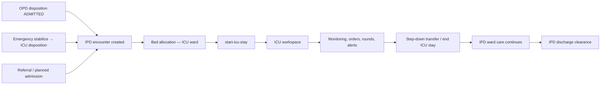

# ICU Module — Implementation Prompt

## Objective

Complete the **ICU (Intensive Care) Module** for HOSSPI HMS so ICU nurses, intensivists, bed managers, and escalation coordinators can run critical-care work end-to-end: receive escalated inpatients, manage ICU stays and ICU beds, record high-acuity observations and vitals, raise and resolve critical alerts, perform ICU rounds, place inpatient orders, coordinate step-down transfers, and signal discharge readiness — all anchored to the **same IPD encounter** without duplicating admission records.

**Source of truth (read in this order):**

1. [flows/icu-flow.mdc](../.cursor/flows/icu-flow.mdc) — ICU workflow, queue contract, stay lifecycle, bed board, cross-flow rules, status-based actions
2. [flows/ipd-flow.mdc](../.cursor/flows/ipd-flow.mdc) — steps 8–9 (ward/ICU handover, nursing admission), §9 transfers (ICU escalation/step-down), §11 `In ICU` status, §15 ICU actions, §16 IPD encounter as hub
3. [flows/opd-flow.mdc](../.cursor/flows/opd-flow.mdc) — §3 stage `ADMITTED` as outpatient completion, §6 summary-card worklist pattern, §7 OPD-to-IPD handoff
4. [app-write-up.mdc](../.cursor/app-write-up.mdc) — ICU module boundaries vs IPD, Nursing, Billing, Theater, Emergency, Discharge

**Central encounter rule:** every ICU stay, observation, alert, round, order, and transfer attaches to the **IPD admission / encounter**. ICU is a clinical overlay and workspace on top of inpatient flow — not a parallel admission system. Emergency `ICU` disposition and OPD `ADMITTED` handoff must land in the ICU workspace with source context preserved.

**Module boundary (per app-write-up):** ICU owns intensive-care stays, monitoring, critical alerts, ICU rounds, and ICU transfer/discharge readiness. Inpatient owns admission lifecycle and hospital-wide bed ops; Nursing owns ward care plans and MAR; OPD owns outpatient completion; Billing owns cashier workflows; Discharge owns full clearance.

Deliver a **professional, calm, critical-care workspace** optimized for rapid triage: role-focused queues, critical-alert prominence, predictable primary actions, patient context at a glance, and no raw internal identifiers in the UI.

---

## Global Implementation Standards

Mandatory platform rules for all work in this module.

| Area | Requirement |
| ---- | ----------- |
| Product scope | [app-write-up.mdc](../.cursor/app-write-up.mdc) — respect module boundaries; do not duplicate workflows owned elsewhere. |
| Patient flows | Align with [`.cursor/flows/`](../.cursor/flows/). Use [opd-flow.mdc](../.cursor/flows/opd-flow.mdc) and [ipd-flow.mdc](../.cursor/flows/ipd-flow.mdc) for journey touchpoints; read the module-specific flow file when one exists (lab, nursing, pharmacy, radiology, discharge, emergency, icu, theater). |
| Encounters | One active OPD encounter per outpatient visit; IPD admission as inpatient hub; overlays (ICU, Theater) and executing departments attach — never parallel admission records. |
| UI/UX | Modern, clean, minimal on-screen text; hospital workflow language (not enum names or UUIDs). Follow `frontend/.cursor/design-system.mdc`, `components.mdc`, `ui-patterns.mdc`, `ui-workspace.mdc`, `layouts.mdc`, `platform_guidelines.mdc`. Reuse `frontend/lib/shared/*` before creating new widgets. Responsive on Android, iOS, web, Windows, macOS, Linux. |
| Theming and i18n | Full theme support (light/dark/system). All user-visible strings in `app_en.arb` — no hardcoded labels. |
| Modal-first workflows | **All create/edit/approve/complete/handoff actions** use **in-page dialogs, bottom sheets, or nested modals**. Do **not** navigate to new routes for within-module workflows. Shell entry routes (`/opd`, `/ipd`, etc.) and deep-link **pre-selection** of a patient/record are allowed; selecting a row opens the workspace detail panel — not a separate workflow page. |
| Realtime sync | Subscribe to relevant `RealtimeEventGroups` in workspace controllers. After mutations, refresh affected rows, detail panels, summary cards, and nav badges. Keep UI, frontend state, backend services, and database consistent. |
| Architecture | UI/controllers → repository → API (`frontend/.cursor/feature_workflow.mdc`, `architecture.mdc`). Enforce RBAC + ABAC + tenant/facility scope + module entitlements (frontend `AccessGate` + backend authorization). |
| Database | Apply migrations for schema changes per backend standards; keep API contracts and schema aligned. |
| Quality gate | From `frontend/`: `flutter pub get`, `dart format --set-exit-if-changed .`, `flutter analyze`, `flutter test`. From `backend/`: targeted `npm test` for touched modules. |

---


## Mandatory Reading (before any ICU change)

1. Re-read [flows/icu-flow.mdc](../.cursor/flows/icu-flow.mdc) — full step-by-step ICU workflow, entry paths, queue contract, stay lifecycle, bed board, monitoring, orders, transfers, discharge handoff, cross-flow integration (§17), module boundaries.
2. Re-read [flows/ipd-flow.mdc](../.cursor/flows/ipd-flow.mdc) — §8 care loop, §9 transfers, §10–§12 discharge, §11 `In ICU`, §14 boards, §15 status-based actions, §16 encounter hub rule.
3. Re-read [flows/opd-flow.mdc](../.cursor/flows/opd-flow.mdc) — §3 stage contract (`ADMITTED`), §7 OPD-to-IPD handoff, §6 UI rules (summary cards filter worklist; reuse `frontend/lib/shared/*`).
4. Re-read [app-write-up.mdc](../.cursor/app-write-up.mdc) — ICU vs Inpatient vs Nursing vs Discharge vs Billing boundaries.

When changing ICU workflow behavior, update `icu-flow.mdc` first so flow docs and implementation stay aligned.

---

## Flow Integration Requirements

ICU is not a standalone admission module. Every feature must trace to OPD handoff, IPD encounter hub rules, or app-write-up boundaries.

### IPD flow (`../.cursor/flows/ipd-flow.mdc`)

| IPD step / concept | ICU module responsibility |
| ------------------ | ------------------------- |
| Step 8: Ward transfer / ICU handover | Receive patient after transfer complete to ICU bed; capture handover note; then `start-icu-stay` |
| Step 9: Nursing admission | ICU nursing receive checklist (devices, allergies, baseline vitals) — ICU-scoped, not duplicate IPD ward checklist |
| Step 11: Inpatient orders | Doctors place lab/radiology/medication/procedure/consult orders on IPD encounter from ICU workspace |
| Step 12: Service execution | Show pending results/orders on ICU detail; realtime refresh when departments complete work |
| Step 13: Daily review loop | ICU rounds, observation timeline, alert resolution feed intensivist review |
| Step 14: Transfer / escalation | Ward→ICU and ICU→ward step-down via `request-transfer` + `update-transfer`; end ICU stay on step-down |
| Step 15: Discharge planning | `plan-discharge` marks readiness only; clearance stays in IPD/Discharge/Billing |
| §11 status `In ICU` | Board scope `icu_status=ACTIVE`; row badges and next-action labels match backend stage |
| §11 backend stages | Align UI with `ADMITTED_IN_BED`, `TRANSFER_REQUESTED`, `TRANSFER_IN_PROGRESS`, `DISCHARGE_PLANNED`, `DISCHARGED` |
| §14.1 patient board pattern | Mirror column set scoped to ICU patients (consultant, LOS, payer, alerts) |
| §14.2 bed board | ICU-ward filtered bed board; assign/transfer via IPD bed actions |
| §15 `In ICU` actions | ICU notes, monitoring, orders, transfer to ward, discharge plan — expose in `AppActionList` |
| §16 encounter hub | All mutations use `admissionId`; detail loads `include_icu=true`; timeline events attach to IPD encounter |
| §2.1 Emergency admission | `Billing Deferred` badge when applicable; emergency case context on detail |
| §4 Billing gates | `ClinicalRequestBillingPanel` on orders; read-only billing snapshot on detail |

### OPD flow (`../.cursor/flows/opd-flow.mdc`)

| OPD concept | ICU module responsibility |
| ----------- | ------------------------- |
| §3 stage `ADMITTED` | Terminal OPD stage — ICU must not recreate OPD encounter; show read-only OPD source on ICU detail |
| §4 worklist contract | ICU board columns mirror OPD clarity: patient identity, encounter context, stage, next action, responsible role |
| §5 role rules | Actions visible only when backend state + role both allow; hide buttons the API would reject |
| §6 UI rules | Summary cards **filter** the board (not modals); hide zero-value cards; reuse `frontend/lib/shared/*` |
| §7 OPD-to-IPD handoff | After doctor admits, IPD owns bed allocation; ICU receives patient after ICU bed + `start-icu-stay` |
| No duplicate encounters | ICU lists IPD admissions with ICU overlay — never create parallel admission from ICU UI |
| Deep-link from OPD/IPD | `/icu?id={admissionDisplayId}` opens ICU workspace with patient pre-selected |

### App write-up (`../.cursor/app-write-up.mdc`)

| Product rule | ICU implementation |
| ------------ | ------------------ |
| ICU module row | Stays, bed assignment (ICU view), observations, escalation, alerts, rounds, transfer-out, discharge readiness |
| Inpatient boundary | IPD creates admission; ICU consumes `GET /ipd-flows` with ICU filters |
| Nursing boundary | Shared vitals/MAR visibility; ICU owns stay-scoped observations and critical alerts |
| Theater boundary | Post-op handoff summary + link when `theatre_case` reference exists |
| Billing boundary | Order billing choice via shared panel; no cashier/invoice UI in ICU |
| Discharge boundary | Readiness signal only; multi-step clearance via IPD/Discharge modules |
| Access control | `icu-critical-care` entitlement + `icuManager` / clinical roles; backend auth mandatory |

### Recommended patient journey (OPD → IPD → ICU → exit)



| Upstream | Flow reference | ICU responsibility |
| -------- | -------------- | ------------------ |
| OPD doctor admits | opd-flow §7, stage `ADMITTED` | Show linked OPD encounter on ICU detail; do not recreate admission |
| Emergency ICU path | ipd-flow §2.1, icu-flow §4.1 | Patients from `startEmergencyIcuFlow` appear on active ICU board |
| IPD bed manager | ipd-flow §3, §14 | ICU bed board is ICU-ward scoped view of same bed catalog |
| IPD transfer | ipd-flow §9, icu-flow §11 | Ward→ICU: complete transfer then `start-icu-stay`; step-down ends stay |
| Nursing | app-write-up Nursing row | Shared vitals/MAR visibility; ICU owns stay-scoped observations/alerts |
| Theater post-op | app-write-up Theater row | Post-op handoff summary on ICU detail when theatre reference exists |
| Billing | ipd-flow §4, icu-flow §13 | Orders use `ClinicalRequestBillingPanel`; clearance stays in Billing/IPD |
| Discharge | ipd-flow §10–§12, icu-flow §12 | ICU marks readiness only; IPD/Discharge own multi-step clearance |

---

## Current State (read before changing code)

### Already in place

| Area | Location / API | Notes |
|------|----------------|-------|
| ICU flow spec | `../.cursor/flows/icu-flow.mdc` | Step-by-step workflow, queue contract, cross-flow rules, implementation section |
| Product scope | `../.cursor/app-write-up.mdc` | ICU owns stays, monitoring, alerts, rounds, transfer-out, discharge readiness |
| IPD flow spec | `../.cursor/flows/ipd-flow.mdc` | ICU transfer types, `In ICU` status, ward→ICU handover, step-down |
| OPD handoff | `../.cursor/flows/opd-flow.mdc` §7 | OPD `ADMITTED` → IPD owns bed/ward; ICU receives escalated patients |
| Frontend scaffold | `frontend/lib/features/icu/` | `data/`, `domain/`, `presentation/` layers exist |
| Workspace UI | `icu_workspace_page.dart` | ICU board, scope filters, summary cards, detail panels, observations/vitals/alerts/round/transfer/discharge dialogs |
| Controller | `icu_workspace_controller.dart` | Realtime + periodic sync, pagination, scope/search, patient selection, mutations |
| Repository | `icu_repository.dart` / `icu_repository_impl.dart` | Board via `GET /ipd-flows` with ICU filters; detail via `include_icu=true`; observation, vitals, alerts, ward round, transfer request, plan discharge, end ICU stay |
| IPD ICU overlay API | `backend/src/modules/ipd-flow/` | `start-icu-stay`, `end-icu-stay`, `add-icu-observation`, `add-critical-alert`, `resolve-critical-alert`; list filters `icu_queue_scope`, `icu_status`, `has_critical_alert` |
| Standalone ICU APIs | `icu-stay/`, `icu-observation/` modules | CRUD at `/api/v1/icu-stays`, `/icu-observations`; frontend should use IPD-flow actions as canonical |
| Emergency → ICU | `emergency-case.service.js` | `startEmergencyIcuFlow` creates IPD admission then `startIcuStay` |
| IPD workspace overlay | `ipd_workspace_page.dart`, `IpdIcuOverlay` | `include_icu=true`; critical-alert badges; `icuManager` role on IPD |
| Nursing workspace | `frontend/lib/features/nursing/` | Ward vitals, handover, MAR — shared encounter context |
| Clinical shared UI | `lib/shared/clinical_actions/` | Lab, radiology, prescription, billing panel patterns (not wired in ICU yet) |
| Permissions / module gate | `icu-critical-care` entitlement | `clinicalRead`/`clinicalWrite` + `icuManager` role; route in `app_routes.dart` |
| Realtime | `RealtimeEventGroups.icu` | Controller subscribes to ICU/IPD domain events |
| Shell integration | `app_router.dart` | `/icu` route with nav badge from critical-alert count |
| Backend tests | `backend/src/tests/modules/ipd-flow/`, `icu-stay/`, `icu-observation/` | Route, service, RBAC coverage |

### Known gaps to close

- **`startIcuStay` missing from repository** — `IcuRepository` has `transferOut` (end stay) but no `startIcuStay`; backend and Emergency path support `POST /ipd-flows/:id/start-icu-stay`. IPD repo also omits start stay.
- **No ICU bed board** — icu-flow §7 and ipd-flow §14.2 expect ICU bed assignment visibility; UI shows ward/bed on patient rows only, no live ICU bed occupancy board.
- **Transfer lifecycle incomplete** — UI requests transfer (`request-transfer`) but does not wire approve/start/complete/cancel (`update-transfer`) or require target ICU/ward bed on complete.
- **Discharge is readiness-only** — `plan-discharge` marks readiness; no integration with IPD multi-step discharge clearance (pharmacy, billing, nursing) from flow §10.
- **No inpatient clinical orders from ICU** — unlike Nursing/IPD targets; no lab, radiology, prescription, procedure, or consult actions scoped to ICU encounter.
- **Ward round reused for ICU round** — `add-ward-round` works but is not labeled or structured as ICU-specific round documentation when API supports structured fields.
- **Localization gap** — most ICU copy is private `_IcuText` constants; only `icuStayDialogTitle` and nav label exist in `app_en.arb`.
- **No deep links** — notifications may target `/icu?id=…&panel=…`; router does not parse query params to pre-select patient or panel.
- **OPD / IPD entry context thin** — board does not show source OPD encounter, emergency case, admission reason, consultant, or payer on list/detail.
- **Billing / insurance gates** — flow §4 ICU packages and high-cost procedure gates not surfaced; no `ClinicalRequestBillingPanel` on ICU-originated orders.
- **Theater handoff** — post-op ICU patients from Theater module lack explicit cross-navigation and handover summary in ICU detail.
- **IPD ↔ ICU bridge one-way** — IPD detail shows ICU overlay but lacks actions to open ICU workspace or start ICU stay; ICU lacks link back to IPD admission detail.
- **No frontend tests** — `test/features/icu/` does not exist (Theater/Biomedical have controller tests as reference).
- **Large page file** — `icu_workspace_page.dart` (~1.9k lines) mixes board, detail, dialogs; needs extraction per project conventions.
- **Standalone `icu-stays` API unused** — confirm whether admin/reporting needs direct CRUD or IPD-flow actions remain canonical.

---

## Scope — Core Capabilities

Implement or finish the following, in priority order. Each item maps to `icu-flow.mdc`, IPD flow sections, OPD handoff rules, and app-write-up ICU responsibilities.

### 1. ICU patient board and role-focused queues

**Goal:** ICU staff can triage active critical-care patients by acuity and next action using backend ICU filters on the IPD worklist.

**Actions:**

- Keep primary layout: **board → patient detail → action panel** (`AppWorkspace`, `AppListTable`, `AppWorkspaceDetailPanel`, `AppActionList`, `AppWorkspacePatientContextHeader`).
- Preserve and align board scopes with backend filters (icu-flow §5):
  - **Active ICU** → `icu_queue_scope=ACTIVE`, `icu_status=ACTIVE` (default landing)
  - **Critical alerts** → `has_critical_alert=true`
  - **Transfer pending** → open transfer request (`transfer_status=REQUESTED` or equivalent)
  - **Discharge ready** → `stage=DISCHARGE_PLANNED` with active ICU stay
  - **Ended stays** → `icu_status=ENDED` (recent step-down / historical)
  - **All ICU** → `icu_queue_scope=WITH_ICU`
- Summary cards must filter the board (mirror opd-flow §6 and ipd-flow §14); hide zero-value cards where the workspace pattern expects it.
- Table columns: patient, admission no., ICU stay status, ward/bed, consultant (when API provides), admitted/ICU start time, length of ICU stay, acuity/alert severity, transfer state, next action.
- Prominent critical-alert badge and severity chip on rows with open alerts.
- Use display IDs (`displayId`, patient display name) — never surface raw UUIDs.
- Preserve realtime sync via `RealtimeEventGroups.icu`; refresh selected detail after mutations.

**Primary files:** `icu_workspace_controller.dart`, `icu_workspace_page.dart`, `icu_repository_impl.dart`, `icu_dtos.dart`.

**Reference APIs:** `GET /ipd-flows?include_icu=true&icu_queue_scope=…`, `GET /ipd-flows/:id?include_icu=true`.

### 2. ICU stay lifecycle (start, active, end)

**Goal:** Authorized staff can open, track, and close ICU stays on the IPD admission per icu-flow §6 and ipd-flow §11 `In ICU`.

**Actions:**

- Add **`startIcuStay`** to `IcuRepository` → `POST /ipd-flows/:id/start-icu-stay` with optional `started_at`.
- Wire controller method and **Start ICU stay** action in `AppActionList` when admission has no active stay but is eligible (IPD transfer complete to ICU bed, Emergency disposition, or manual escalation with reason).
- Show active stay metadata: started at, duration, stay id (display form only), linked bed.
- Keep **`endIcuStay`** (`transferOut`) with confirmation copy for step-down to ward or pre-discharge; require handover note when API supports it.
- Prevent duplicate active stays (handle `icu_stay_already_active` with user-friendly message).
- After end stay, patient remains on IPD board (ward step-down) — do not close encounter from ICU module.
- **IPD bridge:** add matching **Start ICU stay** / **Open in ICU** actions on `ipd_workspace_page.dart` when overlay shows eligible state.

**Primary files:** `icu_repository.dart`, `icu_repository_impl.dart`, `icu_workspace_controller.dart`, `ipd_workspace_page.dart`.

**Reference APIs:** `POST …/start-icu-stay`, `POST …/end-icu-stay`.

### 3. ICU bed board and bed assignment

**Goal:** Bed managers and ICU charge nurses see ICU bed occupancy and can assign or transfer to suitable ICU beds (icu-flow §7, ipd-flow §3, §14.2).

**Actions:**

- Add **ICU bed board** tab or section filtered to ICU/NICU ward types from `/wards` and `/beds`.
- Columns: ward, room/bed, bed class, status, current patient, alert indicator, next action.
- Wire **assign bed** and **transfer complete** via IPD `assign-bed`, `update-transfer` with `to_bed_id` — reuse `clinical_admission_action_dialog.dart` bed picker.
- Enforce isolation/equipment suitability when backend returns blocking reasons.
- Coordinate with IPD bed board — ICU module owns ICU-ward view; link **View in IPD** for hospital-wide bed ops.

**Primary files:** new `icu_bed_board_section.dart` (or similar) under `presentation/widgets/`, IPD bed repository patterns from `frontend/lib/features/ipd/`.

### 4. Monitoring, observations, vitals, and critical alerts

**Goal:** Continuous critical-care documentation per app-write-up and ipd-flow §8 care loop.

**Actions:**

- **ICU observations** — keep `add-icu-observation`; support structured fields when API adds them (GCS, vent settings, intake/output, etc.).
- **Vitals** — keep encounter-scoped vital signs CRUD; show trend summary on detail (latest BP, HR, SpO₂, RR, temp).
- **Critical alerts** — raise with severity + message; **acknowledge/resolve** via `resolve-critical-alert`; open alerts drive nav badge and critical queue.
- Surface alert history and observation timeline on detail; sync to IPD timeline (`ICU_OBSERVATION` events).
- Nursing overlap: reuse Nursing vitals patterns (`AppRecordVitalsDialog`) where identical; ICU module remains primary owner for ICU-stay-scoped observations and alerts.

### 5. ICU rounds and clinical assessment

**Goal:** Intensivists document ICU rounds and update care plan (icu-flow §9, ipd-flow §6–§8 inpatient doctor care scoped to ICU).

**Actions:**

- **ICU round note** — extend beyond free-text `add-ward-round` when API supports structured assessment (working diagnosis, plan, lines/devices, goals of care).
- Patient context header: source OPD/emergency, allergies, active orders, pending results, open alerts, current devices.
- Link to **doctor notes** / care plan on encounter when clinical module APIs provide them.

### 6. Inpatient orders from ICU

**Goal:** Doctors can order services without leaving ICU workspace (ipd-flow §7 department routing, icu-flow §10).

**Actions:**

- Add clinical order actions scoped to IPD encounter, mirroring IPD/Nursing patterns:
  - Lab (`clinical_lab_order_action_dialog.dart`)
  - Radiology (`clinical_radiology_order_action_dialog.dart`)
  - Medication/prescription (`clinical_prescription_action_dialog.dart`)
  - Procedure, consult, nursing instructions — per catalog/API availability
- Each order uses **`ClinicalRequestBillingPanel`** for pay-now vs bill-later (ipd-flow §4, opd-flow billing visibility).
- Show pending order/result summary on ICU detail; route to Lab/Radiology/Pharmacy queues automatically.

**Primary files:** `icu_workspace_page.dart` action panel, `lib/shared/clinical_actions/*`.

### 7. Transfers and step-down

**Goal:** Internal ICU escalation and step-down without closing IPD encounter (icu-flow §11, ipd-flow §9).

**Actions:**

- **Request transfer** — ward/ICU/isolation targets with reason and urgency.
- **Manage transfer** — approve, start, complete, cancel via `update-transfer`; require `to_bed_id` on complete.
- Distinguish labels: **Step-down to ward**, **ICU bed transfer**, **Isolation**, **Theater**, **External**.
- On complete transfer to non-ICU bed: prompt to **end ICU stay** if still active.
- Show handover note capture and from/to location on detail.

### 8. Discharge readiness and clearance handoff

**Goal:** ICU signals discharge readiness; IPD/Discharge modules own full clearance (icu-flow §12, ipd-flow §10–§12).

**Actions:**

- Keep **Mark discharge readiness** (`plan-discharge`) with summary and expected date.
- Display discharge substates when API provides them (`Planned`, `Summary Pending`, `Billing Pending`, etc.).
- Do not implement full discharge clearance in ICU — link to **IPD workspace** discharge panel or **Billing** for clearance tasks.
- Block misleading “patient discharged” language until IPD `DISCHARGED` stage.

### 9. Cross-module integration (OPD, IPD, Emergency, Theater, Nursing, Billing)

**Goal:** ICU connects cleanly across the patient journey defined in OPD and IPD flows (icu-flow §17).

**Actions:**

- **OPD → IPD → ICU:**
  - When OPD stage is `ADMITTED` (opd-flow §3, §7), IPD encounter is created upstream; ICU board shows patient after ICU bed assignment and/or `start-icu-stay`.
  - Show OPD encounter summary (visit type, disposition note, consulting doctor) on ICU detail — read-only source context from IPD overlay DTO.
  - Deep-link from OPD/IPD: `/icu?id={admissionDisplayId}`.
- **Emergency → ICU:** `startEmergencyIcuFlow` patients appear on active ICU board with emergency case context and `Billing Deferred` when applicable (ipd-flow §2.1).
- **IPD workspace:** add **Open in ICU** when `icu_status=ACTIVE` or critical alert; **Start ICU stay** when escalated without stay.
- **ICU detail:** add **Open in IPD** for admission-wide context (bed history, full discharge panel).
- **Nursing:** shared vitals/MAR visibility; deep-link to Nursing handover for ward step-down.
- **Theater:** post-op handoff to ICU — show theatre case summary and link to Theater workspace when API provides `theatre_case` reference.
- **Deep links:** handle `/icu?id={admissionDisplayId}&panel={vitals|alerts|observations|orders|transfer|discharge}` in `app_router.dart` — select patient and focus panel.
- **Notifications:** critical alerts, transfer requests, discharge readiness update board badges and row alerts.

### 10. Billing and insurance (read-mostly in ICU UI)

**Goal:** ICU respects configurable billing gates without duplicating cashier workflows (icu-flow §13, ipd-flow §4, app-write-up Billing boundary).

**Actions:**

- Show billing snapshot on detail when API provides: `Billing Deferred`, deposit status, insurance pre-auth, running balance.
- Gate elective high-cost ICU procedures on clearance when policy requires; emergency path allows proceed-first-bill-later.
- Orders from ICU use shared billing panel — charges post to IPD bill automatically.
- Link to billing workspace for deposits and interim bills (see [prompts/09-billing-module-prompt.md](./09-billing-module-prompt.md)).

---

## Module Boundaries (do not violate)

From `../.cursor/app-write-up.mdc`:

| Own in ICU | Do not duplicate — use other module |
| ---------- | ----------------------------------- |
| ICU stays, monitoring, critical alerts, ICU rounds | IPD admission creation, ward rounds for non-ICU patients |
| ICU-ward bed board view | Hospital-wide bed CRUD (Facility settings / IPD bed board) |
| Discharge **readiness** signal | Full discharge clearance (Discharge / IPD / Billing) |
| ICU-scoped observations and alerts | Ward nursing care plans and MAR (Nursing module) |
| Order placement with billing choice | Invoice/payment/cashier workflows (Billing) |
| Equipment at bedside (display only if API links) | Equipment maintenance lifecycle (Biomedical) |

---

## UI / UX Requirements

Follow `frontend/.cursor/ui-patterns.mdc`, `design-system.mdc`, `components.mdc`, and `layouts.mdc`. Mirror proven workspace patterns from **IPD**, **Nursing**, and **Theater** (sibling overlays/wards on the same admission encounter). Before creating UI, check `frontend/lib/shared/*` for reusable components (opd-flow §6).

### Organization

- **Two primary views**, clearly separated:
  1. **ICU patient board** — active critical-care queue (default).
  2. **ICU bed board** — ICU ward bed occupancy and bed operations.
- **Single primary task per region:** board (main), detail (split panel or dialog), actions (grouped panel).
- **Progressive disclosure:** summary cards for critical/transfer/discharge workload; search and scope chips; complex forms in dialogs.
- **Role-appropriate actions:** ICU nurse (vitals, observations, alerts, MAR), intensivist/doctor (rounds, orders, discharge plan), bed manager (ICU bed assign/transfer), billing (clearance links) — per icu-flow §14 adapted for ICU.
- Default landing: **Active ICU** queue.

### Simplicity

- **Critical alerts first** — severity color on chips and summary cards only; avoid alarm fatigue elsewhere.
- **One stage chip + one next-action column** on the board.
- **Action panel hierarchy:** record vitals/observation when unstable → resolve alerts → clinical orders → transfer step-down → discharge readiness → end ICU stay (destructive/terminal last).
- **Forms:** one column on narrow viewports; datetime for observations and rounds; validate partial BP entry.
- **Loading/saving:** `AppWorkspace` status tone; refresh selected row after modal actions.

### Professional healthcare feel

- Terminology: ICU stay, observation, critical alert, step-down, discharge readiness — not generic “submit”.
- Calm hierarchy: neutral backgrounds; acuity color on alerts and severity only.
- Audit-friendly: show who/when on observations, alert resolution, and transfers when API provides actor metadata.
- Accessibility: semantic labels on queues, tables, and dialogs; keyboard-navigable modals.
- No raw UUIDs, internal enum codes, or debug field names in production UI.

---

## Architecture and Conventions

Follow `frontend/docs/workflows/feature-workflow.md` and `../.cursor/` rules.

| Rule | Requirement |
|------|-------------|
| Layering | UI/controllers → repository interface → repository impl → API client. No API calls from widgets. |
| State | Riverpod `AsyncNotifier` controllers; `Result<T>` / `AppFailure` for errors. |
| DTOs | `data/dtos/` with explicit mappers to `domain/entities/`. |
| Localization | All user strings in `app_en.arb`; run codegen; remove `_IcuText` over time. |
| Permissions | `AccessGate` / `AppAccessActionGate`; `icu-critical-care` module + `icuManager` / clinical roles. |
| Encounter anchor | All mutations use IPD admission id; `include_icu=true` on detail refresh. |
| Shared UI | Reuse `lib/shared/clinical_actions` for orders and bed assignment; reuse nursing/billing panels. |
| File size | Extract widgets to `presentation/widgets/`; keep page compositional. |
| Tests | Add `test/features/icu/` — controller scopes, DTO mapping, dialog flows, queue filter mapping. |
| Backend | Prefer `ipd-flow` ICU actions as canonical; extend overlay DTO before adding duplicate endpoints. |

**Do not** duplicate IPD admission lifecycle in ICU. **Do not** add ICU business logic to `core/` unless genuinely cross-module.

**Reuse existing services** — analyze Emergency ICU start, IPD ICU overlay, Nursing vitals, and clinical-order billing before adding endpoints.

---

## Suggested Implementation Order

Work in small, reviewable increments. One clear responsibility per new file.

| Phase | Task | Validates integration with |
| ----- | ---- | -------------------------- |
| 1 | `startIcuStay` in repository + controller + UI action; IPD **Open in ICU** / **Start ICU stay** | ipd-flow §11, §15; icu-flow §6 |
| 2 | Localization pass — migrate `_IcuText` to `app_en.arb` | opd-flow §6 (hospital language) |
| 3 | Widget extraction + deep links (`/icu?id=&panel=`) | icu-flow §17; opd-flow §7 |
| 4 | Patient board polish — OPD/emergency source, consultant, payer, LOS | opd-flow §7; ipd-flow §14.1 |
| 5 | ICU bed board — ward filter, assign/transfer complete | ipd-flow §14.2; icu-flow §7 |
| 6 | Transfer lifecycle — approve/start/complete/cancel; end stay on step-down | ipd-flow §9; icu-flow §11 |
| 7 | Clinical orders + `ClinicalRequestBillingPanel` | ipd-flow §7; §4 |
| 8 | Discharge readiness handoff links to IPD/Billing | ipd-flow §10–§12 |
| 9 | Theater post-op context | app-write-up Theater boundary |
| 10 | Frontend tests + quality gate | All acceptance criteria |

---

## Acceptance Criteria

- [ ] Staff can open ICU workspace, filter by scope, and open patient detail with live sync.
- [ ] Board scopes match backend ICU filters and ipd-flow §11 `In ICU` meaning.
- [ ] **Start ICU stay** and **end ICU stay** work end-to-end on eligible IPD admissions.
- [ ] **ICU bed board** shows ICU ward bed status and supports assign/transfer complete.
- [ ] Observations, vitals, critical alerts (raise + resolve), and round notes persist and appear on timeline.
- [ ] Doctors can place **lab, radiology, and medication orders** from ICU with pay-now/bill-later choice.
- [ ] Transfer request → approve → complete lifecycle works with target bed and optional ICU stay end.
- [ ] Discharge readiness integrates with IPD discharge workflow; clearance happens outside ICU module.
- [ ] OPD `ADMITTED` and Emergency source context visible; deep links (`/icu?id=…&panel=…`) open correct patient/panel.
- [ ] IPD workspace exposes **Open in ICU** and **Start ICU stay**; ICU detail exposes **Open in IPD**.
- [ ] Critical-alert count drives shell nav badge; critical queue triages open alerts.
- [ ] All user-facing strings localized; permissions and `icu-critical-care` entitlement enforced.
- [ ] UI provides **patient board** and **bed board** with calm, scannable critical-care layout.
- [ ] `flutter analyze` and `flutter test` pass; new ICU tests cover repository mapping and primary flows.

### Integration smoke scenarios (manual or E2E)

1. **OPD admit → ICU:** OPD doctor dispositions `ADMITTED` → IPD assigns ICU bed → `start-icu-stay` → patient on Active ICU board with OPD source on detail.
2. **Emergency → ICU:** Emergency ICU disposition → patient on board with `Billing Deferred` when policy applies.
3. **Ward escalation:** Nursing/IPD requests ward→ICU transfer → complete with ICU bed → start stay → critical alert → resolve → step-down → end stay → patient on IPD ward board.
4. **Discharge path:** ICU marks readiness → user follows link to IPD discharge/Billing clearance → IPD reaches `DISCHARGED` (ICU never shows false “discharged”).

---

## Quality Gate

Before marking complete, run from `frontend/`:

```sh
flutter pub get
dart format --set-exit-if-changed .
flutter analyze
flutter test
```

Run backend ICU/IPD tests from `backend/`:

```sh
npm test -- --testPathPattern="ipd-flow|icu-stay|icu-observation"
```

Enable `icu-critical-care` module entitlement and `icuManager` / clinical roles for integration testing. Add focused tests during development; run the full gate before PR or merge.

---

## Key File References

```
.cursor/flows/icu-flow.mdc                          # ICU workflow source of truth
.cursor/flows/ipd-flow.mdc                          # ICU transfer, In ICU status, care loop
.cursor/flows/opd-flow.mdc                          # OPD → IPD handoff (§7), ADMITTED stage
.cursor/app-write-up.mdc                            # ICU module boundaries

frontend/lib/features/icu/
├── data/dtos/icu_dtos.dart
├── data/repositories/icu_repository_impl.dart
├── domain/entities/icu_entities.dart
├── domain/repositories/icu_repository.dart
└── presentation/
    ├── controllers/icu_workspace_controller.dart
    ├── pages/icu_workspace_page.dart
    └── widgets/                                  # Extract board, detail, dialogs here

frontend/lib/features/ipd/                        # Admission hub, ICU overlay, bed ops
frontend/lib/features/nursing/                    # Vitals, handover, MAR patterns
frontend/lib/features/theater/                    # Post-op → ICU handoff
frontend/lib/features/billing/                    # Clearance, deposits
frontend/lib/shared/clinical_actions/
├── clinical_request_billing_panel.dart
├── dialogs/clinical_admission_action_dialog.dart
├── dialogs/clinical_lab_order_action_dialog.dart
├── dialogs/clinical_radiology_order_action_dialog.dart
└── dialogs/clinical_prescription_action_dialog.dart

frontend/lib/app/router/app_router.dart            # /icu route + deep-link handling

backend/src/modules/ipd-flow/                      # Canonical ICU stay actions on admission
backend/src/modules/icu-stay/                      # Standalone stay CRUD (admin/reporting)
backend/src/modules/icu-observation/
backend/src/modules/emergency-case/services/emergency-case.service.js  # Emergency → ICU
backend/src/modules/opd-flow/services/opd-flow.service.js              # OPD admit handoff
```

---

## Flow Traceability Matrix

Use when implementing or reviewing PRs — every deliverable should map to source documents.

| Source | Section | Topic | Primary implementation target |
|--------|---------|-------|-------------------------------|
| icu-flow | §3–§6 | ICU workflow + stay lifecycle | Repository, controller, board scopes |
| icu-flow | §7 | ICU bed board | New bed board section + IPD bed actions |
| icu-flow | §8–§9 | Monitoring + rounds | Detail panels, dialogs |
| icu-flow | §10 | Orders | `clinical_actions` wiring |
| icu-flow | §11–§12 | Transfer + discharge | Transfer lifecycle, IPD/Billing links |
| icu-flow | §17 | Cross-flow integration | Context headers, deep links, IPD bridge |
| ipd-flow | §2.1 | Emergency admission | Billing deferred badge, emergency context |
| ipd-flow | §4 | Billing gates | `ClinicalRequestBillingPanel`, billing snapshot |
| ipd-flow | §8 | Inpatient care loop | ICU detail pending results/orders loop |
| ipd-flow | §9 | Transfers (ICU) | Transfer dialogs + end stay on step-down |
| ipd-flow | §10–§12 | Discharge | Readiness in ICU; clearance via IPD/Billing |
| ipd-flow | §11 | `In ICU` status | Board scope + stay lifecycle |
| ipd-flow | §13–§15 | Role actions | `AppActionList` visibility by stay/alert/transfer state |
| ipd-flow | §14.2 | Bed board | ICU bed board section |
| ipd-flow | §16 | IPD encounter hub | All panels scoped to `admissionId` / encounter |
| opd-flow | §3 | Stage `ADMITTED` | Patients entering ICU from OPD admit path |
| opd-flow | §5 | Role rules | Action visibility by stage + permission |
| opd-flow | §6 | Summary cards filter worklist | ICU summary card behavior |
| opd-flow | §7 | OPD-to-IPD handoff | Source OPD context on ICU detail |
| app-write-up | ICU module row | Module responsibility | Stay, monitoring, alerts, rounds, transfer-out |
| app-write-up | Module boundaries | vs IPD/Nursing/Billing | No duplicate admission or cashier logic |
