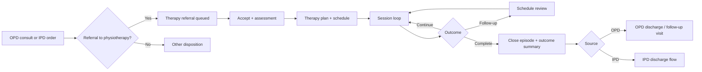

# Physiotherapy Module — Implementation Prompt

## Objective

Complete the **Physiotherapy Module** for HOSSPI HMS so therapy staff can manage rehabilitation patients end-to-end: receive referrals from outpatient and inpatient care, accept and assess, create therapy plans, schedule and deliver treatment sessions, record attendance and progress, issue exercise instructions, schedule follow-up reviews, and close therapy episodes — with clear handoffs from **OPD → Physiotherapy** and **IPD → Physiotherapy** (and back to ward care or discharge when appropriate).

Deliver a **professional, calm, therapy-grade workspace** that is easy to scan during a busy clinic day: clear hierarchy, minimal cognitive load, predictable primary actions, attendance-aware session styling, and no raw internal identifiers in the UI.

**Central encounter rule:** every therapy episode attaches to an existing **clinical encounter** (OPD visit or IPD admission). Physiotherapy does not create parallel patient records. Outpatient therapy uses the OPD encounter; inpatient therapy uses the IPD admission encounter.

**Flow alignment:** every physiotherapy workflow step must map to `../.cursor/flows/opd-flow.mdc` (referral/disposition, follow-up visits) and `../.cursor/flows/ipd-flow.mdc` (inpatient orders, daily review loop, discharge planning). Module boundaries follow `../.cursor/app-write-up.mdc` — Physiotherapy owns assessment, plans, sessions, attendance, progress, and outcome review; OPD/IPD own admission and discharge orchestration.

---

## Global Implementation Standards

Mandatory platform rules for all work in this module.

| Area | Requirement |
| ---- | ----------- |
| Product scope | [app-write-up.mdc](../.cursor/app-write-up.mdc) — respect module boundaries; do not duplicate workflows owned elsewhere. |
| Patient flows | Align with [`.cursor/flows/`](../.cursor/flows/). Use [opd-flow.mdc](../.cursor/flows/opd-flow.mdc) and [ipd-flow.mdc](../.cursor/flows/ipd-flow.mdc) for journey touchpoints; read the module-specific flow file when one exists (lab, nursing, pharmacy, radiology, discharge, emergency, icu, theater). |
| Encounters | One active OPD encounter per outpatient visit; IPD admission as inpatient hub; overlays (ICU, Theater) and executing departments attach — never parallel admission records. |
| UI/UX | Modern, clean, minimal on-screen text; hospital workflow language (not enum names or UUIDs). Follow `frontend/.cursor/design-system.mdc`, `components.mdc`, `ui-patterns.mdc`, `ui-workspace.mdc`, `layouts.mdc`, `platform_guidelines.mdc`. Reuse `frontend/lib/shared/*` before creating new widgets. Responsive on Android, iOS, web, Windows, macOS, Linux. |
| Theming and i18n | Full theme support (light/dark/system). All user-visible strings in `app_en.arb` — no hardcoded labels. |
| Modal-first workflows | **All create/edit/approve/complete/handoff actions** use **in-page dialogs, bottom sheets, or nested modals**. Do **not** navigate to new routes for within-module workflows. Shell entry routes (`/opd`, `/ipd`, etc.) and deep-link **pre-selection** of a patient/record are allowed; selecting a row opens the workspace detail panel — not a separate workflow page. |
| Realtime sync | Subscribe to relevant `RealtimeEventGroups` in workspace controllers. After mutations, refresh affected rows, detail panels, summary cards, and nav badges. Keep UI, frontend state, backend services, and database consistent. |
| Architecture | UI/controllers → repository → API (`frontend/.cursor/feature_workflow.mdc`, `architecture.mdc`). Enforce RBAC + ABAC + tenant/facility scope + module entitlements (frontend `AccessGate` + backend authorization). |
| Database | Apply migrations for schema changes per backend standards; keep API contracts and schema aligned. |
| Quality gate | From `frontend/`: `flutter pub get`, `dart format --set-exit-if-changed .`, `flutter analyze`, `flutter test`. From `backend/`: targeted `npm test` for touched modules. |

---


## Current State (read before changing code)

### Already in place

| Area | Location / API | Notes |
|------|----------------|-------|
| Frontend scaffold | `frontend/lib/features/physiotherapy/` | `data/`, `domain/`, `presentation/` layers exist |
| Workspace UI | `physiotherapy_workspace_page.dart` | Summary cards, therapy worklist, detail panels (assessment, plan, sessions, notes, follow-ups), action dialogs, print summary, backend-gap panel |
| Controller | `physiotherapy_workspace_controller.dart` | Realtime + periodic sync, scope/search/filter, all repository mutations |
| Repository | `physiotherapy_repository.dart` / `physiotherapy_repository_impl.dart` | Composes worklist from encounters + appointments; mutations via procedures, care plans, clinical notes, follow-ups, appointments |
| Localization | `app_en.arb` | Physiotherapy workspace strings largely defined (scopes, columns, dialogs, backend-gap labels) |
| Shell integration | `app_router.dart`, `app_routes.dart` | `/physiotherapy` route with nav item |
| OPD upstream | `opd_flow_actions_dialog.dart`, `opd_workspace_page.dart` | `PHYSIOTHERAPY` listed as disposition/referral destination at `WAITING_DISPOSITION` |
| Triage routing | `triage.service.js` | `ROUTE_DESTINATIONS.PHYSIOTHERAPY` supported |
| Realtime | `RealtimeEventGroups.physiotherapy` | Appointments + clinical events |
| Permissions | `clinicalRead` / `clinicalWrite`, `patientRead` / `patientWrite`, `billingRead` | Page gates on permission requirements; no dedicated module entitlement key yet |
| Procedure codes (client) | Repository impl | `PHYSIO_REFERRAL_ACCEPTED`, `PHYSIO_ASSESSMENT`, `PHYSIO_SESSION`, `PHYSIO_EPISODE_CLOSED` posted to `/procedures` |
| Shared clinical UI import | `physiotherapy_workspace_page.dart` | Imports `clinical_actions.dart` (billing panel not yet wired for therapy charges) |

### Known gaps to close

- **No dedicated backend therapy-flow module** — worklist hydrates generic `/encounters`, `/appointments`, `/procedures`, `/care-plans`, `/clinical-notes`, `/follow-ups`; client infers therapy status from `PHYSIO_*` procedure codes and text search (`physio`). Scales poorly and is fragile.
- **Backend gap flags always shown** — `THERAPY_STATUS_UNAVAILABLE`, `BILLING_AUTHORIZATION_UNAVAILABLE`, `THERAPY_REPORT_UNAVAILABLE` hard-coded in repository; UI shows permanent “backend gaps” panel.
- **Referral intake incomplete** — OPD can select `PHYSIOTHERAPY` disposition but there is no guaranteed `therapy-flow` handoff creating a physiotherapy queue row with referral reason, source encounter link, and therapist assignment.
- **IPD → Physiotherapy entry missing** — IPD flow §11 (inpatient orders / consult) has no **Request physiotherapy** action; inpatient referrals do not appear reliably on the therapy board.
- **Worklist hydration cap** — `_maxEncounterHydration = 30`; larger facilities will miss patients unless backend provides `GET /therapy-flows` (or equivalent) with queue scopes.
- **Billing integration** — `billingStatus` defaults to `UNAVAILABLE`; no pay-now / bill-later for therapy sessions or packages; no link to billing clearance for deferred packages (IPD flow §4).
- **Session scheduling** — uses generic `/appointments` with reason text containing “physio”; no therapy-specific session type, duration template, or therapist roster filter.
- **Status contract is client-derived** — scopes (`REFERRAL`, `ACTIVE_PLAN`, `FOLLOW_UP_DUE`, etc.) computed in `physiotherapy_entities.dart`; backend should own canonical `therapy_status` and `next_step`.
- **Cross-navigation** — no deep links from OPD/IPD detail to physiotherapy workspace with encounter pre-selected; physiotherapy detail does not link back to source OPD visit or IPD admission.
- **Exercise instructions** — assessment dialog captures instructions in procedure/care-plan text only; no structured home-exercise plan or printable patient handout beyond generic print template.
- **Module entitlement** — no `physiotherapy` / `therapy-referrals` subscription module gate (unlike `icu-critical-care`, `inpatient-bed-management`).
- **Tests** — no `test/features/physiotherapy/` coverage.
- **Large page file** — `physiotherapy_workspace_page.dart` (~2k lines) mixes board, detail, and dialogs; needs widget extraction per project conventions.

---

## Flow Integration Requirements

### OPD flow (`../.cursor/flows/opd-flow.mdc`)

| OPD concept | Physiotherapy module responsibility |
| ----------- | ----------------------------------- |
| `WAITING_DISPOSITION` | Doctor may refer to physiotherapy (alongside admit, discharge, follow-up). Referral must create or update a therapy work item linked to the **same OPD encounter**. |
| OPD encounter as parent | Outpatient therapy sessions, assessments, and plans attach to the OPD encounter — do not open a second OPD visit for ongoing therapy unless backend explicitly starts a new visit type. |
| `ADMITTED` handoff | If patient is admitted, IPD owns the admission; any in-progress OPD therapy episode should either close or transfer context to the IPD encounter per clinical policy. |
| `DISCHARGED` | OPD visit completes; therapy episode should be `COMPLETED` or `CLOSED` with outcome summary when treatment ends. |
| No duplicate encounters | Therapy board lists encounters with therapy content or active referrals — never create duplicate outpatient encounters from the physiotherapy module. |
| Role rules | Therapy actions for physiotherapists (`clinicalWrite`), doctors referring, reception scheduling — hide actions the backend would reject. |

### IPD flow (`../.cursor/flows/ipd-flow.mdc`)

| IPD step / concept | Physiotherapy module responsibility |
| ------------------ | ----------------------------------- |
| Step 11: Inpatient orders | Doctors request physiotherapy consult/referral from IPD detail; referral appears on therapy board with `source=IPD` and admission context. |
| Step 12: Service execution | Therapy department executes scheduled sessions; IPD nursing does not replace physiotherapy documentation. |
| Step 13: Daily review loop | Progress notes and session outcomes visible to ward doctors via encounter timeline (backend); physiotherapy records structured session notes. |
| Step 14: Transfer | Patient may transfer ward/ICU while therapy continues on same IPD encounter — location updates on board, episode stays open. |
| Step 15–16: Discharge planning | **Close therapy episode** or mark **discharge-ready for therapy** before IPD final clearance when active plan exists; IPD owns finalize discharge. |
| Encounter status `In Ward` / `In ICU` | Inpatient therapy items show ward/bed context from IPD overlay when available. |
| Billing gates (§4) | Therapy packages and per-session charges respect deposit/authorization; show clearance banner on detail when backend marks encounter. |

### Recommended therapy patient journey



---

## Scope — Core Capabilities

Implement or finish the following, in priority order.

### 1. Therapy worklist and queue contract

**Goal:** Physiotherapists see who needs action now, aligned with backend queue scopes (not client-side inference alone).

**Actions:**

- Keep primary layout: **summary cards → worklist table → detail panel → action bar** (`AppWorkspace` pattern).
- Preserve scopes: **Referrals**, **Today**, **Missed**, **Active plans**, **Follow-up due**, **Completed**, **All work** — summary cards filter the worklist, not modal lists.
- Board columns (minimum): patient, source (OPD/IPD/Emergency), session date/time, status, plan summary, attendance, billing, therapist, next action.
- **Target API:** `GET /therapy-flows` with `queue_scope`, `search`, `therapist_id`, date range — mirror `ipd-flow` / `opd-flow` list patterns. Until backend exists, document limitations of encounter hydration cap and keep current composite query as fallback.
- Show empty states that explain entry paths (“Referrals appear after OPD disposition or IPD consult order”).
- Use display IDs only — never raw UUIDs.
- Subscribe to `RealtimeEventGroups.physiotherapy`; refresh affected row/detail after mutations.

**Reference:** `physiotherapy_repository_impl.dart` `listWorkItems`, `physiotherapyItemMatchesScope`.

### 2. Referral intake (OPD and IPD)

**Goal:** Referrals land on the therapy board with traceable source and reason.

**Actions:**

- **OPD:** When doctor selects physiotherapy at `WAITING_DISPOSITION`, backend should create therapy referral linked to OPD `encounter_id` (reason, urgency, requested sessions if applicable). Frontend: verify OPD action payload and show success link **Open in Physiotherapy**.
- **IPD:** Add **Request physiotherapy** action on IPD admission detail (doctor / `clinicalWrite`) → `POST /ipd-flows/:id/request-therapy` or `POST /therapy-flows/referrals` with admission encounter id, clinical indication, priority.
- **Triage:** When routed to `PHYSIOTHERAPY`, create or enqueue referral with triage context.
- Therapy board **Referrals** scope shows unaccepted referrals; **Accept referral** (existing) transitions to assessment-ready state.
- Store `source`, `source_id`, `source_title`, `referral_reason` on work item from backend — not parsed from procedure description text.

### 3. Assessment, plan, and exercise instructions

**Goal:** Structured initial assessment and ongoing plan per `../.cursor/app-write-up.mdc`.

**Actions:**

- **Accept referral** — existing; require acceptance note when policy demands.
- **Record assessment** — assessment text, goals, plan, optional home-exercise instructions (existing dialog); persist via backend therapy assessment endpoint when available, else keep procedure + care-plan composition.
- **Update plan** — revise goals, session frequency, duration, contraindications; show active plan chip on worklist.
- **Exercise instructions** — printable section in print template / patient handout (reuse `AppPrintFormTemplate` patterns).
- Timeline on detail: assessments, plan revisions, sessions, notes, follow-ups (backend `timeline` when present).

### 4. Session scheduling, delivery, and attendance

**Goal:** Reliable session calendar and attendance tracking.

**Actions:**

- **Schedule session** — therapist, start/end, location/unit; use therapy session resource (not generic appointment search by “physio” text) when backend provides it.
- **Today's** and **Missed** scopes driven by `session_at` and `attendance_status` from backend.
- **Record session** — session note + optional attendance in one flow (existing).
- **Mark attendance** — `ATTENDED`, `NO_SHOW`, `CANCELLED`, `RESCHEDULED` on linked session record.
- Warn when scheduling conflicts with therapist roster (HR/availability when API exists).

### 5. Progress notes and follow-up review

**Goal:** Support outcome tracking and doctor visibility in care loop.

**Actions:**

- **Progress note** — structured note linked to encounter (existing via `/clinical-notes`).
- **Schedule follow-up** — review date and notes (existing via `/follow-ups`); **Follow-up due** scope surfaces overdue reviews.
- **Close episode** — outcome summary required; sets `COMPLETED`/`CLOSED`; hide from active scopes.

### 6. Billing and package awareness

**Goal:** Therapy charges respect hospital billing policy without duplicating billing module logic.

**Actions:**

- Integrate `ClinicalRequestBillingPanel` for session packages or per-visit charges when creating/scheduling sessions (pay-now vs bill-later) — mirror lab/radiology/pharmacy pattern.
- Show `billing_status` on worklist and detail: clearance, authorization pending, paid, bill-later.
- IPD inpatient therapy: charges post to IPD encounter bill per IPD flow §4 — do not duplicate invoice creation in physiotherapy.
- Remove `BILLING_AUTHORIZATION_UNAVAILABLE` gap flag when backend + billing panel are wired.

### 7. OPD and IPD cross-navigation

**Goal:** Traceable path across modules without duplicate records.

**Actions:**

- Therapy detail header: link to **source OPD visit** or **IPD admission** and **patient registry** when IDs available.
- OPD row at `WAITING_DISPOSITION` / after physio referral: **Open in Physiotherapy** deep link (`/physiotherapy?encounterId=…`).
- IPD admission detail: when active therapy referral or plan exists, **Open in Physiotherapy** link.
- Preserve `encounter_id` for all mutations; inpatient items show ward/bed from IPD overlay when `encounter_type` is IPD.

### 8. Backend therapy-flow module (recommended)

**Goal:** Replace fragile client-side encounter composition with orchestrated API.

**Actions:**

- Add `backend/src/modules/therapy-flow/` (or `physiotherapy-flow/`) analogous to `ipd-flow` / `opd-flow`:
  - `GET /therapy-flows` — list with `queue_scope`, filters, pagination
  - `GET /therapy-flows/:id` — detail with timeline, sessions, plan, billing overlay
  - `POST /therapy-flows/referrals` — create referral from OPD/IPD/triage context
  - `POST /therapy-flows/:id/accept-referral`, `record-assessment`, `schedule-session`, `record-session`, `mark-attendance`, `update-plan`, `add-progress-note`, `schedule-follow-up`, `close-episode`
- Canonical statuses: `REFERRAL`, `ACCEPTED`, `ASSESSMENT`, `ACTIVE_PLAN`, `SESSION_SCHEDULED`, `FOLLOW_UP_DUE`, `MISSED`, `COMPLETED`, `CLOSED`
- RBAC, schema validation, and tests mirroring `ipd-flow` module.
- Frontend: switch `PhysiotherapyRepositoryImpl` to therapy-flow endpoints; remove `_unavailableWorkflowCodes` when endpoints are live.

### 9. Localization, permissions, entitlement, and polish

**Actions:**

- Keep strings in `app_en.arb` (already largely done); add any new action labels.
- Add module entitlement (e.g. `physiotherapy` or `therapy-referrals`) and `AccessGate` on route — align with subscription seed data.
- Physiotherapist role: full therapy workspace; doctors: refer + view; reception: schedule only if policy allows.
- Extract large widgets from `physiotherapy_workspace_page.dart` to `presentation/widgets/`.
- Remove or hide backend-gap panel when gaps are closed.

---

## UI / UX Requirements

Follow `frontend/.cursor/ui-patterns.mdc`, `design-system.mdc`, `components.mdc`, and `layouts.mdc`. Mirror **OPD**, **Nursing**, and **IPD** workspace patterns (`AppWorkspace`, `AppListTable`, `AppWorkspaceDetailPanel`, `AppActionPanel`, `AppWorkspacePatientContextHeader`).

### Organization

- **Single primary task per region:** worklist (triage), detail (plan + history), actions (grouped bar).
- **Progressive disclosure:** summary cards for workload; advanced filters collapsed; mutations in dialogs.
- **Four logical domains:**
  1. **Worklist** — referrals and today's sessions (default landing: Referrals or Today based on facility preference; keep **Referrals** as default).
  2. **Assessment & plan** — goals, exercises, plan dates.
  3. **Sessions** — schedule, attendance, session notes.
  4. **Outcome** — follow-up reviews, episode closure, print summary.

### Simplicity

- One status chip per domain (therapy status, attendance, billing) — avoid duplicate badges.
- Action bar order: **Accept referral** → **Assessment** → **Schedule session** → **Record session** → **Attendance** → **Update plan** → **Progress note** → **Follow-up** → **Print** → **Close episode** (destructive last).
- Disable session actions when no active plan exists (with tooltip) unless referral-only walk-in policy applies.
- No raw enum names in user-facing labels.

### Professional healthcare feel

- Terminology: referral, assessment, treatment plan, session, attendance, home exercise program, outcome — not generic “submit”.
- Source-aware copy: “Referred from OPD visit” vs “Inpatient consult during admission”.
- Accessibility: semantic labels on attendance controls, date pickers, and action buttons.

---

## Architecture and Conventions

Follow `frontend/docs/workflows/feature-workflow.md` and `../.cursor/` rules.

| Rule | Requirement |
|------|-------------|
| Layering | UI/controllers → repository interface → repository impl → API client. No API calls from widgets. |
| State | Riverpod `AsyncNotifier` controllers; `Result<T>` / `AppFailure` for errors. |
| DTOs | `data/dtos/` with explicit mappers to `domain/entities/`. |
| Orchestration | Prefer `POST /therapy-flows/:id/*` actions over ad-hoc procedure text codes when backend module exists. |
| Localization | All user strings in `app_en.arb`. |
| Permissions | `AccessGate` for module; action-level gates for clinical writes. |
| Shared UI | Reuse `lib/shared/clinical_actions`, `lib/shared/components`, `lib/shared/forms`, `lib/shared/printing`. |
| Flow docs | When changing therapy behavior, verify alignment with `opd-flow.mdc`, `ipd-flow.mdc`, and `app-write-up.mdc`. |
| Tests | `test/features/physiotherapy/` — DTO mapping, scope matching, controller mutations, dialog smoke tests. |

**Do not** create parallel patient or encounter records. **Do not** finalize IPD or OPD discharge from physiotherapy — only close the therapy episode. **Do not** duplicate billing logic — use shared clinical billing and encounter charges.

**Reuse existing services** — extend OPD/IPD flow modules for referral creation; add therapy-flow orchestration rather than scattering `PHYSIO_*` procedure codes.

---

## Suggested Implementation Order

1. **Backend therapy-flow module** — list/detail, referral intake, canonical statuses (unblocks scalable worklist).
2. **OPD + IPD referral wiring** — disposition and IPD consult create therapy referrals with deep links.
3. **Repository migration** — switch frontend from encounter hydration to therapy-flow APIs; remove backend-gap flags.
4. **Billing panel** — session/package pay-now vs bill-later on schedule and record session.
5. **Cross-navigation** — OPD/IPD ↔ Physiotherapy deep links and patient context header.
6. **Widget extraction + tests** — split page file; add repository/controller/widget tests.
7. **Module entitlement + seed data** — subscription module, demo physiotherapist user, sample referrals.
8. **Print / exercise handout** — polish patient-facing exercise instructions template.

Work in small, reviewable increments. One clear responsibility per new file.

---

## Acceptance Criteria

- [ ] Physiotherapists can open the workspace, filter by scope, select a work item, and view assessment, plan, sessions, notes, and follow-ups.
- [ ] OPD `WAITING_DISPOSITION` physiotherapy referral creates a board row linked to the OPD encounter with reason and source metadata.
- [ ] IPD **Request physiotherapy** creates an inpatient referral visible on the therapy board with admission context.
- [ ] Accept → assess → plan → schedule → record session → attendance flow works with API validation errors surfaced in UI.
- [ ] **Today**, **Missed**, **Active plans**, and **Follow-up due** scopes match backend queue counts (not client-only guesses).
- [ ] **Close episode** completes therapy with outcome summary; item moves to **Completed** scope.
- [ ] Therapy session charges support pay-now / bill-later when billing integration is enabled.
- [ ] OPD/IPD ↔ Physiotherapy paths are traceable via cross-links; no duplicate encounters.
- [ ] All user-facing strings localized; permissions and module entitlement enforced; no raw UUIDs in UI.
- [ ] Realtime/sync keeps worklist and detail current after mutations.
- [ ] Backend-gap panel removed or empty when therapy-flow and billing endpoints are live.
- [ ] `flutter analyze` and `flutter test` pass; new tests cover repository mapping and primary therapy flows.

---

## Quality Gate

Before marking complete, run from `frontend/`:

```sh
flutter pub get
dart format --set-exit-if-changed .
flutter analyze
flutter test
```

From `backend/` when therapy-flow module is added:

```sh
npm test -- --testPathPattern=therapy-flow
```

Add focused tests during development; run the full gate before PR or merge. Manually smoke-test: OPD refer to physio → accept → assess → schedule session → attend → progress note → close episode; and IPD consult → inpatient session → close before discharge planned.

---

## Key File References

```
.cursor/flows/opd-flow.mdc           # OPD disposition, ADMITTED handoff, no duplicate encounters
.cursor/flows/ipd-flow.mdc           # Inpatient orders, care loop, discharge planning, billing gates
.cursor/app-write-up.mdc             # Module boundaries: Physiotherapy owns therapy assessment, sessions, progress

frontend/lib/features/physiotherapy/
├── data/dtos/physiotherapy_dtos.dart
├── data/repositories/physiotherapy_repository_impl.dart
├── domain/entities/physiotherapy_entities.dart
├── domain/repositories/physiotherapy_repository.dart
└── presentation/
    ├── controllers/physiotherapy_workspace_controller.dart
    └── pages/physiotherapy_workspace_page.dart

frontend/lib/features/opd/            # PHYSIOTHERAPY disposition; referral handoff
frontend/lib/features/ipd/            # Add request-physiotherapy entry (gap)
frontend/lib/shared/opd_actions/        # OPD flow actions including PHYSIOTHERAPY
frontend/lib/shared/clinical_actions/
├── clinical_request_billing_panel.dart
├── clinical_request_billing_state.dart
└── dialogs/                          # Billing pattern to reuse for therapy charges

backend/src/modules/triage/           # PHYSIOTHERAPY routing
backend/src/modules/opd-flow/           # Disposition → therapy referral (extend)
backend/src/modules/ipd-flow/           # Inpatient consult → therapy referral (extend)
backend/src/modules/therapy-flow/       # Recommended new orchestration module (gap)
```
