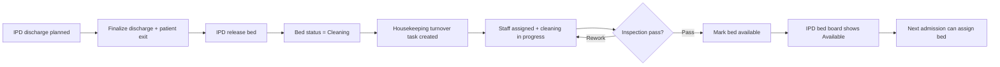

# Housekeeping Module — Implementation Prompt

## Objective

Complete the **Housekeeping Module** for HOSSPI HMS so housekeeping staff, supervisors, and bed managers can run sanitation and turnover work end-to-end: receive bed-release and room-cleaning work, assign and complete cleaning tasks, manage recurring schedules, track room/bed readiness, coordinate laundry and ward sanitation, escalate facility issues to maintenance, and mark beds **available** for the next admission — with clear handoffs from **IPD discharge → bed release → cleaning → bed available** and traceability back to the inpatient encounter when turnover is bed-driven.

**Source of truth:** implement housekeeping workflow in alignment with:

- [flows/ipd-flow.mdc](../.cursor/flows/ipd-flow.mdc) — step 18 (bed release after patient exit), discharge step 9 (housekeeping role), §3 bed statuses (`Cleaning`, release workflow), §13 housekeeping role, §14.2 bed board next actions, §17 turnaround (auto-notify housekeeping on bed release)
- [flows/opd-flow.mdc](../.cursor/flows/opd-flow.mdc) — §5 role boundary (housekeeping has no OPD clinical actions); facility room readiness for outpatient areas when applicable
- [app-write-up.mdc](../.cursor/app-write-up.mdc) — Housekeeping module boundaries vs IPD, Operations, Rooms/wards/beds, and Nursing

**Central location rule:** cleaning tasks attach to **facility rooms and/or beds** (physical care spaces). When turnover is triggered by IPD discharge, the task must retain a link to the **IPD admission / bed assignment** for audit and bed-board sync — Housekeeping does not own clinical discharge or encounter closure. IPD and Discharge modules release beds; Housekeeping owns cleaning execution and readiness confirmation.

Deliver a **professional, calm, operations workspace** optimized for shift triage: role-focused queues, overdue prominence, predictable primary actions, location context at a glance, and no raw internal identifiers in the UI.

---

## Global Implementation Standards

Mandatory platform rules for all work in this module.

| Area | Requirement |
| ---- | ----------- |
| Product scope | [app-write-up.mdc](../.cursor/app-write-up.mdc) — respect module boundaries; do not duplicate workflows owned elsewhere. |
| Patient flows | Align with [`.cursor/flows/`](../.cursor/flows/). Use [opd-flow.mdc](../.cursor/flows/opd-flow.mdc) and [ipd-flow.mdc](../.cursor/flows/ipd-flow.mdc) for journey touchpoints; read the module-specific flow file when one exists (lab, nursing, pharmacy, radiology, discharge, emergency, icu, theater). |
| Encounters | One active OPD encounter per outpatient visit; IPD admission as inpatient hub; overlays (ICU, Theater) and executing departments attach — never parallel admission records. |
| UI/UX | Modern, clean, minimal on-screen text; hospital workflow language (not enum names or UUIDs). Follow `frontend/.cursor/design-system.mdc`, `components.mdc`, `ui-patterns.mdc`, `ui-workspace.mdc`, `layouts.mdc`, `platform_guidelines.mdc`. Reuse `frontend/lib/shared/*` before creating new widgets. Responsive on Android, iOS, web, Windows, macOS, Linux. |
| Theming and i18n | Full theme support (light/dark/system). All user-visible strings in `app_en.arb` — no hardcoded labels. |
| Modal-first workflows | **All create/edit/approve/complete/handoff actions** use **in-page dialogs, bottom sheets, or nested modals**. Do **not** navigate to new routes for within-module workflows. Shell entry routes (`/opd`, `/ipd`, etc.) and deep-link **pre-selection** of a patient/record are allowed; selecting a row opens the workspace detail panel — not a separate workflow page. |
| Realtime sync | Subscribe to relevant `RealtimeEventGroups` in workspace controllers. After mutations, refresh affected rows, detail panels, summary cards, and nav badges. Keep UI, frontend state, backend services, and database consistent. |
| Architecture | UI/controllers → repository → API (`frontend/.cursor/feature_workflow.mdc`, `architecture.mdc`). Enforce RBAC + ABAC + tenant/facility scope + module entitlements (frontend `AccessGate` + backend authorization). |
| Database | Apply migrations for schema changes per backend standards; keep API contracts and schema aligned. |
| Quality gate | From `frontend/`: `flutter pub get`, `dart format --set-exit-if-changed .`, `flutter analyze`, `flutter test`. From `backend/`: targeted `npm test` for touched modules. |

---


## Current State (read before changing code)

### Already in place

| Area | Location / API | Notes |
|------|----------------|-------|
| Product scope | `../.cursor/app-write-up.mdc` | Housekeeping owns cleaning, schedules, turnover, sanitation readiness, laundry coordination |
| IPD flow spec | `../.cursor/flows/ipd-flow.mdc` | Bed release step 18; `Cleaning` bed status; housekeeping role in discharge |
| Frontend scaffold | `frontend/lib/features/housekeeping/` | `data/`, `domain/`, `presentation/` layers exist |
| Workspace UI | `housekeeping_workspace_page.dart` | Summary cards, worklist table, task/schedule/maintenance dialogs, detail panel, report preview (~1.9k lines) |
| Controller | `housekeeping_workspace_controller.dart` | Realtime + refresh, search, resource/queue/status filters, task/schedule/maintenance mutations |
| Repository | `housekeeping_repository.dart` / `housekeeping_repository_impl.dart` | Workspace via `GET /housekeeping-workspace`; tasks, schedules, maintenance CRUD |
| Backend workspace | `housekeeping-workspace/` | Panels (overview, tasks, requests, assets, history), queues (TODAY, OVERDUE_TASKS, OPEN/OVERDUE_REQUESTS), summary cards |
| Task API | `housekeeping-task/` | CRUD at `/api/v1/housekeeping-tasks`; status `PENDING` / `IN_PROGRESS` / `COMPLETED` / `CANCELLED` |
| Schedule API | `housekeeping-schedule/` | CRUD at `/api/v1/housekeeping-schedules`; room + frequency |
| Maintenance handoff | `maintenance-request/` | Create/triage/update from housekeeping workspace; overlaps Operations module boundary |
| IPD bed release | `ipd-flow` `release-bed` | Sets bed `AVAILABLE` immediately; no `Cleaning` status or auto task creation |
| IPD UI | `ipd_workspace_page.dart` | **Release bed** action when discharge planned; cleaning icon only |
| Localization | `app_en.arb` | Substantial housekeeping workspace strings |
| Permissions / roles | `access_policy.dart` | `HOUSEKEEPING_MANAGER`, `HOUSEKEEPING_SUPERVISOR`; task read/write/report gates |
| Realtime | `RealtimeEventGroups.housekeeping` | Controller subscribes to housekeeping/maintenance events |
| Shell integration | `app_router.dart` | `/housekeeping` route with nav badge from pending + open-request workload |
| Backend tests | `housekeeping-task/`, `housekeeping-schedule/` | Route, service, RBAC coverage |
| Backend gap flags (UI) | `housekeeping_entities.dart` | `housekeepingUnavailableWorkflows` documents discharge-to-cleaning, bed cleaning status, inspection, reports |

### Known gaps to close

- **Discharge → cleaning not connected** — IPD `release-bed` marks bed `AVAILABLE` without `Cleaning` transition or housekeeping task; UI shows permanent backend-gap banner for discharge-to-cleaning automation.
- **No bed-centric tasks** — housekeeping tasks use `room_id` only; no `bed_id`, ward, or admission reference for IPD turnover queues.
- **Bed status contract mismatch** — flow recommends `Cleaning`, `Maintenance`, `Blocked`; backend bed model uses `AVAILABLE`, `OCCUPIED`, `RESERVED`, `OUT_OF_SERVICE` only.
- **No bed turnover queue** — no dedicated **Beds awaiting cleaning** or **Turnover pending** scope filtered from IPD releases or beds in cleaning state.
- **IPD ↔ Housekeeping bridge missing** — IPD release-bed does not deep-link or notify housekeeping; housekeeping detail does not link to IPD admission or bed board.
- **OPD integration thin** — OPD flow excludes housekeeping from clinical actions; outpatient consultation room cleaning (if facility policy requires) is not routed from OPD — document or implement facility-room schedules only.
- **Panel parity** — backend workspace defines assets/history panels; frontend primarily surfaces tasks, schedules, and maintenance requests; assets/service-log panels incomplete or hidden.
- **Inspection / rework workflow** — no sanitation checklist, supervisor sign-off, or rework loop when cleaning fails inspection.
- **Mark room/bed ready** — completing a task does not update bed status to `AVAILABLE` or unblock IPD bed assignment.
- **Deep links** — backend builds `/housekeeping?panel=&queue=&id=` paths; Flutter router does not parse query params to pre-select item or panel.
- **Laundry coordination** — app-write-up includes laundry; no laundry queue or handoff in current UI/API.
- **Operations boundary** — maintenance requests live in housekeeping workspace; clarify vs Operations module and avoid duplicate facility maintenance UIs.
- **Module entitlement** — no dedicated `housekeeping` subscription module key documented (unlike `icu-critical-care`, `inpatient-bed-management`).
- **No frontend tests** — `test/features/housekeeping/` does not exist.
- **Large page file** — `housekeeping_workspace_page.dart` mixes worklist, detail, and many dialogs; needs extraction per project conventions.

---

## Flow Integration Requirements

### IPD flow (`../.cursor/flows/ipd-flow.mdc`)

| IPD step / concept | Housekeeping module responsibility |
| ------------------ | -------------------------------- |
| Step 17: Patient exit | Patient leaves ward; bed becomes eligible for release — housekeeping notified when bed enters cleaning queue |
| Step 18: Bed release | IPD/bed manager releases bed; system should move bed to **`Cleaning`** (not straight to `Available`) and create or enqueue housekeeping turnover task |
| Discharge step 9 | Housekeeping cleans released bed and confirms readiness |
| §3 Bed statuses | Support `Cleaning` → `Available` lifecycle; show on housekeeping bed/turnover board |
| §14.2 Bed board | Next action **Clean** / **Mark available** for beds in cleaning; coordinate with IPD bed board (IPD owns hospital-wide view; housekeeping owns cleaning queue) |
| §13 Housekeeping role | Assign tasks, start/complete cleaning, escalate maintenance, mark bed ready |
| §17 Turnaround | Auto-notify housekeeping on bed release; focused turnover queue |
| §16 Encounter hub | Turnover tasks link to `admission_id` / `bed_assignment_id` when triggered by IPD — clinical record stays in IPD |

### OPD flow (`../.cursor/flows/opd-flow.mdc`)

| OPD concept | Housekeeping module responsibility |
| ----------- | ---------------------------------- |
| §5 Role rules | Housekeeping has **no** OPD workspace clinical actions — do not add OPD stage mutations |
| Facility rooms | Outpatient consultation/treatment rooms may use **scheduled cleaning** (housekeeping-schedules) independent of OPD encounters |
| `ADMITTED` handoff | When OPD patient is admitted, room cleaning (if needed) is facility ops — not tied to OPD encounter closure |
| Traceability | If a cleaning task references a room used for OPD, show room/facility context only — do not duplicate OPD encounter records |

### Recommended bed turnover journey



---

## Scope — Core Capabilities

Implement or finish the following, in priority order. Each item maps to IPD flow sections and app-write-up Housekeeping responsibilities.

### 1. Turnover queue and role-focused worklist

**Goal:** Housekeeping staff triage today's cleaning work, overdue tasks, and beds awaiting turnover using backend workspace queues.

**Actions:**

- Keep primary layout: **summary cards → worklist → detail panel → action bar** (`AppWorkspace`, `AppListTable`, `AppWorkspaceDetailPanel`, `AppActionList`).
- Preserve and align queues with backend definitions:
  - **Today's tasks** → `queue=TODAY`, resource `housekeeping-tasks` (default landing for cleaners)
  - **Overdue tasks** → `queue=OVERDUE_TASKS`
  - **Beds awaiting cleaning** → new queue when API supports beds in `Cleaning` or pending turnover (until then, document filter gap)
  - **Open maintenance** → `queue=OPEN_REQUESTS`
  - **Overdue maintenance** → `queue=OVERDUE_REQUESTS`
  - **Schedules** → resource `housekeeping-schedules` for recurring ward/room cleaning
- Summary cards must filter the worklist (mirror IPD §14 and OPD §6); hide zero-value cards where the workspace pattern expects it.
- Table columns: location (ward/room/bed), task type (turnover, scheduled, request), status, assignee, scheduled/due time, priority, source (IPD discharge, manual, schedule), next action.
- Use display IDs (`human_friendly_id`, room/bed labels) — never surface raw UUIDs.
- Subscribe to `RealtimeEventGroups.housekeeping`; refresh affected row after mutations.
- Remove or shrink `housekeepingUnavailableWorkflows` banner entries as each backend capability ships.

**Reference APIs:** `GET /housekeeping-workspace?panel=&resource=&queue=&status=`, `GET /housekeeping-tasks`.

### 2. IPD discharge → bed cleaning handoff

**Goal:** Closing the loop from IPD bed release to housekeeping task without duplicate bed records (flow §10 step 9, §18, §17).

**Actions:**

- **Backend (coordinate with IPD):** extend `release-bed` (or post-release hook) to:
  - Set bed status to **`CLEANING`** (add enum value if missing) instead of immediate `AVAILABLE`
  - Auto-create housekeeping task with `bed_id`, `room_id`, `admission_id` reference, task type `BED_TURNOVER`, default priority from ward policy
  - Emit realtime event to `RealtimeEventGroups.housekeeping` and optional notification to housekeeping role
- **Frontend IPD:** after release-bed success, show toast/link **View in Housekeeping** with deep-link to turnover task.
- **Frontend Housekeeping:** turnover tasks show admission no., last patient display name (when policy allows), discharge time, isolation/infection flags if API provides.
- **Do not** finalize IPD discharge or close encounter from Housekeeping.

**Reference APIs:** `POST /ipd-flows/:id/release-bed`; new or extended `POST /housekeeping-tasks` with bed/admission linkage.

### 3. Task lifecycle (assign, start, complete, inspect)

**Goal:** Staff execute cleaning work with clear status progression.

**Actions:**

- **Create task** — manual or from schedule; support room, bed, ward, assignee, scheduled time, task category (turnover, terminal clean, isolation, routine).
- **Update status** — `PENDING` → `IN_PROGRESS` → `COMPLETED` (or `CANCELLED` with reason).
- **Assign / reassign** — `assigned_to_staff_id` update with supervisor permission.
- **Complete with checklist** — when API supports: linen changed, bathroom sanitized, high-touch surfaces, waste removed, equipment wiped — store as structured checklist or note.
- **Inspection / rework** — supervisor marks pass/fail; fail returns to `IN_PROGRESS` with rework note (close backend-gap flag when implemented).
- **Mark bed ready** — on pass, call bed API to set status `AVAILABLE`; unblock IPD assign-bed for that bed.

**Reference APIs:** `PUT /housekeeping-tasks/:id`, `PUT /beds/:id` (status), optional `POST …/inspect` action.

### 4. Schedules and ward cleaning

**Goal:** Recurring sanitation for wards, rooms, and non-IPD areas (app-write-up schedules + ward cleaning).

**Actions:**

- Keep **Create schedule** dialog — room, frequency, start/end date.
- Surface schedules resource in worklist with upcoming occurrences.
- Generate tasks from schedules (backend job or on-demand) — document if cron/worker owns generation.
- Distinguish **bed turnover** (event-driven from IPD) vs **scheduled ward/room clean** (time-driven).

**Reference APIs:** `GET/POST /housekeeping-schedules`, `GET /housekeeping-workspace?resource=housekeeping-schedules`.

### 5. Bed and room readiness board

**Goal:** Supervisors see which beds/rooms are dirty, in progress, or ready (flow §14.2 cleaning actions).

**Actions:**

- Add **Readiness board** tab or section: ward, room/bed, status (`Cleaning`, `In progress`, `Ready`, `Blocked`), assignee, elapsed time since release, next action.
- Filter by ward, status, overdue threshold.
- Wire **Start cleaning**, **Complete**, **Mark available** from board rows.
- Link **View in IPD bed board** for hospital-wide bed ops context.
- Coordinate bed status ownership: Housekeeping confirms clean; IPD/bed manager may still reserve/assign once `AVAILABLE`.

**Reference APIs:** `GET /beds?status=CLEANING` (when added), housekeeping workspace turnover queue, `GET /wards`.

### 6. Maintenance escalation (Operations boundary)

**Goal:** Housekeeping reports broken fixtures, plumbing, or equipment during cleaning without owning full Operations workflows.

**Actions:**

- Keep **Request maintenance** from housekeeping workspace — asset, description, facility.
- Keep **Triage** action for supervisors — status, SLA, summary.
- On convert/route to Operations, deep-link to Operations workspace when module enabled.
- Document boundary: Housekeeping creates **sanitation-blocking** requests; Operations owns electrical/HVAC/plumbing work orders long-term.

**Reference APIs:** `POST /maintenance-requests`, `POST /maintenance-requests/:id/triage`.

### 7. Laundry coordination (when API available)

**Goal:** Track linen turnaround tied to bed cleaning per app-write-up.

**Actions:**

- If backend exposes laundry requests or linen status per ward/bed, show pending linen on turnover detail.
- Until API exists, document gap; do not fake laundry state in UI.

### 8. Cross-module integration

**Goal:** Housekeeping connects cleanly to IPD, Nursing, Operations, and facility structure.

**Actions:**

- **IPD:** deep-link from release-bed and bed board cleaning rows to `/housekeeping?id={taskDisplayId}&panel=tasks`.
- **Housekeeping → IPD:** turnover detail links to admission (read-only) and bed on IPD bed board.
- **Nursing:** after nursing clearance, bed release may follow — housekeeping does not perform nursing clearance.
- **Notifications:** new turnover tasks and overdue items update shell nav badge and row alerts.
- **Deep links:** parse `/housekeeping?panel=&queue=&id=&action=` in `app_router.dart` — select resource, queue, and item.
- **OPD:** no encounter mutations; optional facility-room schedule for clinic rooms only.

### 9. Reporting and audit

**Goal:** Supervisors review turnaround time and backlog without replacing Reports module.

**Actions:**

- Keep report preview action; wire to real report endpoint when available (close backend-gap flag).
- Show who/when on task status changes when API provides actor metadata.
- Turnaround metrics: median time from bed release to `AVAILABLE` per ward.

---

## UI / UX Requirements

Follow `frontend/.cursor/ui-patterns.mdc`, `design-system.mdc`, `components.mdc`, and `layouts.mdc`. Mirror proven workspace patterns from **Operations**, **IPD bed board**, and **Nursing** queues.

### Organization

- **Three primary views**, clearly separated:
  1. **Cleaning worklist** — tasks and queues (default for cleaners).
  2. **Readiness board** — beds/rooms by sanitation status (default for supervisors).
  3. **Schedules** — recurring cleaning plans.
- **Single primary task per region:** worklist (triage), detail (split panel or dialog), actions (grouped panel).
- **Progressive disclosure:** summary cards for overdue/open workload; ward/facility filters collapsed; mutations in dialogs.
- **Role-appropriate actions:** cleaner (start/complete task), supervisor (assign, inspect, cancel), manager (schedules, reports, maintenance triage) — per flow §13 adapted for housekeeping.
- Default landing: **Today's tasks** or **Beds awaiting cleaning** when turnover queue has items.

### Simplicity

- **Overdue first** — warning tone on overdue cards and rows only.
- **One status chip + one next-action column** on the worklist.
- **Action panel hierarchy:** start task → complete cleaning → request maintenance (if issue found) → mark bed ready (supervisor) → cancel (manager only).
- **Forms:** one column on narrow viewports; datetime for scheduled tasks; required location (room/bed).
- **Loading/saving:** `AppWorkspace` status tone; refresh selected row after modal actions.

### Professional healthcare feel

- Terminology: turnover, sanitation, room ready, bed available, maintenance request — not generic "submit".
- Calm hierarchy: neutral backgrounds; urgency color on overdue and isolation flags only.
- Infection-control awareness: show isolation/terminal-clean badges when API provides flags.
- Accessibility: semantic labels on queues, tables, and dialogs; keyboard-navigable modals.
- No raw UUIDs, internal enum codes, or debug field names in production UI.

---

## Architecture and Conventions

Follow `frontend/docs/workflows/feature-workflow.md` and `../.cursor/` rules. **Re-read `../.cursor/flows/ipd-flow.mdc` and `../.cursor/app-write-up.mdc` before any housekeeping flow change.**

| Rule | Requirement |
|------|-------------|
| Layering | UI/controllers → repository interface → repository impl → API client. No API calls from widgets. |
| State | Riverpod `AsyncNotifier` controllers; `Result<T>` / `AppFailure` for errors. |
| DTOs | `data/dtos/` with explicit mappers to `domain/entities/`. |
| Localization | All user strings in `app_en.arb`; run codegen. |
| Permissions | `AccessGate` / `AppAccessActionGate`; housekeeping roles + module entitlement when defined. |
| Location anchor | Tasks reference `room_id` / `bed_id`; IPD-triggered tasks also store admission reference when API supports. |
| Shared UI | Reuse `AppWorkspace`, `AppListTable`, `AppWorkspaceDetailPanel`, `AppReportActionButton`. |
| File size | Extract widgets to `presentation/widgets/`; keep page compositional. |
| Tests | Add `test/features/housekeeping/` — controller queues, DTO mapping, task lifecycle, deep-link parsing. |
| Backend | Prefer `housekeeping-workspace` for list/summary; extend task/bed schemas before parallel endpoints. |

**Do not** finalize IPD discharge or release beds from Housekeeping (except **mark bed available** after cleaning when that is the agreed bed-status transition). **Do not** duplicate Operations maintenance lifecycle — escalate and link out. **Do not** add OPD clinical actions.

**Reuse existing services** — analyze `release-bed`, `housekeeping-workspace.service.js`, and bed module before adding endpoints.

---

## Suggested Implementation Order

1. **IPD release-bed → cleaning status + auto task** — backend hook; bed `CLEANING` enum; admission/bed linkage on task.
2. **Turnover queue + readiness board** — new queue filter; bed-centric columns; remove discharge-to-cleaning gap flag.
3. **Mark bed ready on complete** — task completion updates bed to `AVAILABLE`; IPD bed board reflects change.
4. **Deep links** — parse `/housekeeping?panel=&queue=&id=`; IPD release-bed success link.
5. **Inspection / rework** — supervisor pass/fail; checklist fields when API ready.
6. **Panel parity** — schedules prominence; assets/history if in scope for this phase.
7. **IPD / bed board cross-links** — bidirectional navigation with admission context on turnover detail.
8. **Operations boundary** — maintenance convert/link to Operations module.
9. **Laundry** — when API exists; else keep documented gap.
10. **Widget extraction + tests** — split page; controller and repository tests.
11. **Reports** — real turnaround report endpoint; remove report gap flag.

Work in small, reviewable increments. One clear responsibility per new file.

---

## Acceptance Criteria

- [ ] Staff can open Housekeeping workspace, filter by queue/resource, and open task detail with live sync.
- [ ] **IPD release-bed** creates or enqueues turnover work and sets bed to **Cleaning** (not immediate Available).
- [ ] **Today's** and **Overdue** task queues match backend workspace queue contracts.
- [ ] Cleaners can **start**, **complete**, and supervisors can **assign** tasks with validation errors surfaced in UI.
- [ ] **Mark bed ready** after successful cleaning sets bed **Available** for IPD assignment.
- [ ] Readiness board shows beds/rooms in cleaning with ward, elapsed time, and assignee.
- [ ] Recurring **schedules** can be created and appear in worklist.
- [ ] **Maintenance requests** can be created and triaged; Operations link when enabled.
- [ ] IPD release-bed and housekeeping turnover tasks are **cross-linked**; deep links (`/housekeeping?id=…&panel=…`) open correct item.
- [ ] Shell nav badge reflects pending + overdue workload; realtime updates refresh counts.
- [ ] All user-facing strings localized; housekeeping roles and permissions enforced.
- [ ] No OPD clinical mutations from Housekeeping; OPD rooms use schedules only if needed.
- [ ] `housekeepingUnavailableWorkflows` entries removed as capabilities ship.
- [ ] UI provides **worklist**, **readiness board**, and **schedules** with calm, scannable operations layout.
- [ ] `flutter analyze` and `flutter test` pass; new housekeeping tests cover repository mapping and primary flows.

---

## Quality Gate

Before marking complete, run from `frontend/`:

```sh
flutter pub get
dart format --set-exit-if-changed .
flutter analyze
flutter test
```

Run backend housekeeping tests from `backend/`:

```sh
npm test -- --testPathPattern="housekeeping-task|housekeeping-schedule|housekeeping-workspace"
```

Enable housekeeping role accounts (`HOUSEKEEPING_MANAGER`, default housekeeping user from seed) for integration testing. Manually smoke-test: IPD discharge planned → finalize → release bed → housekeeping turnover task → complete cleaning → bed available → IPD assign-bed to new patient.

---

## Key File References

```
.cursor/flows/ipd-flow.mdc                          # Bed release §18, Cleaning status §3, discharge step 9
.cursor/flows/opd-flow.mdc                          # Role boundary §5 (no OPD clinical actions)
.cursor/app-write-up.mdc                            # Housekeeping module boundaries

frontend/lib/features/housekeeping/
├── data/dtos/housekeeping_dtos.dart
├── data/repositories/housekeeping_repository_impl.dart
├── domain/entities/housekeeping_entities.dart
├── domain/repositories/housekeeping_repository.dart
└── presentation/
    ├── controllers/housekeeping_workspace_controller.dart
    └── pages/housekeeping_workspace_page.dart

frontend/lib/features/ipd/                        # release-bed, bed board, discharge
frontend/lib/features/operations/                 # Maintenance boundary — link, don't duplicate
frontend/lib/app/router/app_router.dart           # /housekeeping route + deep-link handling

backend/src/modules/housekeeping-workspace/       # Workspace summary, queues, panels
backend/src/modules/housekeeping-task/            # Task CRUD
backend/src/modules/housekeeping-schedule/        # Schedule CRUD
backend/src/modules/maintenance-request/          # Escalation from housekeeping
backend/src/modules/ipd-flow/                     # release-bed — extend for cleaning handoff
backend/src/modules/bed/                          # Bed status lifecycle
```

---

## Flow Traceability Matrix

Use when implementing or reviewing PRs — every deliverable should map to source documents.

| Source | Section | Topic | Primary implementation target |
|--------|---------|-------|-------------------------------|
| ipd-flow | Step 17–18 | Patient exit + bed release | IPD `release-bed` → cleaning task |
| ipd-flow | §3 | Bed statuses `Cleaning` | Bed enum + readiness board |
| ipd-flow | §10 step 9 | Housekeeping cleans bed | Task complete → bed available |
| ipd-flow | §13 | Housekeeping role | Action visibility by role |
| ipd-flow | §14.2 | Bed board next actions | Clean / mark available |
| ipd-flow | §17 | Auto-notify housekeeping | Realtime + notification on release |
| ipd-flow | §16 | IPD encounter hub | Turnover task admission link (read-only) |
| opd-flow | §5 | Role rules | No OPD workspace actions in Housekeeping |
| opd-flow | §7 | OPD → IPD handoff | Indirect — turnover after IPD discharge only |
| app-write-up | Housekeeping row | Module responsibility | Tasks, schedules, turnover, readiness |
| app-write-up | Module boundaries | vs IPD / Operations | No discharge finalize; escalate maintenance |
