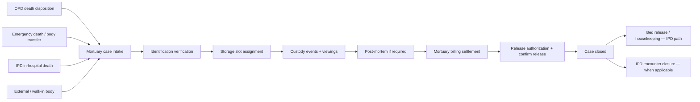

# Mortuary Module — Implementation Prompt

## Objective

Complete the **Mortuary Module** for HOSSPI HMS so mortuary staff, mortuary managers, billing, and clinical coordinators can run post-death custody end-to-end: receive deceased cases from inpatient, emergency, or outpatient pathways, verify identification, assign storage slots, maintain chain-of-custody, schedule viewings, coordinate post-mortem requests, settle mortuary billing, authorize and confirm release, and close cases — all linked to the **source clinical encounter** (IPD admission, emergency case, or OPD visit) without duplicating patient or admission records.

**Source of truth:** implement mortuary workflow in alignment with:

- [flows/ipd-flow.mdc](../.cursor/flows/ipd-flow.mdc) — death during admission as an alternate exit path (vs normal discharge §10–§12); bed release §18; encounter closure §19; billing gates §4; encounter hub §16
- [flows/opd-flow.mdc](../.cursor/flows/opd-flow.mdc) — terminal disposition when outpatient death occurs before `ADMITTED`; source encounter preservation; §6 UI rules (summary cards filter worklist)
- [app-write-up.mdc](../.cursor/app-write-up.mdc) — Mortuary module boundaries vs IPD, Discharge, Billing, Emergency, Housekeeping, and Patient registry

**Central linkage rule:** every mortuary case attaches to a **deceased profile** and optionally to a **source workflow reference** (`source_workflow`, `source_reference_id`, linked `patient_id`, IPD admission, emergency case, or OPD encounter). Mortuary owns custody, storage, release, and mortuary-specific billing — it does not recreate clinical admission records or perform clinical death certification beyond what the source module provides.

Deliver a **dignified, audit-ready, chain-of-custody workspace** optimized for legal and operational compliance: role-focused queues, clear identification and release gates, predictable primary actions, deceased context at a glance, and no raw internal identifiers in the UI.

---

## Global Implementation Standards

Mandatory platform rules for all work in this module.

| Area | Requirement |
| ---- | ----------- |
| Product scope | [app-write-up.mdc](../.cursor/app-write-up.mdc) — respect module boundaries; do not duplicate workflows owned elsewhere. |
| Patient flows | Align with [`.cursor/flows/`](../.cursor/flows/). Use [opd-flow.mdc](../.cursor/flows/opd-flow.mdc) and [ipd-flow.mdc](../.cursor/flows/ipd-flow.mdc) for journey touchpoints; read the module-specific flow file when one exists (lab, nursing, pharmacy, radiology, discharge, emergency, icu, theater). |
| Encounters | One active OPD encounter per outpatient visit; IPD admission as inpatient hub; overlays (ICU, Theater) and executing departments attach — never parallel admission records. |
| UI/UX | Modern, clean, minimal on-screen text; hospital workflow language (not enum names or UUIDs). Follow `frontend/.cursor/design-system.mdc`, `components.mdc`, `ui-patterns.mdc`, `ui-workspace.mdc`, `layouts.mdc`, `platform_guidelines.mdc`. Reuse `frontend/lib/shared/*` before creating new widgets. Responsive on Android, iOS, web, Windows, macOS, Linux. |
| Theming and i18n | Full theme support (light/dark/system). All user-visible strings in `app_en.arb` — no hardcoded labels. |
| Modal-first workflows | **All create/edit/approve/complete/handoff actions** use **in-page dialogs, bottom sheets, or nested modals**. Do **not** navigate to new routes for within-module workflows. Shell entry routes (`/opd`, `/ipd`, etc.) and deep-link **pre-selection** of a patient/record are allowed; selecting a row opens the workspace detail panel — not a separate workflow page. |
| Realtime sync | Subscribe to relevant `RealtimeEventGroups` in workspace controllers. After mutations, refresh affected rows, detail panels, summary cards, and nav badges. Keep UI, frontend state, backend services, and database consistent. |
| Architecture | UI/controllers → repository → API (`frontend/.cursor/feature_workflow.mdc`, `architecture.mdc`). Enforce RBAC + ABAC + tenant/facility scope + module entitlements (frontend `AccessGate` + backend authorization). |
| Database | Apply migrations for schema changes per backend standards; keep API contracts and schema aligned. |
| Quality gate | From `frontend/`: `flutter pub get`, `dart format --set-exit-if-changed .`, `flutter analyze`, `flutter test`. From `backend/`: targeted `npm test` for touched modules. |

---


## Mandatory Reading (before any Mortuary change)

1. Re-read [flows/ipd-flow.mdc](../.cursor/flows/ipd-flow.mdc) — especially §3 bed management, §4 billing gates, §10–§12 discharge (contrast with death pathway), §16 encounter hub rule, §18 bed release after exit.
2. Re-read [flows/opd-flow.mdc](../.cursor/flows/opd-flow.mdc) — §3 stage contract, §7 OPD-to-IPD handoff (mortuary is a separate terminal path when death occurs in OPD), §6 UI rules.
3. Re-read [app-write-up.mdc](../.cursor/app-write-up.mdc) — Mortuary vs Discharge vs Billing vs Housekeeping boundaries; online-only release expectation.
4. Re-read `backend/.cursor/compliance.mdc` and `backend/.cursor/offline-support.mdc` — mortuary release and custody actions require full audit evidence and are **online-only**.

---

## Cross-Flow Integration Map

Mortuary sits **after** a death event in a clinical module and **parallel to** (not inside) the IPD encounter lifecycle.



| Upstream | Flow reference | Mortuary responsibility |
| -------- | -------------- | ----------------------- |
| IPD in-hospital death | ipd-flow §16 hub, §18 bed release | Receive case with `source_workflow=IPD` and admission reference; do not duplicate IPD admission |
| OPD death before admit | opd-flow §3 disposition | Receive with OPD encounter reference; OPD visit closes; mortuary owns body custody |
| OPD `ADMITTED` then death | opd-flow §7 + ipd-flow | Show both OPD source and active IPD admission on case detail |
| Emergency death | ipd-flow §2.1 pattern | Receive with emergency case reference; preserve `Billing Deferred` context when applicable |
| IPD bed manager | ipd-flow §3, §18 | After release, IPD bed moves to cleaning via Housekeeping — mortuary does not own bed CRUD |
| Billing | ipd-flow §4, app-write-up Billing | Mortuary billable events post to billing; cashier settles — mortuary does not run cashier desk |
| Discharge module | ipd-flow §10–§12 | Death bypasses normal discharge clearance; mortuary release replaces patient exit for deceased |
| Housekeeping | ipd-flow step 18 | Trigger or link bed cleaning after body leaves ward — coordinate via IPD bed status |
| Patient registry | app-write-up Patient row | Link living patient record; deceased profile is mortuary-owned extension |

---

## Current State (read before changing code)

### Already in place

| Area | Location / API | Notes |
|------|----------------|-------|
| Product scope | `../.cursor/app-write-up.mdc` | Mortuary owns custody, storage, viewing, post-mortem, release, mortuary billing events |
| Frontend scaffold | `frontend/lib/features/mortuary/` | `data/`, `domain/`, `presentation/` layers exist |
| Workspace UI | `mortuary_workspace_page.dart` | Six panels (overview, intake, storage, custody, release, reporting), summary cards, queues, detail sections, print — **mutations disabled** via `_ActionGapPanel` |
| Controller | `mortuary_workspace_controller.dart` | Realtime + periodic sync, panel/queue/resource switching, search, pagination, item selection |
| Repository (read) | `mortuary_repository.dart` / `mortuary_repository_impl.dart` | `GET /mortuary` workspace, `GET /mortuary/lookups`, item view via `action=view` |
| Backend workspace | `backend/src/modules/mortuary-workspace/` | Read-only workspace aggregator; panels, queues, summary cards, resource lists, case detail with nested custody/viewing/post-mortem/release/billing |
| Panel contract | Service `PANEL_DEFINITIONS` | `overview`, `intake`, `storage`, `custody`, `release`, `reporting` |
| Queue contract | Service `QUEUE_DEFINITIONS` | `IDENTIFICATION_PENDING`, `STORAGE_EXCEPTIONS`, `RELEASE_READY`, `UNSETTLED_BILLING`, `POST_MORTEM_PENDING` |
| Case statuses | Entities + backend | `RECEIVED`, `IDENTIFICATION_PENDING`, `IN_STORAGE`, `POST_MORTEM_PENDING`, `READY_FOR_RELEASE`, `RELEASED`, `CLOSED`, `CANCELLED` |
| Permissions | `access_policy.dart` | `mortuary:read/write/release/manage_storage/post_mortem_request/approve/billing_event/export/audit`; roles `MORTUARY_STAFF`, `MORTUARY_MANAGER` |
| Feature flag | `mortuary_workspace_v1` | Routes return 404 when disabled |
| Localization (substantial) | `app_en.arb` | Workspace, panels, queues, sections, action labels (actions currently disabled) |
| Shell integration | `app_router.dart` | `/mortuary` route with nav badge from workload count |
| Realtime | `RealtimeEventGroups.mortuary` | Controller subscribes to mortuary domain events |
| Tests (minimal) | `test/features/mortuary/` | DTO mapping + controller tests |

### Known gaps to close

- **No mutation APIs** — backend routes are GET-only; repository has no create/update methods; all action buttons are disabled with `mortuaryActionsUnavailableTooltip`.
- **No case intake from IPD/OPD/Emergency** — clinical modules lack “notify mortuary / create mortuary case” handoff; mortuary cannot self-start from source encounter.
- **Storage board incomplete** — storage panel lists assignments but no live **storage slot board** (available/occupied/cleaning/out-of-service) with assign/reassign/end actions.
- **Identification workflow** — statuses `UNVERIFIED` / `PARTIAL` / `VERIFIED` displayed but no verify/partial-update dialogs.
- **Custody chain** — timeline displayed read-only; no record custody event mutation.
- **Viewings** — listed on detail; no schedule/complete/cancel viewing dialogs.
- **Post-mortem lifecycle** — request/approve/schedule/complete not wired; `POST_MORTEM_PENDING` queue is read-only.
- **Release authorization** — approve and confirm release are **online-only** per platform rules; UI shows disabled buttons only.
- **Billing integration** — billable events shown; no request billing / link to Billing workspace for settlement; `UNSETTLED_BILLING` queue not actionable.
- **IPD bed release coordination** — death on ward does not auto-signal housekeeping or IPD bed cleaning from mortuary release complete.
- **OPD / IPD / Emergency cross-links** — `source_workflow`, `source_reference_id`, `patient_id` shown when API provides; no deep links to source modules.
- **Deep links** — notifications may target `/mortuary?...`; router should parse `panel`, `queue`, `id`, `resource` query params to pre-select case and panel.
- **Documents / print** — print action exists; release documents and custody forms need template completion when mutations exist.
- **Large page file** — `mortuary_workspace_page.dart` (~1.8k lines) mixes board, detail, sections; needs extraction per project conventions.
- **Backend workflow tests** — no mutation/integration tests for mortuary case lifecycle (high-risk domain per `backend/.cursor/testing.mdc`).
- **Demo seed data** — app-write-up expects mortuary demo cases; verify seed covers full panel/queue walkthrough.

---

## Scope — Core Capabilities

Implement or finish the following, in priority order. Each item maps to IPD/OPD flow rules, app-write-up mortuary responsibilities, and compliance constraints.

### 1. Mortuary workspace boards and role-focused queues

**Goal:** Mortuary staff can triage cases by panel and queue using backend contracts.

**Actions:**

- Keep primary layout: **panel tabs → worklist → detail** (`AppWorkspace`, `AppListTable`, `AppWorkspaceDetailPanel`, `AppActionList`).
- Preserve panel/resource alignment with backend:
  - **Overview** → `mortuary-cases` (default landing)
  - **Intake** → `mortuary-cases` + `IDENTIFICATION_PENDING` queue
  - **Storage** → `mortuary-storage-assignments` + `STORAGE_EXCEPTIONS` queue
  - **Custody** → `mortuary-custody-events`
  - **Release** → `mortuary-release-authorisations` + `RELEASE_READY` / `UNSETTLED_BILLING` queues
  - **Reporting** → `mortuary-post-mortem-requests` + `POST_MORTEM_PENDING` queue
- Summary cards must filter the worklist (mirror OPD §6 and IPD §14); hide zero-value cards where the workspace pattern expects it.
- Table columns: deceased name, case number, identification status, storage slot, case status, billing status, received date, next action.
- Use display IDs (`human_friendly_id`, deceased display name) — never surface raw UUIDs.
- Preserve realtime sync via `RealtimeEventGroups.mortuary`; refresh selected detail after mutations.
- Remove `_ActionGapPanel` once mutations are implemented; replace with status-based `AppActionList`.

**Reference APIs:** `GET /mortuary?panel=…&resource=…&queue=…`, `GET /mortuary/lookups`.

### 2. Case intake and source encounter linkage

**Goal:** Authorized staff can open a mortuary case from clinical death events or manual intake with full source context (ipd-flow §16, opd-flow §7).

**Actions:**

- Add backend **create mortuary case** action (prefer workflow module endpoint, e.g. `POST /mortuary/cases` or `POST /ipd-flows/:id/notify-mortuary` for IPD deaths).
- **Receive case** dialog: deceased identity, date/time of death, received from (ward/ER/morgue/external), source workflow, link patient, link IPD/OPD/emergency reference.
- **IPD death handoff:** when doctor/nurse records in-hospital death on IPD admission, system offers mortuary case creation with pre-filled patient and admission context; IPD stage moves toward closure — not normal discharge.
- **OPD death:** when disposition is death (not `ADMITTED`), create mortuary case linked to OPD encounter; OPD completes per §8 completion rules.
- **Emergency death:** link emergency case; preserve billing deferral flag on case detail when applicable.
- Prevent duplicate open cases for same deceased/source when backend enforces uniqueness.

### 3. Identification verification

**Goal:** Legal identification is tracked before release (intake panel / `IDENTIFICATION_PENDING` queue).

**Actions:**

- **Verify identification** — update `identification_status` to `VERIFIED` with verifier, method, and notes.
- **Partial identification** — `PARTIAL` with documented gaps.
- Show identification checklist on detail: patient registry match, ID documents, witness, next of kin contact.
- Queue `IDENTIFICATION_PENDING` drives intake workload; clearing queue updates summary cards.

### 4. Storage unit board and slot assignment

**Goal:** Mortuary staff see storage capacity and assign bodies to slots (app-write-up storage units/slots).

**Actions:**

- Add **storage slot board** tab or section: units, slots, status (`AVAILABLE`, `OCCUPIED`, `HELD`, `OUT_OF_SERVICE`, `CLEANING`).
- **Assign storage** — select unit + slot; record reason; update case to `IN_STORAGE`.
- **Reassign / end assignment** — close prior assignment with custody event; handle `STORAGE_EXCEPTIONS` queue (overdue, slot conflict, unit out of service).
- Slot status syncs with assignment lifecycle; occupied slots show linked case.

### 5. Custody events and chain of custody

**Goal:** Immutable-style custody trail for legal audit (compliance.mdc actor attribution).

**Actions:**

- **Record custody event** — transfer between locations, internal moves, external handoffs, viewing prep, post-mortem handoff; capture actor, time, location, reason, notes.
- Display chronological custody timeline on case detail (already scaffolded).
- Each event requires authenticated online session with full audit evidence.

### 6. Viewings

**Goal:** Schedule and complete family/viewing appointments.

**Actions:**

- **Schedule viewing** — datetime, authorised by, attendees, location.
- **Complete / cancel viewing** — status update with notes.
- Viewings appear on case detail and custody timeline.

### 7. Post-mortem requests

**Goal:** Coordinate coronial/pathology post-mortem workflow (reporting panel).

**Actions:**

- **Request post-mortem** — reason, requesting clinician, urgency.
- **Approve / schedule / complete** — status transitions per `POST_MORTEM_STATUS_OPTIONS`; link diagnostics reference when lab/pathology module provides it.
- `POST_MORTEM_PENDING` queue drives reporting panel workload.
- Case status `POST_MORTEM_PENDING` while request is open.

### 8. Mortuary billing and settlement handoff

**Goal:** Mortuary charges post to billing without duplicating cashier workflows (ipd-flow §4, app-write-up Billing boundary).

**Actions:**

- **Request billing event** — storage daily rate, preparation, viewing, post-mortem, release fees; amounts post to patient/sponsor bill.
- Show billing snapshot on detail: unsettled total, `billing_reference_id`, settlement status.
- `UNSETTLED_BILLING` queue blocks release until settled or manager override per policy.
- Link to **Billing workspace** for payment/deposit — mortuary does not implement cashier UI.
- Emergency/IPD deferred billing context visible on case when source had `Billing Deferred`.

### 9. Release authorization and confirm release

**Goal:** Controlled body release with manager approval (online-only per platform rules).

**Actions:**

- **Draft release authorization** — recipient name, relationship, verification reference, funeral service, release method.
- **Approve release** — requires `mortuary:approve` or manager role; captures approver and timestamp.
- **Confirm release** — requires `mortuary:release`; **online-only**; records physical release time; case → `RELEASED`.
- **Close case** — after release and billing settled → `CLOSED`.
- Block release when identification unverified or billing unsettled unless policy override with audit reason.
- Disable offline queueing for release mutations.

### 10. Cross-module integration (IPD, OPD, Emergency, Housekeeping, Billing)

**Goal:** Mortuary connects cleanly across the patient journey.

**Actions:**

- **IPD in-hospital death:**
  - Mortuary case links to IPD admission `displayId`; show ward/bed at time of death.
  - On confirm release (or earlier per policy), signal IPD **bed release** for housekeeping (ipd-flow step 18).
  - IPD encounter closure (step 19) after mortuary intake — coordinate stage so active nursing/ICU boards exclude deceased.
- **OPD death:**
  - Link OPD encounter on detail; deep-link from OPD disposition to `/mortuary?id={caseDisplayId}`.
- **Emergency:**
  - Show emergency case summary; link to Emergency workspace.
- **ICU death:**
  - End ICU stay on death if still active; then mortuary intake — do not duplicate ICU overlay logic in Mortuary.
- **Deep links:** handle `/mortuary?panel={panel}&queue={queue}&id={caseDisplayId}&resource={resource}` — select case and focus panel.
- **Notifications:** identification pending, storage exceptions, release ready, unsettled billing update nav badge and row alerts.
- **Patient registry:** link to living patient record when `patient_id` exists; read-only clinical history for identification only.

---

## Module Boundaries (do not violate)

From `../.cursor/app-write-up.mdc`:

| Own in Mortuary | Do not duplicate — use other module |
| --------------- | ----------------------------------- |
| Deceased profile, mortuary case, custody, storage, viewing, post-mortem, release | Patient demographics CRUD (Patient registry) |
| Mortuary storage slot board view | Hospital-wide ward/bed CRUD (Facility settings / IPD) |
| Mortuary billable event creation | Invoice payment, cashier, refunds (Billing) |
| Release authorization and confirm release | Clinical death certification / cause of death documentation (Clinical / Doctor on source encounter) |
| Chain-of-custody events | IPD nursing notes, ICU observations (source clinical modules) |
| Bed cleaning after body leaves ward | Housekeeping task creation (trigger/link from mortuary release) |
| IPD encounter closure signal | Full IPD discharge clearance workflow (Discharge / IPD — death uses alternate path) |

---

## UI / UX Requirements

Follow `frontend/.cursor/ui-patterns.mdc`, `design-system.mdc`, `components.mdc`, and `layouts.mdc`. Mirror proven workspace patterns from **ICU**, **Nursing**, **IPD**, and **Biomedical**.

### Organization

- **Six primary panels**, clearly separated: Overview, Intake, Storage, Custody, Release, Reporting.
- **Storage slot board** as secondary view within Storage panel (like ICU/IPD bed board pattern).
- **Single primary task per region:** worklist (main), detail (split panel), actions (grouped panel).
- **Progressive disclosure:** summary cards and spotlight queues; complex forms in dialogs.
- **Role-appropriate actions:** mortuary staff (custody, storage, viewing), mortuary manager (approve release, overrides), billing (settlement links) — per permissions.
- Default landing: **Overview** with active cases.

### Simplicity

- **Identification and release gates first** — warning tone only on blocked release/billing/identification states.
- **One case status chip + one next-action column** on the board.
- **Action panel hierarchy:** verify identification → assign storage → record custody → viewing/post-mortem → billing settlement → approve release → confirm release → close case (destructive/terminal last).
- **Dignified language:** deceased, case, custody, release — not generic “submit” or casual terms.
- **Loading/saving:** `AppWorkspace` status tone; refresh selected row after modal actions.

### Professional healthcare feel

- Calm, respectful hierarchy; no alarming colors except true exceptions (storage breach, release blocked).
- Audit-friendly: show who/when on custody, release approval, and billing events when API provides actor metadata.
- Accessibility: semantic labels on queues, tables, and dialogs; keyboard-navigable modals.
- No raw UUIDs, internal enum codes, or debug field names in production UI.

---

## Architecture and Conventions

Follow `frontend/docs/workflows/feature-workflow.md` and `../.cursor/` rules.

| Rule | Requirement |
|------|-------------|
| Layering | UI/controllers → repository interface → repository impl → API client. No API calls from widgets. |
| State | Riverpod `AsyncNotifier` controllers; `Result<T>` / `AppFailure` for errors. |
| DTOs | `data/dtos/` with explicit mappers to `domain/entities/`. |
| Localization | All user strings in `app_en.arb`; run codegen. |
| Permissions | `AccessGate` / `AppAccessActionGate`; mortuary permissions + `MORTUARY_STAFF` / `MORTUARY_MANAGER` roles. |
| Source linkage | Cases store `source_workflow`, `source_reference_id`, `patient_id`; mutations validate scope. |
| Online-only | Release and approval mutations must not use offline queue (see `offline-support.mdc`). |
| Audit | All custody and release mutations require backend actor attribution (see `compliance.mdc`). |
| File size | Extract widgets to `presentation/widgets/`; keep page compositional. |
| Tests | Extend `test/features/mortuary/` — controller scopes, DTO mapping, release gate logic, queue filter mapping. |
| Backend | Extend `mortuary-workspace` or add `mortuary-flow` mutation routes; preserve workspace read aggregator. |

**Do not** duplicate IPD admission or OPD encounter in Mortuary. **Do not** add mortuary business logic to `core/` unless genuinely cross-module.

**Reuse existing services** — analyze IPD death hooks, emergency handoff, billing charge posting, and housekeeping bed status before adding endpoints.

---

## Suggested Implementation Order

1. **Backend mutation APIs** — case intake, identification update, storage assign, custody event, viewing, post-mortem, billing event, release approve/confirm, case close.
2. **Repository + controller mutations** — wire `MortuaryRepository` write methods; remove `_ActionGapPanel`.
3. **Deep links** — parse `/mortuary` query params in router; sync controller from route.
4. **Storage slot board** — unit/slot status, assign/reassign dialogs.
5. **Identification + intake queues** — verify/partial workflows; intake from IPD death action (backend + IPD UI link).
6. **Custody + viewings** — record event and schedule viewing dialogs.
7. **Post-mortem lifecycle** — request through complete.
8. **Billing handoff** — request billable events; link to Billing; enforce `UNSETTLED_BILLING` gate.
9. **Release workflow** — approve + online-only confirm release; audit trail.
10. **Cross-module bridges** — IPD/OPD/Emergency deep links; IPD bed release on release confirm; ICU stay end on death.
11. **Widget extraction + tests** — split page; backend workflow regression tests.

Work in small, reviewable increments. One clear responsibility per new file.

---

## Acceptance Criteria

- [ ] Staff can open Mortuary workspace, switch panels/queues, and open case detail with live sync.
- [ ] Panel and queue contracts match backend `PANEL_DEFINITIONS` and `QUEUE_DEFINITIONS`.
- [ ] **Receive case** works from manual intake and from IPD/OPD/Emergency death handoff with source context preserved.
- [ ] **Identification verification** clears `IDENTIFICATION_PENDING` queue appropriately.
- [ ] **Storage slot board** shows slot status and supports assign/reassign/end assignment.
- [ ] **Custody events** and **viewings** can be recorded and appear on timeline.
- [ ] **Post-mortem** request lifecycle works through reporting panel queue.
- [ ] **Billable events** post charges; unsettled billing blocks release; link to Billing workspace works.
- [ ] **Approve release** and **confirm release** work online-only with audit evidence; case reaches `RELEASED` / `CLOSED`.
- [ ] IPD bed release / housekeeping signal fires on applicable in-hospital deaths after body release.
- [ ] OPD and IPD source encounters visible on detail; deep links open correct case/panel.
- [ ] Nav badge reflects workload; summary cards filter worklist.
- [ ] All user-facing strings localized; mortuary permissions and `mortuary_workspace_v1` flag enforced.
- [ ] `flutter analyze` and `flutter test` pass; mortuary tests cover repository mapping and primary flows.
- [ ] Backend mortuary workflow tests cover intake, custody, billing gate, and release RBAC.

---

## Quality Gate

Before marking complete, run from `frontend/`:

```sh
flutter pub get
dart format --set-exit-if-changed .
flutter analyze
flutter test
```

Run backend mortuary tests from `backend/`:

```sh
npm test -- --testPathPattern="mortuary"
```

Enable `mortuary_workspace_v1` feature flag and `MORTUARY_STAFF` / `MORTUARY_MANAGER` roles for integration testing. Add focused tests during development; run the full gate before PR or merge.

---

## Key File References

```
.cursor/flows/ipd-flow.mdc                          # Death alternate exit, bed release, encounter hub, billing
.cursor/flows/opd-flow.mdc                          # OPD terminal disposition, handoff rules, UI patterns
.cursor/app-write-up.mdc                            # Mortuary module boundaries
backend/.cursor/compliance.mdc                      # Audit attribution for release/custody
backend/.cursor/offline-support.mdc                 # Online-only release rule

frontend/lib/features/mortuary/
├── data/dtos/mortuary_dtos.dart
├── data/repositories/mortuary_repository_impl.dart
├── domain/entities/mortuary_entities.dart
├── domain/repositories/mortuary_repository.dart
└── presentation/
    ├── controllers/mortuary_workspace_controller.dart
    └── pages/mortuary_workspace_page.dart

frontend/lib/features/ipd/                        # Death notification, bed release, encounter closure
frontend/lib/features/billing/                    # Charge settlement, cashier handoff
frontend/lib/app/router/app_router.dart         # /mortuary route + deep-link handling

backend/src/modules/mortuary-workspace/           # Workspace read aggregator (extend with mutations)
```

---

## Flow Traceability Matrix

Use when implementing or reviewing PRs — every deliverable should map to source documents.

| Source | Section | Topic | Primary implementation target |
|--------|---------|-------|-------------------------------|
| ipd-flow | §4 | Billing gates | Mortuary billable events + unsettled billing queue |
| ipd-flow | §10–§12 | Discharge (contrast) | Death bypasses discharge; mortuary release instead |
| ipd-flow | §16 | IPD encounter hub | Source admission link on case; no duplicate admission |
| ipd-flow | Step 18 | Bed release | Housekeeping trigger after body leaves ward |
| ipd-flow | Step 19 | Encounter closure | IPD close after mortuary intake when applicable |
| ipd-flow | §14.2 | Bed board pattern | Storage slot board in Mortuary |
| opd-flow | §3 | Stage contract | OPD death disposition vs `ADMITTED` |
| opd-flow | §6 | Summary cards filter worklist | Mortuary summary card behavior |
| opd-flow | §7 | OPD-to-IPD handoff | Death before admit → mortuary only; after admit → IPD + mortuary |
| opd-flow | §8 | Completion rules | OPD closes on death disposition |
| app-write-up | Mortuary module row | Module responsibility | Custody, storage, release, mortuary billing |
| app-write-up | Module boundaries | vs IPD/Billing/Housekeeping | No duplicate clinical or cashier logic |
| compliance | — | Audit | Actor on custody and release mutations |
| offline-support | — | Online-only | Release confirm not offline-queued |
